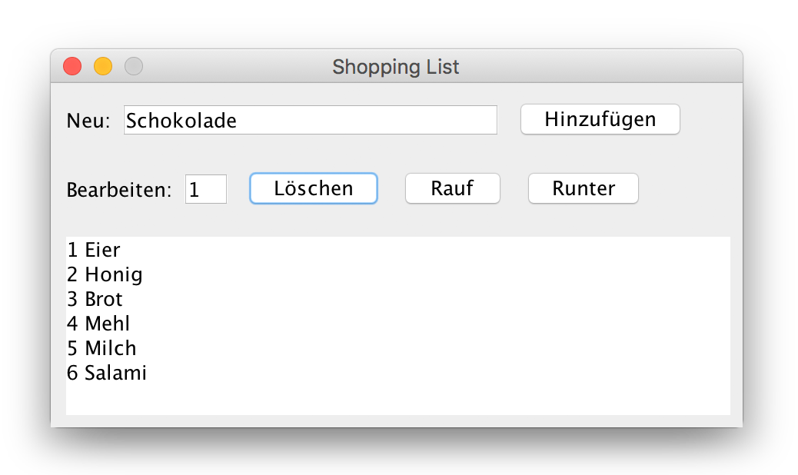

# {{ page.title }}

## Aufgabenstellung

Es soll ein Programm erstellt werden, mit dem man eine Einkaufsliste verwalten kann. Die einzelnen Produkte  auf der Liste sollen in einer Datei gespeichert werden.

Während der Programmausführung sollen die einzelnen Produkte in Form einer einfach verketteten Liste abgebildet werden. Die Verwaltung der Produkte soll über eine grafische Benutzeroberfläche ermöglicht werden.


*Beispielhafte einfache Implementierung*

## 1. Abbilden der Einkaufsliste in einer verketteten Liste
Erstelle die Klassen `List` und `Node` und implementiere die notwendigen Methoden zur Verwaltung der Produkte:

* `append()` – fügt einen Knoten am Ende der Liste an
* `prepend()` – fügt einen Knoten am Anfang der Liste ein
* `count()` – liefert die Anzahl der Knoten in der Liste
* `print()` – gibt die Daten aller Knoten im Ausgabefenster aus
* `delete()` – löscht einen Knoten aus der Liste
* `get()` – liefert einen Knoten mit einem bestimmten Index
* `moveForward()` – bewegt einen Knoten um eine Position Richtung Anfang
* `moveBackward()` – bewegt einen Knoten um eine Position Richtung Ende

Lege im `main()` eine Instanz der Klasse `List` an und teste die einzelnen Methoden ausführlich.


## 2. Speichern der Daten in einer Datei

Erweitere die Klasse `List`, so dass die Inhalte der verketteten Liste aus einer Datei gelesen und in eine Datei geschrieben werden können. In jeder Zeile der Datei steht ein Produkt der Einkaufsliste:
```txt
1;kg;Brot
4;Liter;Milch
20;dag;Edamer
```

Erstellen in der Klasse `List` einen Konstruktor `public List (String file)` und speichere den Dateinamen in einer Instanzvariable.

Implementiere folgende Methoden:
* `loadFromFile ()` – Liest die Textdatei zeilenweise ein und fügt die Einträge der Liste hinzu. 

* `saveToFile ()` – Schreibt alle Knoten der Liste in die Textdatei

Wird das Programm gestartet, soll die Liste mittels `loadFromFile ()` befüllt werden.

Wird das Programm beendet, soll die aktuelle Liste mittels `saveToFile ()` in die Textdatei geschrieben werden, sodass die Änderungen beim neuerlichen Start der App berücksichtigt werden.


## 3. Erstellen einer grafische Benutzeroberfläche zur Verwaltung der Einkaufsliste

Erstelle eine Klasse `View`, mit der die Einträge in der verketteten List dargestellt und verändert werden können.

Erstelle einen Konstruktor `public View(List data)`, wobei `data` eine Referenz auf die verkettete Liste beinhaltet. 

```Java
public static void main(String[] args) {
    
    // Liste erzeugen und mit Daten befüllen
    List myList = new List( "list.txt");
    myList.loadFromFile();
    
    // JFrame und alle Controls erzeugen
    View myView = new View ( myList );
    myView.create();
}
```


Erstelle die grafische Oberfläche wie oben angegeben unter Verwendung des `FlowLayout`–Managers und rufe bei Klick auf die Buttons die entsprechenden Methoden der referenzierten verketteten Liste auf.


## Erweiterungen

Erweitere die Einkaufsliste um zusätzliche Funktionalitäten:

* Pro Eintrag können `Anzahl`, `Einheit` und `Bezeichnung` gespeichert werden. Implementiere die View so, dass die Einheit über ein Drop-Down-Feld ausgewählt werden kann.
* Erweitere die Einkaufsliste um die Buttons `Laden`, `Speichern` und `Speichern unter`, um mehrere Einkaufslisten zu ermöglichen.
* Füge ein Menü hinzu, das die wichtigsten Befehle enthält.
