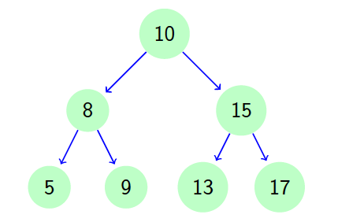

# {{ page.title }}

## 1. Baum implementieren

Lege Objekte der Klassen `Node` an und verbinde diese so miteinander, dass folgender Baum entsteht.


Hilfestellung:
```java
Node n10 = Node(10);
Node n8 = Node(8);
n10.left = n8;
...
Tree tree = new Tree(n10);
tree.print();
```

Hinweis: Verwende folgende Implementierung der Klasse Tree mit der Methode print() zur Ausgabe des Baums.
```java
public class Tree {
    Node root;
    public Tree(Node root) {
    this.root = root;
}

// Pretty print the tree
void print() {
    System.out.println("---------------------------------------");
    if (root == null)
        System.out.println("Empty!");
    else
        showTreeHelper(root, 0);
    System.out.println("---------------------------------------");
}

void showTreeHelper(Node n, int ebene) {
    if (n == null) {
        return;
    }
    showTreeHelper(n.right, ebene + 1);
    for (int i = 1; i <= ebene; i++) {
        System.out.print("....");
    }
        System.out.println(n.key);
        showTreeHelper(n.left, ebene + 1);
    }
}
```


## 2. Suchen und Einfügen
Implementiere in der Klasse `Tree`:

### 2.1 Suchen im Baum
Eine Methode `find()` die einen bestimmten Wert im Baum sucht. Übergabeparameter ist der gesuchte
Schlüssel-Wert. Rückgabewert ist eine Referenz auf den gefundenen Knoten oder `null` falls nicht
gefunden.

### 2.2 Vorgänger suchen
Erstelle eine Methode `findParent()`, die den Vorgängerknoten eines bestimmten Elements ermittelt.

### 2.3 Linker oder rechter Nachfolger
Erstelle eine Methode `getPosition()`, die ermittelt ob ein Node ein linker oder ein rechter Nachfolger ist. Verwendet Konstanten für den Rückgabewert:

```java
public final static int POSITION_NO_NODE = -99;
public final static int POSITION_ROOT = 0;
public final static int POSITION_LEFT = 1;
public final static int POSITION_RIGHT = -1;
```

### 2.4 Einfügen in den Baum
Erstelle eine Methode `insertNode ()`, die einen Node an der richtigen Stelle im Baum einfügt.
Übergabeparameter ist der einzufügende Knoten. Es gibt keinen Rückgabewert. 

Beachte: Das Einfügen in einen leeren Baum ist ein Spezialfall.


## 3 Löschen eines Nodes aus dem Baum

Erstelle eine Methode `remove(int key)`, die einen Knoten mit einem bestimmten Schlüssel aus dem Baum löscht. Stelle sicher, dass der Baum danach immer noch intakt ist.

Zu unterscheidende Fälle — der zu löschende  Knoten hat:
1. keine Nachfolger
2. nur einen Nachfolger (linker oder rechter Nachfolger)
3. allgemeiner Fall (linker und rechter Nachfolger)

### 3.1 Einfache Fälle

Stelle fest, ob der zu löschende Knoten keinen, oder nur einen Nachfolger hat. Entferne dann den Knoten und ziehe den richtigen Knoten nach oben.

Beachte:
- Es muss der Vorgänger des zu löschenden  Knotens gesucht und unterschieden werden ob dieser linker oder rechter Nachfolger ist. 
- Das Löschen des Wurzelknotens ist ein Spezialfall (da dieser
keinen Vorgänger hat).

### 3.2 Allgemeiner Fall

Implementieren den allgemeinen Fall. Für den zu löschenden Knoten muss der richtige Ersatz gefunden werden, der diesen Platz einnehmen kann. Es bieten sich zwei Möglichkeiten an:

1. Das Maximum des linken Teilbaumes des zu löschenden Knotens
2. Das Minimum des rechten Teilbaumes des zu löschenden Knotens


## 4. Traversieren des Baumes

Erstelle Methoden, um den Baum zu traversieren und jedes Element auszugeben.

### 4.1 Rekursives Traversal

Erstelle Methoden, um alle Elemente im Baum auszugeben. Verwende die unterschiedlichen Arten:

1. In-Order Traversal (rekursiv)
2. Pre-Order Traversal (rekursiv)
3. Post-Order Traversal (rekursiv)

### 4.2 Level-Order Traversal (iterativ)
Überlege wie ein Baum in der level-order Reihenfolge ausgegeben werden kann. 

*Hinweis:* Verwende  eine Liste als Zwischenspeicher (z.B. ArrayList).

### 4.3 Pre-Order Traversal (iterativ)
Gib einen Baum in pre-order Reihenfolge aus ohne Rekursion zu verwenden. 

*Hinweis:* Verwende einen Stack.

### 4.4 In-Order Traversal (iterativ)
Gib einen Baum in in-order Reihenfolge aus ohne Rekursion zu verwenden.


## 5. Weitere Aufgaben

### 5.1 Anzahl der Nodes im Baum (rekursiv/iterativ)
Erstelle eine Methode `count()`, die die Anzahl der Nodes im Baum (rekursiv/iterativ) ermittelt.

### 5.2 Höhe des Baumes (rekursiv/iterativ)
Erstelle eine Methode `height()`, die die Höhe des Baums (rekursiv/iterativ) ermittelt.

Die Höhe ist maximalen Abstand zwischen der Wurzel und einem Blattknoten. Der leere Baum hat Höhe 0, ein Baum mit nur einem Knoten Höhe 1, usw.

### 5.3 Ermittle die Tiefe eines Nodes (iterativ)
Erstelle eine Methode `depth()`, die die Tiefe eines Nodes im Baum (iterativ) ermittelt.

Die Tiefe ist die Position im Baum und wird durch die Anzahl der Verbindungen angegeben, die notwendig sind um bis zum Root-Node zu gelangen.

### 5.4 Ermittle die Anzahl von Knoten in einer bestimmten Ebene  (rekursiv/iterativ)
Erstelle eine Methode `countOnLevel()`, die die Anzahl der Nodes auf einer Ebene (rekursiv/iterativ) ermittelt.

Unter einer Ebene versteht man alle Knoten, die von der Wurzel den gleichen Abstand haben. Die Wurzel bildet die Ebene 0, die Nachfolger der Wurzel Ebene 1 und so weiter. Schreibe eine Methode die ermittelt wie viele Knoten in einer bestimmten Ebene (Ebenennummer ist Parameter) sind.

### 5.5 Komplett gefüllte unterste Ebene
Schreibe eine Methode die feststellt ob die unterste Ebene vollständig mit Knoten gefüllt ist. D.h. in dieser Ebene
kein Platz für weitere Knoten ist.

### 5.6 Ermittle die Anzahl der Knoten, die sich in einem bestimmten Intervall (range) befinden
Ermittle die Anzahl an Knoten deren Schlüssel sich in einem bestimmten Intervall befinden. 

Bsp.: count(6,13)
ermittelt die Anzahl aller Knoten für deren Schlüssel k gilt $$ 6 \le \text{k} \le 13. $$ Programmiere möglichst effizient.

### 5.7 Ist Baum ein binärer Suchbaum (rekursiv/iterativ)?
Überprüfe, ob es sich bei einem Baum um einen binäre Suchbaum handelt (rekursiv/iterativ).

### 5.8 Anzahl der Knoten mit einem geraden Key (rekursiv/iterativ)
Ermittle die Anzahl der Knoten mit einem geraden Key (rekursiv/iterativ).

### 5.9 Untersten gemeinsamen Vorgänger ermitteln

Schreibe eine Methode die in einem Baum für zwei
Knoten, deren Schlüssel `(keya < keyb)` gegeben sind,
den niedrigsten gemeinsamen Vorgängerknoten (lowest
common ancestor — LCA) findet. Gibt es keinen gemeinsamen
Vorgängerknoten so soll `null` zurückgegeben werden.

Hinweis: Der LCA ist der Knoten mit der Eigenschaft,
dass `keya < lca.key` und `keyb > lca.key`.

Die Lösung ist rekursiv und iterativ möglich, implementiere
beide.
