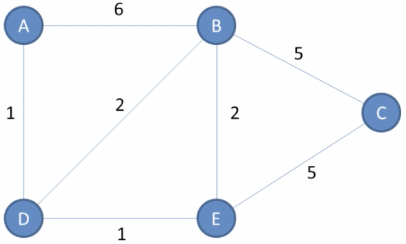
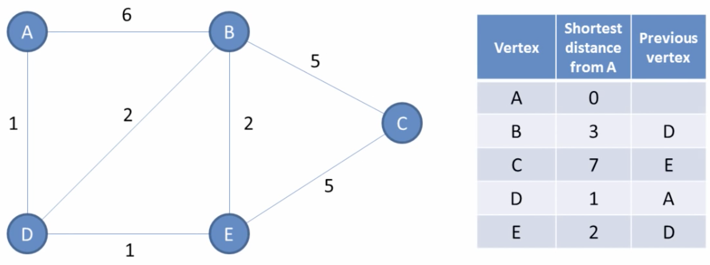
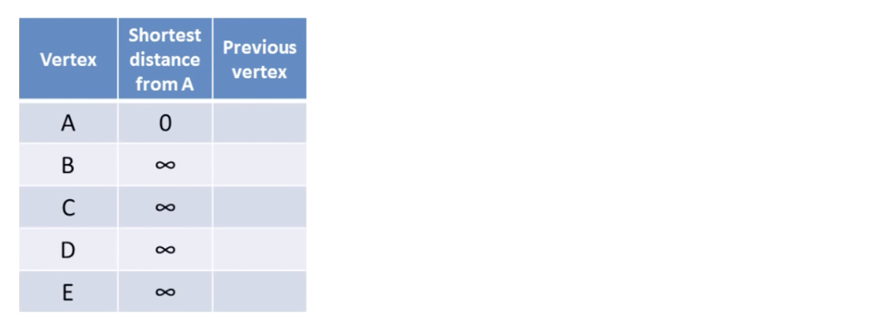
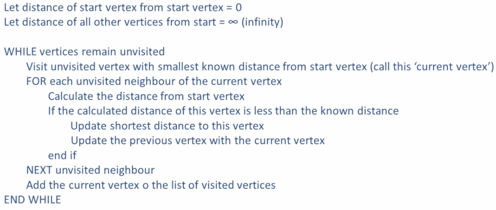

# {{ page.title }} 

## 1. Umsetzung des Graphen 

Erstelle die Klassen `Vertex`, `Edge` und `Graph`.

### 1.1 Klasse Vertex
{: .assignment }
Erstelle eine Klasse `Vertex`, die einen Knotenpunkt im Graphen abbilden soll. Neben dem Namen des Knotenpunkts soll eine Liste von Verbindungen (Edges) gespeichert werden können.

Implementiere einen Konstruktor `public Vertex (String name)`.

### 1.2. Klasse Edge
{: .assignment }
Erstelle eine Klasse `Edge`, die eine gewichtete Verbindung in einem Graphen abbilden soll. Die Verbindung soll eine Referenz auf das Ziel (Vertex) sowie das Gewicht abbilden.

Implementiere einen Konstruktor `public Edge (Vertex destination, int weight)`,
mit dem beide Instanzvariablen gesetzt werden können.

### 1.3. Klasse Graph
{: .assignment }
Der Graph soll das Strassennetzwerk abbilden. Da die Verbindungen bei den einzelnen Vertices gespeichert werden, ist die einzige Instanzvariable der Klasse Graph eine Liste von Vertices `ArrayList<Vertex> vertices`.

Implementiere folgende Methoden:
* `void addVertex(Vertex v)`<br>
Fügt der Liste einen neuen Knotenpunkt hinzu.
* `Vertex getVertex(String s)`<br>
  Durchsucht die Liste nach einem Knotenpunkt mit einem bestimmten Namen. Ist der Knotenpunkt enthalten, wird eine Referenz auf den Knotenpunkt zurückgegeben. Ist kein Knoten mit dem angegebenen Namen enthalten, wird null zurückgegeben werden.
* `void addEdge(Vertex a, Vertex b, int weight)`<br>
Erstellt eine neue Verbindung (Edge und fügt diese Verbindung den beiden Knotenpunkte `a` und `b` hinzu.
* `void print()`<br>
Gibt alle im Graph enthaltenen Knotenpunkte (Vertices) und dessen Verbindungen (Edges) zu anderen Knotenpunkten aus.

### 1.4. Befüllen mit Daten
{: .assignment }
Erstelle im Hauptprogramm einen Graphen und fülle ihn mit den in den Klassen erstellten Methoden mit untenstehender Struktur. Verwende die Methode `print()` um den korrekten Aufbau zu kontrollieren:

{: width="350" }


```console
----------------------------------------
Graph with Vertices with edges
----------------------------------------
Vertex:A Edges: B(6), D(1)
Vertex:B Edges: A(6), D(2), E(2), C(5)
Vertex:C Edges: B(5), E(5)
Vertex:D Edges: A(1), B(2), E(1)
Vertex:E Edges: B(2), D(1), C(5)
```


### 1.5. Traversieren des Graphen
{: .assignment }

#### 1.5.a. Depth-First und Breath-First
Implementierte zwei Methoden, die dem Graphen traversieren, und die Namen aller Vertices im Graphen ausgeben:

* Depth-First (Tiefensuche) – `traversalDFS(Vertex start)`
* Breath-First (Breitensuche) – `traversalBFS(Vertex start)`

Testen die Methoden mit unterschiedlichen Ausgangs-Vertices.


#### 1.5.b. Verbindungen überprüfen
Implementierte zwei Methoden, die überprüfen, ob eine Verbindung von einem Vertex zu einem anderen Vertex besteht:

* Depth-First (Tiefensuche) – `boolean hasPathDFS(Vertex a, Vertex b)`
* Breath-First (Breitensuche) – `boolean hasPathBFS(Vertex a, Vertex b)`

Testen die Methoden mit unterschiedlichen Ausgangs- und Ziel-Vertices.


## 2. Implementierung von Dijkstra’s Algorithmus

### 2.1 Grundlagen
{: .assignment }

[youtube.com - Dijkstra’s Algorithmus](https://www.youtube.com/watch?v=pVfj6mxhdMw){:target="_blank"}

Das Video beschreibt den Dijkstra Algorithmus zur Bestimmung der kürzesten Distanz zweier
Vertices in einem Graphen.

Sieh dir das Video an und erstelle im Anschluss nach dem gleichen Prinzip die Abstandstabelle
für den Ausgangspunkt B auf einem Zettel.

---
### 2.2 Implementieren der Abstandtabelle
{: .assignment }

Ausgehend von einem bestimmten Vertex in einem Graphen sollen also die kürzesten Abstände zu allen anderen Vertices im Graphen gespeichert werden. 

Um den Pfad vom ausgehenden Vertex zum Zielvertex abzubilden, soll für jeden Eintrag zusätzlich eine Referenz auf den
vorangehenden Vertex gespeichert werden.


#### 2.2.a. Klasse `DijkstraTableEntry`
Erstelle die Klasse `DijkstraTableEntry`, die einen solchen Eintrag abbilden kann. 

Erstelle einen Konstruktor `public DijkstraTableEntry (Vertex destination, double distance)`, der die Instanzvariable entsprechend setzt. Die Referenz zum vorangehenden Vertex soll mit null initialisiert werden.

#### 2.2.b. Klasse `DijkstraTable`
Erstelle die Klasse `DijkstraTable`, die eine ArrayList von DijkstraTableEntry-Objekten speichern kann. In dieser Klassen werden alle Methoden implementiert, die zur Berechnung der kürzesten Distanz vom Ausgangspunkt zu einem beliebigen Zielpunkt notwendig sind.

Implementiere in der Klasse den Konstruktor `public DijkstraTable(Vertex v, Graph g)`.

Der Vertex `v` stellt den Startpunkt der Abstandstabelle dar und wird somit als erster Eintrag mit Abstand 0 in
der Liste gespeichert.

Im Graphen `g` sind alle Vertices gespeichert – diese sollen ebenfalls in der Liste gespeichert werden. Der Abstand soll mit `Integer.MAX_VALUE` initialisiert werden:


---
### 2.3. Klasse `DijkstraTable` – Hilfsmethoden
{: .assignment }
Implementiere folgende Methoden und teste sie ausführlich, indem du im Hauptprogramm die notwendigen Elemente anlegst und die Methoden aufrufst:

#### 2.3.a. Methode `void print()`
Gibt alle in der Table enthaltenen Tabelleneinträge aus.

#### 2.3.b. Methode `DijkstraTableEntry getEntryFromVertex(Vertex v)`
Ermittelt aus einem Vertex den zugehörigen Eintrag in der Tabelle.

#### 2.3.c. Methode `Vertex getStart()`
Ermittelt den Ausgangspunkt der Tabelle. Dieser ist immer der erste Eintrag in der Tabelle und hat den Abstand 0.

#### 2.3.d. Methode `DijkstraTableEntry getNearestEntry(ArrayList<Vertex> unvisited)`
Ermittelt den Vertex in der Tabelle, der den geringsten Abstand zum Ausgangspunkt ausweist.

Dabei sollen nur die Elemente berücksichtigt werden, die in der ArrayList `unvisited` enthalten sind.

---
### 2.4. Klasse `DijkstraTable` – Umsetzen des Algorithmus
{: .assignment }

Setze den Algorithmus wie im Video beschrieben um.

#### 2.4.a. Methode `void calculate()`
Erstelle eine Methode `void calculate()`, die Tabelle entsprechend erstellt:
> 

#### 2.4.b. Methode `void printShortestPath(Vertex to)`

Erstelle eine Methode `void printShortestPath(Vertex to)`, die die kürzeste Route
vom Ausgangspunkt darstellt:
```
----------------------------------------
Shortest Path from A to C: 7 km
----------------------------------------
A ------- 0 km
| 1 km
D ------- 1 km
| 1 km
E ------- 2 km
| 5 km
C ------- 7 km
```

---
### 2.5 Erweiterungen
{: .assignment }

#### 2.5.a. Einlesen der Daten
Implementiere die Methode `public void importFromFiles(String vertices, String edges)`, die die Vertices und die Edges aus den CSV-Files `vertices.csv` und `edges.csv` einliest und den Graphen erstellt.

Dateien:

* [Download vertices.csv](assets/vertices.csv){:target="_blank"}
* [Download edges.csv](assets/edges.csv){:target="_blank"}

Aufbau der Datei `vertices.csv`:


```
ID;Name
1;Braunau
2;Ranshofen
3;Neukirchen
```

Aufbau der Datei `edges.csv`:
```
StartID;EndID;Strassentyp;Distanz
1;2;B156;4.2
2;3;B156;7.2
```

#### 2.5.b. Gewichtung der Verbindungen
Neben der Entfernung ist bei den einzelnen Verbindung auch der Strassentyp angegeben.
Erweitere die Klasse `DijkstraTable` um die Methode void `printFastestPath(Vertex
to)`, die auf Basis des Strassentypen die schnellste Route vom Ausgangspunkt darstellt.

Annahme:
- Durchschnittsgeschwindigkeit auf Bundesstrassen ist 80 km/h.
- Durchschnittsgeschwindigkeit auf Landesstrassen ist 60 km/h.

Erweitere die Ausgabe des kürzesten und des schnellsten Pfades um die Zeitdauer.