# 3D-Modellierung mit Blender
## Shortcuts

### Viewport

| Shortcut                          | Operation                     |
|-----------------------------------|-------------------------------|
| `MMB` + `Move`                    | Rotate Scene                  |
| `Scroll` _or_  `Cmd`+`MMB`+`Move` | Zoom In/Out Scene             |
| `Shift`+`MMB`+`Move`              | Pan Scene                     |
| `Numpad`                          | 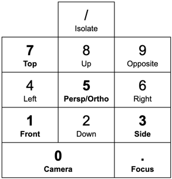 |

### Objekte verändern

| Shortcut            | Operation                    |
|---------------------|------------------------------|
| `LMB`               | Select Object                |
| `s`                 | Scale Object                 |
| `r`                 | Rotate Object                |
| `r` + `x`, `y`, `z` | Rotate Object + Snap to Axis |5
| `g`                 | Move Object (Grab - Mode)    |
| `g` + `x`, `y`, `z` | Move Object + Snap to Axis   |
| `g` + `MMB`         | Move Object + Snap to Axis   |
| `Del`               | Delete Objects               |
| `Shift` + `d`       | Duplicate Objects            |

### Divers

| Shortcut             | Operation                                                                          |
|----------------------|------------------------------------------------------------------------------------|
| `Shift` + `a`        | Add Object                                                                         |
|                      | 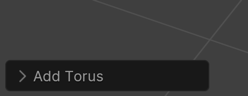  Eigenschaften direkt nach dem Erstellen anpassen       |
| |                                                                                    |
| `F12`                | Open Render Window                                                                 |
| |                                                                                    |
| `Numpad0` &rarr; `n` | Toggle Camera View &rarr; Properties Window                                        |
|                      | 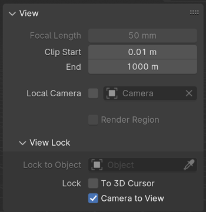 Toggle *Camera to View* um die Kameraposition zu Ändern |
| |                                                                                    |
| `Select Object`+ `RMB` | Open Object Properties                                                             |
|                        | 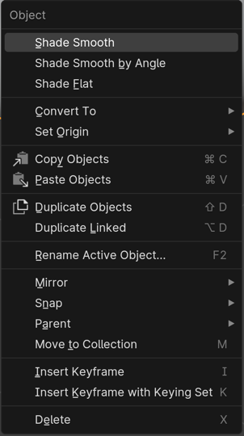                                                            |
|| Toggle X-Ray (auch hintere Vertices/Lines/Faces auswählen                          |

## Modifiers

|                             | Shortcut                               | Operation                                                      |
|-----------------------------|----------------------------------------|----------------------------------------------------------------|
|      | `+ Add Modifier`                       | Modifier hinzufügen                                            |
|  | `Generate` &rarr;`Subdivision Surface` | 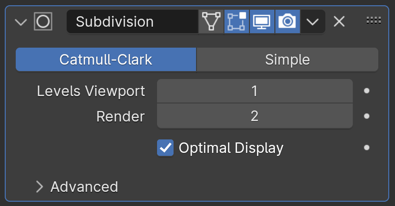 _Mesh Smooth_                       |
|  | `Generate` &rarr;`Solidify`            | Auf einer Ebene ein Objekt machen                              |
|  | `Generate` &rarr;`Array`               | Objekte vervielfältigen                                        |
|  | `Generate` &rarr;`Mirror`              | Objekte spiegeln                                               |
|  | `Deform` &rarr;`Shrinkwrap`            | Auf ein Element ausrichten (Wenn es mit Form ein Problem gibt) |

## Modes

|                         | Shortcut                                              | Operation                                                          |
|-------------------------|-------------------------------------------------------|--------------------------------------------------------------------|
| 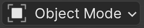 | `tab`                                                 | Toggle Object / Edit Mode                                          |
|                         |                                                       |                                                                    |
| 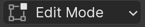 | `tab`                                                 | Toggle Object / Edit Mode                                          |
|                         | `1`                                                   | Select Mode Vertex                                                 |
|                         | `2`                                                   | Select Mode Edge                                                   |
|                         | `3`                                                   | Select Mode Face                                                   |
|                         | 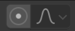 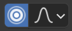   | Enable Proportional Editing (Benachbarte Elemente mit einbeziehen) |
|                         | `Option` + `LMB`                                      | Edge Select                                                        |
|                         | `Cmd` + `Numpad+`                                     | Edge Select More                                                   |
|                         | `Cmd` + `Numpad-`                                     | Edge Select Less                                                   |
|                         |                                                       |                                                                    |
|                         | `e`                                                   | Extrude                                                            |
|                         | `i`                                                   | Inset                                                              |
|                         | `h`                                                   | Hide                                                               |
|                         | `Option` + `h`                                        | Unhide                                                             |
|                         | `Cmd` + `r`                                           | Loop cut                                                           |
|                         | `Cmd` + `r` + `Scroll`                                | Loop cut - Anzahl der Unterteilungen                               |
|                         | `Cmd` + `r` + `Scroll`                                | Loop cut - Anzahl der Unterteilungen                               |
|                         |                                                       |                                                                    |
|  |                                                       | Sculpt Mode                                                        |
|                         | `m`                                                   | Mask Tool                                                          |
|                         | `Cmd` + `i`                                           | Invert Mask                                                        |
|                         | 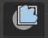 + 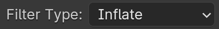 | Mesh Filter                                                        |

## Inhalte
- [Blender Tutorial for Complete Beginners (Youtube)](https://www.youtube.com/playlist?list=PLjEaoINr3zgEPv5y--4MKpciLaoQYZB1Z){:target="_blank"}
- [Blender Style Shortcuts  (Google Docs, Blender Guru)](https://docs.google.com/document/d/1zPBgZAdftWa6WVa7UIFUqW_7EcqOYE0X743RqFuJL3o/edit?pli=1){:target="_blank"}
- [poliigon.com Textures](https://www.poliigon.com/?utm_campaign=donut4&utm_source=youtube&utm_medium=bg){:target="_blank"}
- [Blender 3D Beginner Tutorial: Mushrooms in Bottle (Youtube)](https://www.youtube.com/watch?v=kbiMXiUz9cc){:target="_blank"}
- [Blender 3D Beginner Tutorial: Smooth 3D Living Room(Youtube)](https://www.youtube.com/watch?v=dEGJeVnWZAA){:target="_blank"}
- [10 Tools Every Blender Noob Should Learn(Youtube)](https://www.youtube.com/watch?v=KfSQh2dFCik){:target="_blank"}