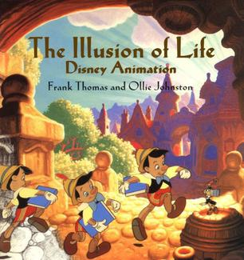
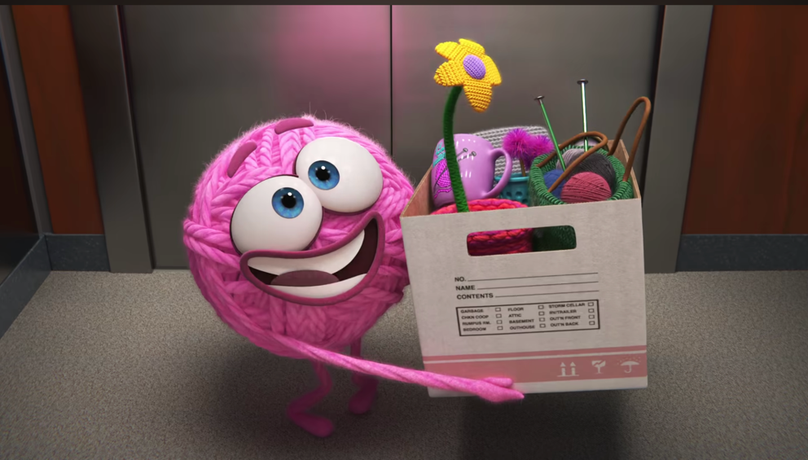

## 12 Principles of Animation – The Illusion of Live

The Illusion of Life: In den frühen 80er-Jahren veröffentlichten Franz Thomas an Ollie Johnson ein Buch, das die verschiedenen Techniken beschreibt, die Disney Animation bei allen Animationen einsetzt und die bis heute ihre Gültigkeit haben

> ### Aufgabe 1: 12 Principles of Animation
>
> Sieh dir eines der Videos an und fasse die wichtigsten Punkte kurz zusammen
>
> - [_The 12 principles of animation_ - Wikipedia](https://en.wikipedia.org/wiki/Twelve_basic_principles_of_animation)
> - [_The illusion of life_ - Video auf Vimeo (Anmeldung erforderlich)](https://vimeo.com/93206523)
> - [_The 12 Principles of Animation (Pixar-ated)_ - Video auf Vimeo](https://vimeo.com/207384652)

> ### Aufgabe 2: Analyse von Animationen
> 
> *Purl, Copyright: Disney•Pixar, 2019*
> 
> Such die einen aktuellen Kurzfilm von _Pixar Animation_ oder einen Klassiker von _Disney_ aus und halte mindestens 3 Techniken aus den _12 Principles of Animation_ fest, die darin Anwendung finden.
> 
> Nimm für jeden dieser Anwendungsfälle zwei Screenshots, und beschreibe die Anwendung in kurzen Worten.
 
## Abgabe
Ergänze das Animation-Portfolio:
- Zusammenfassung der Theorie _12 principles of animation_
- Praktische Anwendung der _12 principles of animation_
- Umfang: ca. 1-2 Seiten A4 (Inklusive der Bilder)
- Form: Als .pdf-Dokument
