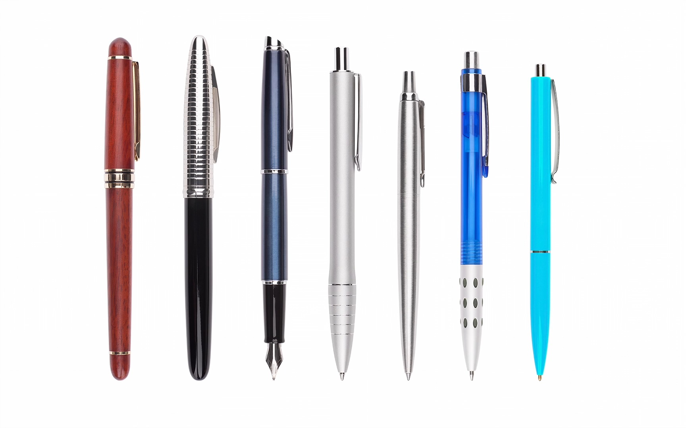

## 1. Grundlagen: Designing Intuitive User Experiences

Mike Stern hat bei der Developer Conference 2014 einen interessanten Vortrag zu _intuitiven Userinterfaces_ gehalten, der sich zwar auf _Apple_ bezieht, aber auch für andere Systeme und Plattformen Gültigkeit hat.

Er beschreibt darin die __Top 5 Characteristics of Intuitive Apps__ und zeigt viele praktische Beispiele:

- [Video auf Youtube](https://www.youtube.com/watch?v=PtNJSrymZb8)
- [Video zum Downloaden](https://devstreaming-cdn.apple.com/videos/wwdc/2014/211xxmyz80g30i9/211/211_sd_designing_intuitive_user_experiences.mov?dl=1)

### Aufgabe: Zusammenfassen der Präsentation

Sieh dir das Video an und fasse die wichtigsten Inhalte zusammen.

Umfang: ca. 1 Seite A4 

## 2. App-Idee, Rapid Prototyping mit Scribbles

## 3. Scribbles, Rapid Prototyping mit Marvel

## 4. App-Design, Rapid Prototyping mit Adobe XD
