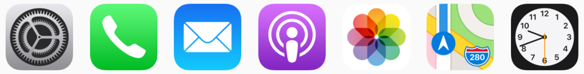

## Aufgabenstellung

Finde eine Idee für eine App, die du umsetzen möchtest. Beachte dabei die angegebenen Hinweise.

### 1. Minimal Viable Product

Halte in kurzen Sätzen fest, was deine App ausmacht und welches Problem die App lösen soll.
Gib einen Überblick über die Bestandteile der App. Eine Mindmap eignet sich gut dafür.

### 2. Definiere die Zielgruppe

Wer soll die App verwenden?
Für welche Endgerät ist die App (Smartphone, Tablett)?
Für welches Betriebssystem soll die App umgesetzt werden?

### 3. Monetarisierung

Wie soll sich die App finanzieren? Welches Modell soll dann später dahinter stecken?

## Zusatz

Erstelle ein Icon für deine App. Verwende dazu ein Programm deiner Wahl. Halte dich dabei schon an die Design-Richtlinien der jeweiligen Plattform.

- [App Icon - developer.apple.com](https://developer.apple.com/design/human-interface-guidelines/ios/icons-and-images/app-icon/)
- [Android icons - material.io](https://material.io/design/platform-guidance/android-icons.html)
- [App Icon Inspiration - 99designs.de](https://99designs.de/blog/design-kreativitaet/app-icon-inspiration/)

## Abgabe
Ergänze das Appdesign-Portfolio:
- Umfang: ca. 1 Seite A4
