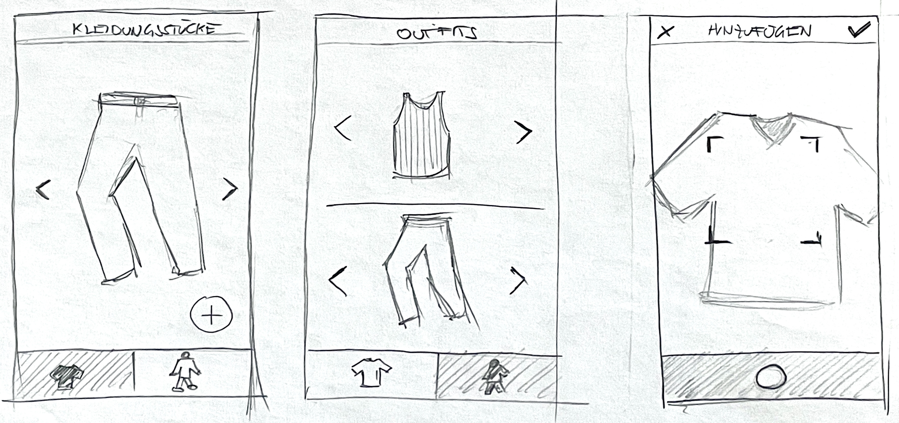
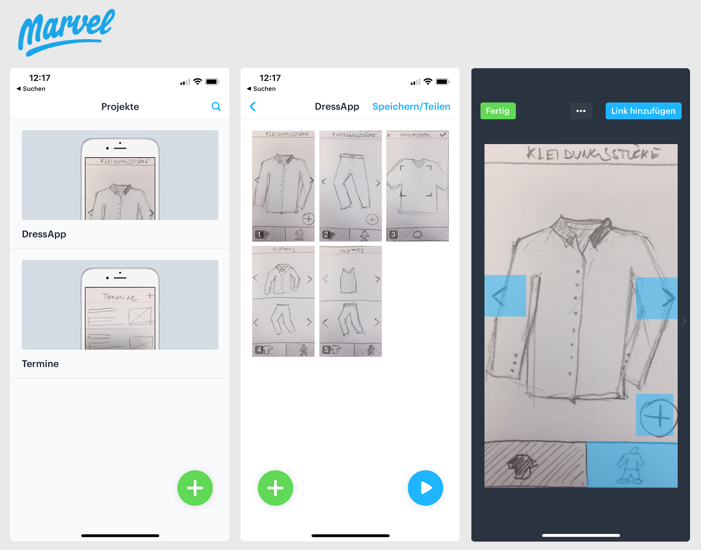

## Aufgabenstellung

Erstelle einen ersten funktionsfähigen Prototyp mithilfe von Scribbles und Wireframing.

### 1. Scribbles anfertigen

Zu Beginn geht es darum den richtigen Weg zu finden und abzuklären, ob die App auch so funktionieren kann wie man sich das vorstellt. 

Scribbles haben den Vorteil, dass sie sehr wenig Zeit in Anspruch nehmen und schnelle Iterationsschritte machen kann.

#### Rahmenbedingungen
  - Die Größe der Scribbles sollte in etwa der Größe des Endgeräts entsprechen.
  - Fertige die Scribbles per Hand an.
  - Halte dich nicht mit Details und dem Design auf, die Funktionalität steht im Vordergrund  .
  - Mehrere Entwürfe desselben Screens sind erlaubt und erwünscht.
  - Es dürfen auch Farben verwendet werden.
  - Notiere dir deine Gedanken zu den einzelnen Screens.

#### Inhalte 
  - Setze die wichtigsten Punkte um, die du für dein _**M**inimal **V**iable **P**roduct_ benötigt
  - Starte mit dem Scribble des Screens den du sehen möchtest, wenn du die App zum 100ten Mal öffnest
  - Erstellen **keine** Screens für _Login_, _Registrieren_, _Impressum_, _Einstellungen_ oder ähnliches

#### Navigation
  - Die Navigation soll so einfach wie möglich sein und folgende Fragen beantworten:
    - Where am I?
    - Where else can I go?
    - What will I find there?
  - Brauche ich wirklich alle Navigationspunkte?
  - Ist die Navigation _platform savvy_? Funktioniert sie dem Betriebssystem entsprechend?

### 2. Prototyp erstellen mit Marvel

Installiere dir die [Marvelapp - marvelapp.com](https://marvelapp.com/) auf deinem Smartphone und füge die Scribbles zu einem ersten Prototypen zusammen:

1. Projekt erstellen
1. Scribbles fotografieren
1. Seiten miteinander verlinken, Seitenübergänge hinzufügen

### 3. Prototyp testen lassen und Feedback holen

Nimm den fertigen Prototyp und gib ihn einer Klassenkollegin oder einem Klassenkollegen und bitte sie oder ihn, den Prototypen zu testen.

Wichtig dabei:
- Keine Erklärungen, wie die App funktioniert und was die App machen soll.
  
- Gib konkrete Aufgabenstellungen:  
  > _" Füge jetzt ein neues Kleidungsstück hinzu ... "_
  
- Bitte darum die Gedanken laut auszusprechen:  
  >_" Hmm. Ich bin also auf der Startseite, aber was soll das komische Icon da rechts in der unteren Ecke ... ? "_

- Nimm das Feedback auf und _"verteidige"_ den Enwurf nicht. Mach dir Notizen zum Feedback.

- Bitte die Klassenkollegin oder den Klassenkollegen um Verbesserungsvorschläge.

### 4. Zurück an den Start

Arbeite das Feedback in deine Scribbles ein und versuche so die App zu verbessern.

Das ganze sollte solange wiederholt werden, bis die App stimmig funktioniert. Erst dann wird mit dem Design begonnen.

## Abgabe
Ergänze das Appdesign-Portfolio:
- Inhalt:
  - Halte die Entwürfe und die Iterationsschritte fest. 
  - Was hat gut funktioniert, was weniger gut?
  - Wie hast du auf die Probleme reagiert?
  - Wie sieht die finale Version aus?
- Umfang: mind. 4 Seiten A4
