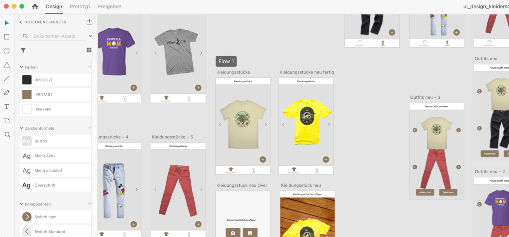
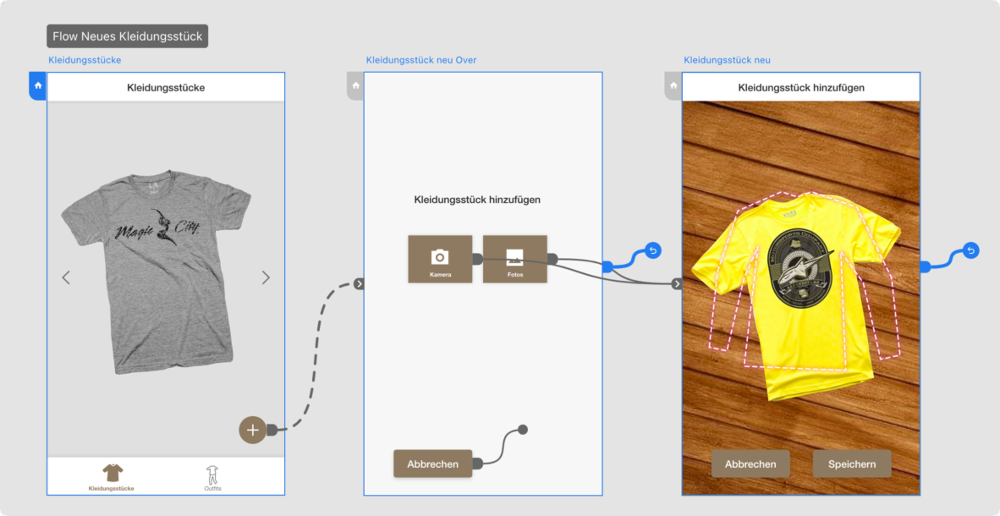
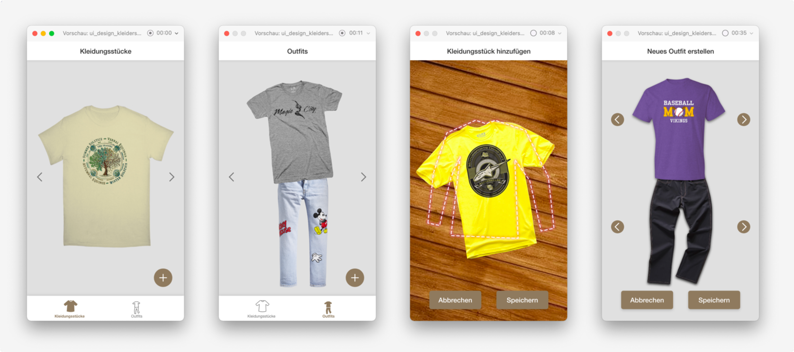

## Aufgabenstellung

Entwirf das Design der App mithilfe von Adobe XD und erstelle daraus einen Prototyp. Das Design stellt dann die Basis für die Umsetzung der App dar.

### Adobe XD Tutorials

Für Adobe XD gibt es eine Reihe [sehr guter Tutorials](https://helpx.adobe.com/at/xd/tutorials.html):

* Empfehlung: [Kurzanleitung für Adobe XD](https://helpx.adobe.com/at/xd/how-to/make-prototype.html)
* [Zeichenflächen hinzufügen und bearbeiten - helpx.adobe.com](https://helpx.adobe.com/at/xd/how-to/add-and-edit-artboards.html)
* [Mit Wiederholungsrastern wiederkehrende Elemente erstellen - helpx.adobe.com](https://helpx.adobe.com/at/xd/how-to/repeating-elements.html)
* [Mit Komponenten arbeiten - helpx.adobe.com](https://helpx.adobe.com/at/xd/how-to/consistent-design-components.html)

### 1. Design erstellen

Die fertigen Scribbles sollen jetzt ein Design bekommen. Damit die verschiedene Designvarianten schnell adaptiert werden können sind folgende Punkte zu beachten:

* Erstelle gute Inhalte (Bilder, sprechende beispielhafte Texte, ...)
* [Verwende Wiederholungsraster](https://helpx.adobe.com/at/xd/how-to/repeating-elements.html)
* [Verwende von Beginn an Komponenten](https://www.adobe.com/at/products/xd/learn/get-started-xd-components-libraries.html)
* [Verwende von Beginn an UI-Kits](https://helpx.adobe.com/at/xd/how-to/ui-kits.html)

### 2. Prototyp erstellen

Mit Adobe XD gibt es sehr viele Möglichkeiten. Nutze so, um einen Prototyp so realitätsnah wie möglich umzusetzen:

* [Overlays](https://helpx.adobe.com/in/xd/user-guide.html/in/xd/help/add-overlays.ug.html)
* [Scrollbare Zeichenflächen](https://helpx.adobe.com/at/xd/how-to/scrollable-artboards.html)
* [Links auf vorhergehene Zeichenflächen](https://helpx.adobe.com/in/xd/user-guide.html/in/xd/help/create-prototypes.ug.html#previous-artboard)
* [Animationen](https://helpx.adobe.com/in/xd/user-guide.html/in/xd/help/animate-prototypes.ug.html)
* ..

Um einen guten Prototypen umzusetzen können sehr viele Zeichenflächen notwendig sein. 

### 3. Prototyp testen lassen und Feedback holen

Siehe auch [Aufgabe 3 - Scribbles](13_appdesign_scribbles.md#3-prototyp-testen-lassen-und-feedback-holen):

1. **Design** erstellen / anpassen
2. **Prototyp** erstellen / anpassen
3. **Testen** - Alles Perfekt?  
   &nbsp;&nbsp;**Nein:** Zurück zu 1.  
   &nbsp;&nbsp;**Ja:** Weiter zur Umsetzung (Aufbereitung der Daten für die Entwickler)

Nutze auch die Möglichkeit von den User-Tests Video- und Tonaufzeichnungen zu machen.

## Abgabe
Ergänze das Appdesign-Portfolio:
- Inhalt:
  - Halte die Entwürfe und die Iterationsschritte fest. 
  - Was hat gut funktioniert, was weniger gut?
  - Wie hast du auf die Probleme reagiert?
  - Wie sieht die finale Version aus?
  - Link zum Prototyp    
- Umfang: mind. 6 Seiten A4
