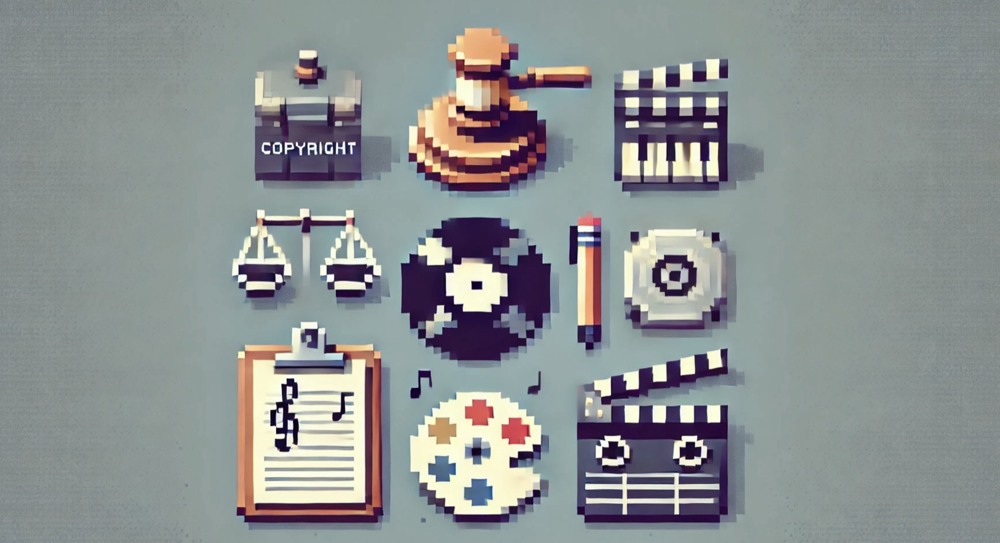

_DALL·E Sprachmodell, Bild zu den Themen Urheberrecht, Musikbusiness, Kreativbranche und Filmbusiness, 28.02.2025_
# Ideen sind was wert

## Aufgabenstellung
Es sollen in der Gruppe Präsentationen zu den Themen _Geistiges Eigentum_, _Musikbusiness_, _Filmbusiness_ und _Kreativwirtschaft_ erstellt werden.

### Ablauf

1. **Gruppeneinteilung** Es werden unterschiedlich große Gruppen entsprechend der Seitenanzahl erstellt:

   | # | Thema                                | Seitenanzahl |
   |--------------------------------------|----|----:|
   |1| Die Kreativwirtschaft                |14|
   |2| Das Musikbusiness                    |30|
   |3| Das Filmbusiness                     |37|
   |4| Geistiges Eigentum und Urhbeberrecht |19|
 

2. **Aufteilen der Inhalte** Innerhalb der Gruppe wird der so Inhalt aufgeteilt, dass jede/r in etwa den gleichen Umfang zu bearbeiten hat.

3. **Ausarbeiten und Ergänzen der Inhalte** Jede/r arbeitet eine Präsentation zum jeweiligen Inhalt aus. Die unten angeführten .pdf-Dokumente stellen eine Basis dar und **sollen** um folgende Inhalt erweitert werden:  
    - **Aktuelle Entwicklungen** 
    Die unten angeführten [.pdf-Dokumente](#inhalte) sind z.T. nicht mehr ganz aktuell, auf neue Entwicklung wird nicht oder nicht ausreichende eingegangen (VPN, Deep-Fakes, KI-Tools zum Generieren von Ton, Bild und Video, Streaming, Social Media, etc...)  
    - **Beispiele aus der Praxis** 
      Beispielhafte Inhalte (Bilder, Videos, Musik- oder andere Tonstücke, ...) , rechtliche Fälle, relevante Ressourcen sollen ebenfalls enthalten sein.   
      _Zum Beispiel: Ich mache ein Fest für die Klasse, lasse eine Spotify Playlist laufen und zeige Musikvideos her. Muss ich da Abgaben bezahlen? Kann mich von einem der Interpreten verklagt werden?_  
    - **Zusätzliche Inhalte** 
      Aktuelle, interessante, weiterführende Informationen, etc. sollen ergänzt werden.  
    - **Quellenangaben**  Alle verwendeten Quellen sind anzugeben.

4. **Erstellen einer gemeinsamen Präsentation** 
   Aus den einzelnen Teilen der Ausarbeitungen wird pro Gruppe eine gemeinsame Präsentation erstellt.   

   - Neben den Inhalten ist auch auf das Aussehen zu achten 
   - Das Tool für die Durchführung der Präsentation ist freigestellt (PowerPoint, Adobe XD, Miro, ...)
   - Die Dauer der Präsentation hängt vom Umfang ab

5. **Erstellen eines gemeinsamen Handouts** 
   Zusätzlich zur Präsentation ist **eine** Zusammenfassung der Inhalte für das gesamte Thema zu erstellen. Es ist zu kennzeichnen, wer welche Inhalte erstellt hat, und wer die Präsentation sowie das Handout erstellt hat.

6. **Abhalten der Präsentationen** 
   Jede Gruppe hält gemeinsam die Präsentation, wobei jede/r seinen/ihren Teil der Folien präsentiert. Ist jemand am Tag der Präsentation nicht anwesend, so wird ein Teammitglied bestimmt, das diesen Teil präsentiert.

### Verwendung von KI für die Erstellung der Inhalte

Die Verwendung von ChatGPT o.ä. ist erlaubt. Werden solche Tools verwendet, so ist der entsprechende Inhalt zu kennzeichnen (z.B. mit Fußnote) am Ende der Präsentation in Form eines Quellenverzeichnisses anzugeben:

**Literatur-/Quellenverzeichnis:** 

_1. OpenAI’s ChatGPT-3.5 Sprachmodell; Erstelle eine Übersicht der aktuellen Entwicklungen des Urheberrechts in maximal 150 Wörtern; Bitte zeige auch einige konkrete Beispiel auf; 03.04.2024._

_2. OpenAI’s ChatGPT-4 Sprachmodell; Erstelle eine Übersicht der aktuellen Entwicklungen des Musikbusiness in maximal 100 Wörtern; Bitte auch einige konkrete Beispiel auf; 04.04.2024._

_3. ..._

## Benotung und Abgabe

Die Abgabe der Präsentation und der Handouts erfolgt per Teams in Form von .pdf-Dokumenten. Eine Abgabe pro Gruppe ist ausreichend. Auf der ersten Folie der Präsentation, sowie auf dem Deckblatt des Handouts sind zusätzlich folgende Informationen gut ersichtlich anzugeben:

* Jahrgang, Klasse, Fach
* Thema
* Teammitglieder
* Ersteller/in der Präsentation oder des Handouts

Die Benotung bezieht sich auf die gesamte Präsentation als Gruppenarbeit sowie auf die einzelne Leistungen:

- **Gesamte Präsentation** *Gewicht: 1*
    - Aufbau und Design der Folien, Gesamteindruck

- **Präsentation der einzelnen Teammitglieder** *Gewicht: 2*
    - Inhalte, Beispiele aus der Praxis verwendet?
    - Umfang, Dauer
    - Präsentationstechnik

- **Handout** *Gewicht: 2*
    - Aufbereitung, Qualität
    - Umfang

Die Schüler:innen die dann das gemeinsame Handout, oder die gemeinsame Präsentation zusammenstellen, erhalten einen Bonus.

## Inhalte
- [Die Kreativwirtschaft (.pdf, 14 Seiten)](./assets/01_die-kreativwirtschaft_14.pdf){:target="_blank"}
- [Das Musikbusiness (.pdf, 30 Seiten)](./assets/02_so-funktioniert-das-musikbusiness_30.pdf){:target="_blank"}
- [Das Fimbusiness (.pdf, 37 Seiten)](./assets/03_so-funktioniert-das-filmbusiness_37.pdf){:target="_blank"}
- [Geistiges Eigentum und Urheberrecht (.pdf, 19 Seiten)](./assets/04_geistiges-eigentum-und-urheberrecht_19.pdf){:target="_blank"}
