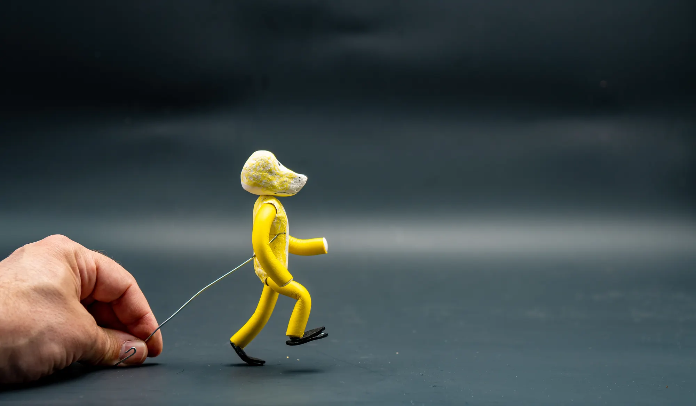
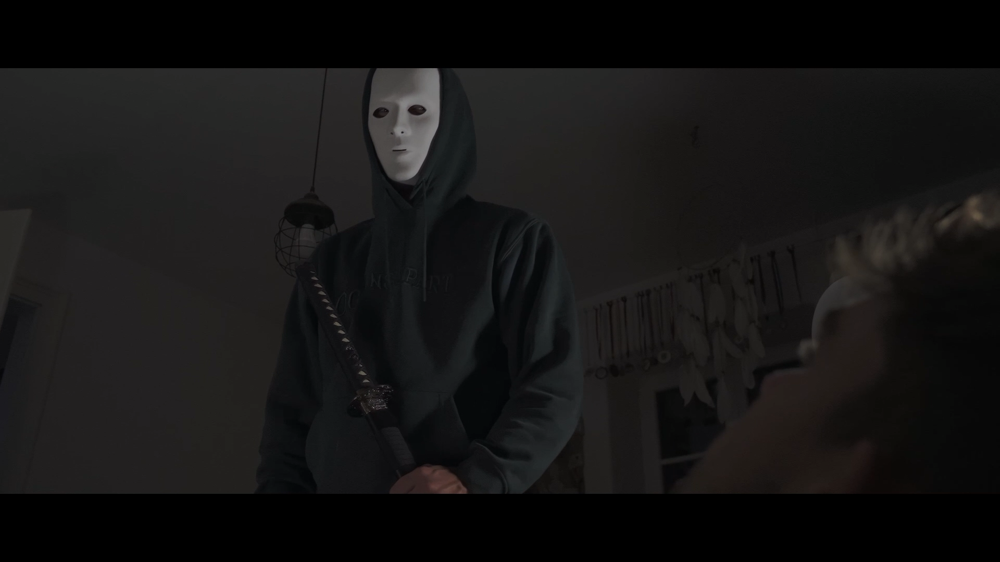

# {{page.title}}

## Allgemeines

In der vorletzten Schulwoche findet auch dieses Jahr wieder die Medienwoche statt. Dazu können Schüler:innen der 2BHELS, 3BHELS, 4BHELS und auch heuer der 3AHITS aus den untenstehenden Kursen einen auswählen.

Die Schüler:innen der 1BHELS machen fix einen Kurs.

### Ablauf

| Woche | ToDo |
| :--- | :--- |
| **KW 23** | Erfassung der Kurswünsche |
| **KW 24** | Zuteilung der Schüler:innen zu den Kursen |
| **KW 25, 26** | Eventuell notwendige Vorarbeiten zu den Kursen, wie Drehbuch oder Ideenfindung |
| **KW 27** | Durchführen der Medienwoche |

### Zeitplan während der Medienwoche

Der genaue Zeitplan wird dann von den Betreuer:innen vorgegeben.

- **Montag**
    - 07:50 Uhr Allgemeine Besprechung in der Aula, Zuweisung zu den Betreuer:innen, Beziehen der Räumlichkeiten
    - bis 15:00 Uhr: Vorträge/Schulungen/Arbeiten an den Projekten
- **Dienstag**
    - 07:50 – 15:00 Arbeiten an den Projekten
- **Mittwoch**
    - 07:50 – 12:30 Arbeiten an den Projekten
- **Donnerstag**
    - 07:50 – 15:00 Arbeiten an den Projekten, Vorbereiten der Präsentationen und Aufbereiten der Arbeiten für die Werkschau
- **Freitag**
    - 09:00 – 10:30 Präsentation der Kurse, anschließend Werkschau
    - 10:45 – 12:00 Präsentation und Bewertung der Videos

 
### Hinweis Kameras
An alle, die selber eine Kamera haben: Bitte unbedingt mitnehmen - Wir haben sonst nicht genug Equipment und müssen abwechseln!

## Kursangebot

--- 

### Kurs 1BHELS - Stop Motion Animation (Claymation)

*Adobe.com, https://www.adobe.com/de/creativecloud/animation/discover/stop-motion-animation.html*

Es werden kurze Videos im Stop-Motion-Verfahren erstellt. Neben ersten Erfahrungen mit Drehbuch und Storyboard können verschiedene Arten wie Papierschnitt, Lego-Animation oder Claymation ausprobiert werden.

---

### Kurs #1: Videoproduktion

*Shattered, Beispielhafte Arbeit, 2022*

| Betreuer | max. Teilnehmer:innen | Klassen |
| :--- | :--- | :---- |
| Leo Moser, Zusätzliche Lehrperson | 28 | 2BHELS, 3BHELS, 4BHELS, 3AHITS |

Es werden in Kleingruppen Kurzvideos mit einer Dauer von 2 bis 5 Minuten erstellt. Nach einer Einführung durch unsere externen Experten (Produzenten von „Der Wilderer“, „Stille Wasser") werden zu eigenen Ideen zunächst ein Storyboard und dann die Filmszenen angefertigt. Mittels eines Schnittprogrammes werden die Kurzfilme bearbeitet, fertiggestellt und präsentiert.

Gruppengrößen von bis 6 Personen sind sinnvoll.

---

### Kurs #2: Digitale Fotografie

*Beispielhafte Arbeit von Jakob Gottesheim, 4BHELS 2021*

| Betreuer:innen | max. Teilnehmer:innen | Klassen |
| :--- | :--- | :---- |
| Daniela Nobis, Zusätzliche Lehrperson | 28 | 2BHELS, 3BHELS, 4BHELS, 3AHITS |

Nach einer Einführung in die Grundlagen der digitalen Fotografie werden Fotoprojekte in Teams von max. 3 Schüler:innen realisiert. Es werden jeden Tag kreative Aufgaben vergeben, die umgesetzt werden müssen.

---

### Kurs #3: Analoge Fotografie

*Beispielhafte Arbeit, 2025*

| Betreuer | max. Teilnehmer:innen | Klassen |
| :--- | :--- | :---- |
| Maximilian Tschann | 8 | 2BHELS, 3BHELS, 4BHELS, 3AHITS |

Nach einer Einführung in die Grundlagen der analogen Fotografie werden Fotoprojekte umgesetzt. Anschließend werden die so entstandenen Bilder entwickelt und zur späteren Bearbeitung/Vervielfältigung digitalisiert.

---

### Kurs #4: Audiodesign

*Produktion im Tonstudio*

| Betreuerin | max. Teilnehmer:innen | Klassen |
| :--- | :--- | :---- |
| Christina Meiringer | 10 | 2BHELS, 3BHELS, 4BHELS, 3AHITS |

Anhand eigener Ideen werden kreative Arbeiten im Bereich Audioproduktion gemacht. Das könnte zum Beispiel das Aufnehmen eines Songs oder eines Hörspiels im Tonstudio und anschließendes Abmischen oder die Produktion eines Podcasts sein. Auch die Produktion von elektronischer Musik ist möglich.

---

### Kurs #5: 3D-Modellierung

*Beispielhafte Arbeit, 2023*

| Betreuer | max. Teilnehmer:innen | Klassen |
| :--- | :--- | :---- |
| Valentin Moser, Markus Fuchs | 8 | 2BHELS, 3BHELS, 4BHELS, 3AHITS |

Nach einer Einführung in Blender zur 3D-Modellierung werden fertige Elektronikbausätze, wie zum Beispiel eine USB-Maus, gestaltet. Anschließend werden die Entwürfe ausgedruckt und der Bausatz montiert.

Nach einer Einführung in Blender zur 3D-Modellierung und Materialdesign werden Charaktere und Szenen entworfen oder Animationen erstellt. Anschließend werden die Ergebnisse gerendert und für die Präsentation aufbereitet.

---

### Kurs #6: Kreative Metallgestaltung

*Beispielhafte Arbeit, 2025*

| Betreuer | max. Teilnehmer:innen | Klassen |
| :--- | :--- | :---- |
| Harald Riedler | 6 | 3BHELS, 4BHELS |

Es werden kreative Arbeiten mit Metall entworfen und realisiert.
Voraussetzung sind eine Idee sowie eine vorherige Absprache mit Herrn Riedler.