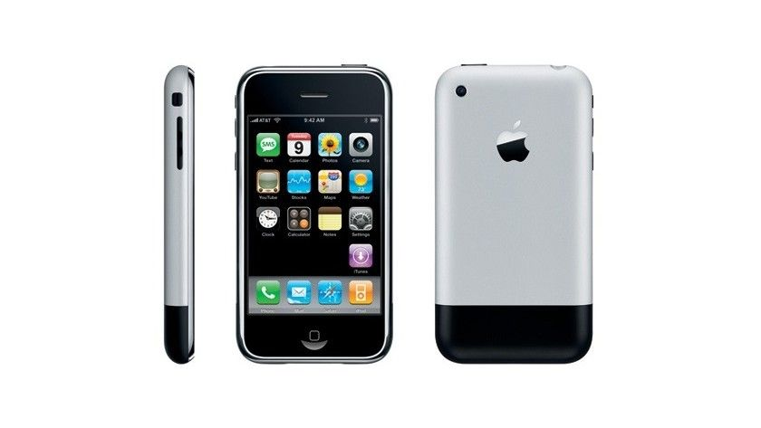
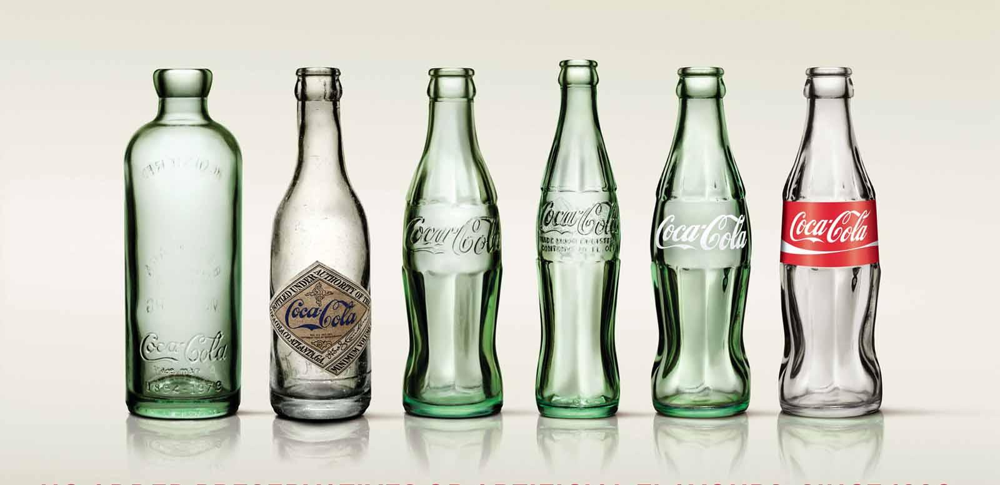
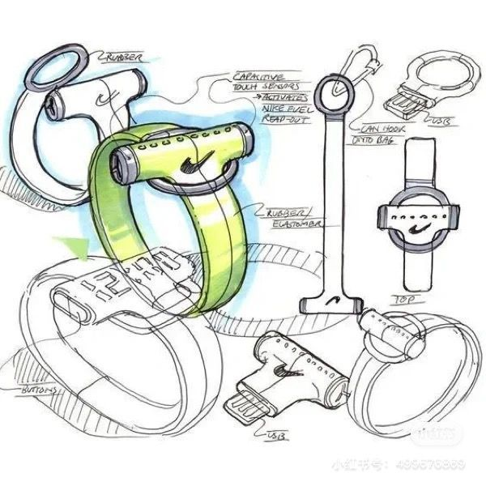
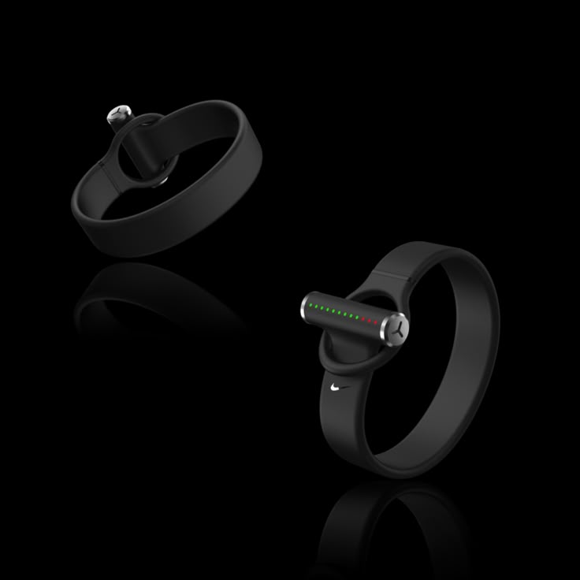
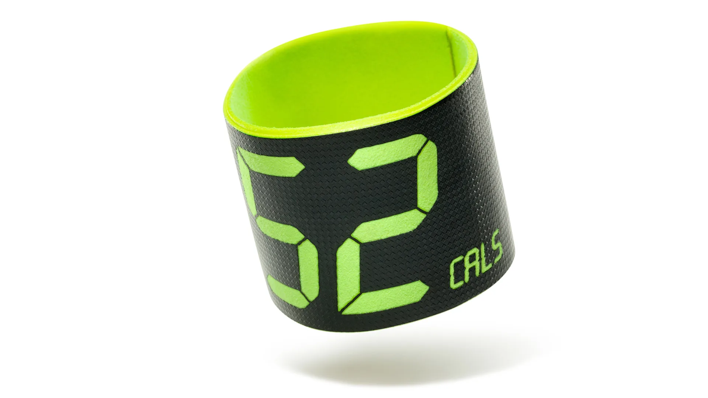
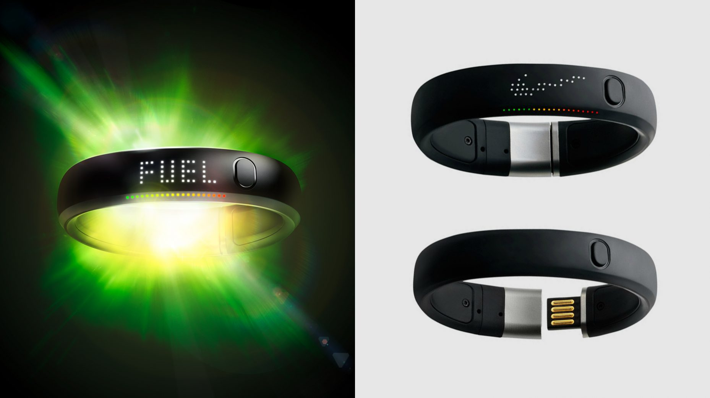
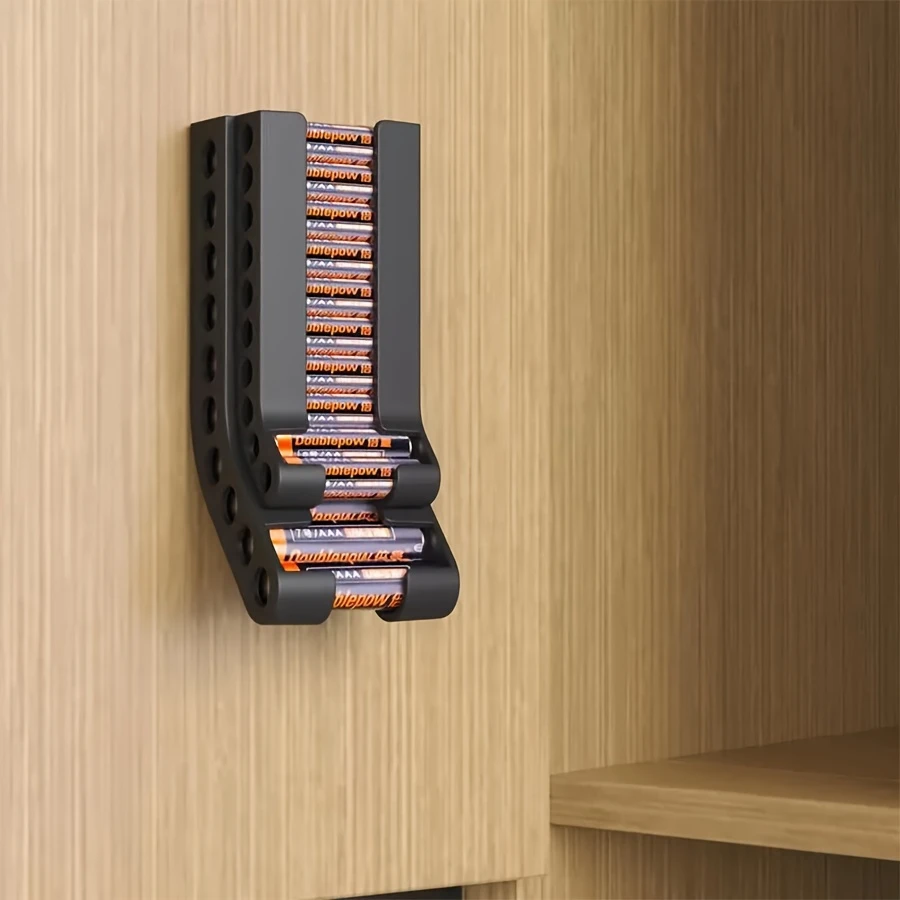
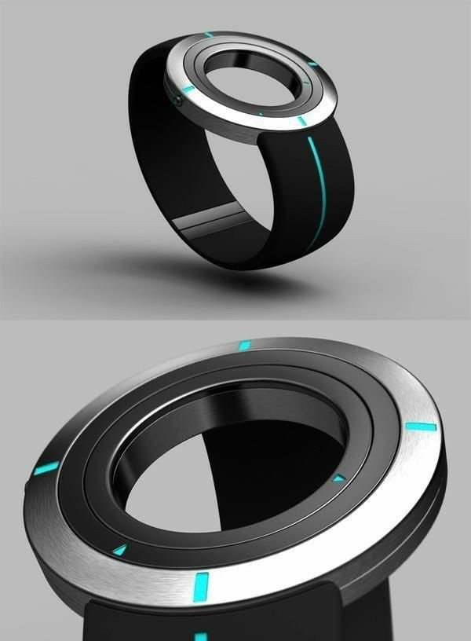
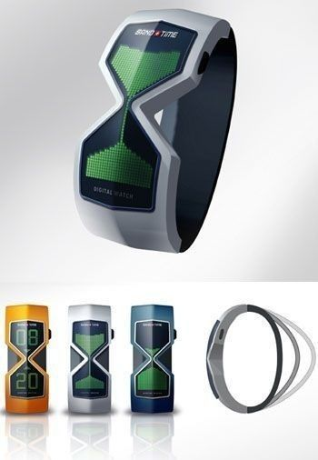

# {{ page.title }}

## Was ist Produktdesign?
https://www.ideenwerkstatt.co.at/was-ist-produktdesign/

- Produktdesign (auch Industriedesign / Industrial Design) beschäftigt sich mit der Gestaltung serieller, industrieller Produkte.
- Produktdesign ist ein Teil der Produktentwicklung.
- Fokus liegt auf Produkten für Massenproduktion, nicht auf Einzelunikaten.
- Unterschieden wird zwischen:
    - **Konsumgütern** (z. B. Haushaltsgeräte, Elektronik, Möbel)
    - **Investitionsgütern** (z. B. Maschinen, Medizintechnik)

--- 

### Beispiele für Produktdesign

#### Konsumgüter:
- Haushaltsgeräte
- Elektronik
- Fahrzeuge
- Möbel

#### Investitionsgüter:
- Produktionsmaschinen
- Medizintechnik
- Nutzfahrzeuge

--- 

### Grundlagen & Leitprinzipien

> **Form follows Function**:
>
> Gestaltung leitet sich aus Funktion ab → intuitive Nutzung
- Designfreiheit variiert stark: z. B. bei technisch geprägten Produkten
- Zusammenarbeit zwischen Design, Technik und Strategie ist essenziell

--- 
### Kernelemente des Produktdesigns

- **Ästhetik**: Form, Farbe, Oberfläche, Proportionen
- **Funktionalität**: Zuverlässigkeit & Benutzerfreundlichkeit
- **Ergonomie**: Anpassung an Nutzerbedürfnisse
- **Nachhaltigkeit**: Recycelbarkeit, langlebiges Design, Ressourcenschonung
- **Technologische Integration**: Einbindung von Innovation (z. B. Smart Devices)

--- 

### Der Designprozess

1. **Forschung & Analyse**: Zielgruppen-, Markt- und Materialforschung
2. **Konzeptentwicklung**: Ideen, Skizzen, Prototypen und Auswahl
3. **Designausarbeitung**: Detailzeichnungen, 3D-Modelle, Materialdefinition
4. **Prototypenbau & Testing**: Nutzerfeedback & Iteration
5. **Produktion & Markteinführung**: Finalisierung, Verpackung, Branding, Marketing

--- 

### Best-Practice-Designs

- **Apple iPhone**: Innovation + zeitloses, intuitives Design

- **VW Käfer**: Einprägsame Form + technische Innovation
- **Coca-Cola-Flasche**: Über 100 Jahre konsistentes, ikonisches Design

https://www.computerwoche.de/article/2751682/10-jahre-happy-birthday-iphone.html

https://www.ideenwerkstatt.co.at/was-ist-produktdesign/

https://www.merkur.de/leben/genuss/coca-cola-flasche-wandel-zeit-5577596.html

---

### Fazit

- Erfolgreiches Produktdesign vereint:
    - Ästhetik
    - Benutzerfreundlichkeit
    - Innovation
    - Nachhaltigkeit
- Leitgedanke: **Form follows Function**
- Interdisziplinäres Arbeiten ist entscheidend (Design, Technik, Strategie)

> ### Beispiel Nike+ Fuelband
>
>  
> https://at.pinterest.com/pin/329114685293989434/
>
>  
> https://at.pinterest.com/pin/329114685293989437/
>
>  
> https://www.fastcompany.com/1682588/the-first-fuelband-prototype-nike-ceo-mark-parker-ever-saw
>
>  
> https://www.whipsaw.com/work/nike-fuelbands
>
> #### Ian Spalter - Productdesigner
>
> <video controls>
>  <source src="./assets/ian_spalter_nikefuelband.mp4" type="video/mp4">
> </video>
> Netflix: Abstrakt - Ian Spalter, Digitales Produktdesign

## Ablauf des Workshops

### 1. Montag
- Einführung
- **Ideenfindung**
    - 6,3,5 er
- **Konzeptentwicklung**:
    - Ideen
        - Sonnenbrille
        - Computermaus
        - Verpackungsdesign
        - Batteriespender, ...
    - Skizzen
    - Konzept
- **Crashkurs Blender Allgemein**

> **Ideen Produktdesign**
>
> 
> https://at.pinterest.com/pin/60798663711345782/
>
> 
>https://at.pinterest.com/pin/60798663711345782/
>
> 
>https://at.pinterest.com/pin/24277285506970174/

### 2. Dienstag
- **Konzeptentwicklung Fortsetzung:**
    - Designstudien
    - Modellierung Blender (Prototypen)

### 3. Mittwoch

- **Crashkurs Blender Materialien Texturierung**
- **Konzeptentwicklung Fortsetzung:**
    - Modellierung Blender
    - Prototypenbau (Vorbereitung 3D-Druck, 3D-Druck)
    - Testdrucke

### 4. Donnerstag
- **Konzeptentwicklung Finalisierung:**  
  Finalisieren, Optimieren Ausdrucke, Drucke starten
  Erstellen Präsentation / Pitch

### 5. Freitag
**Präsentation der Ergebnisse**

## Ressourcen
### Theorie
- https://at.gruender.de/gruendung/produktdesign/
- https://www.ideenwerkstatt.co.at/was-ist-produktdesign/

### Awards
- https://ifdesign.com/de/winner-ranking/winner-overview
- https://www.german-design-award.com/galerie
