# {{ page.title }}

## Was ist Produktdesign?
Zusammenfassung von [www.ideenwerkstatt.co.at/was-ist-produktdesign, 20.11.2024](https://www.ideenwerkstatt.co.at/was-ist-produktdesign/){:target="_blank"}

- Produktdesign (auch Industriedesign / Industrial Design) beschäftigt sich mit der Gestaltung serieller, industrieller Produkte.
- Produktdesign ist ein Teil der Produktentwicklung.
- Fokus liegt auf Produkten für Massenproduktion, nicht auf Einzelunikaten.
- Unterschieden wird zwischen:
    - **Konsumgütern** (z. B. Haushaltsgeräte, Elektronik, Möbel)
    - **Investitionsgütern** (z. B. Maschinen, Medizintechnik)

--- 

### Beispielhafte Bereiche für Produktdesign

#### Konsumgüter:
- Haushaltsgeräte
- Elektronik
- Fahrzeuge
- Möbel

#### Investitionsgüter:
- Produktionsmaschinen
- Medizintechnik
- Nutzfahrzeuge

--- 

### Grundlagen & Leitprinzipien

> #### Form follows Function
>
> - Gestaltung leitet sich aus Funktion ab &rarr; intuitive Nutzung
> - Aus der Form alleine muss der Rückschluss auf Funktion bzw. Zweck möglich sein 
> &rarr; **Intuitives Design**

> #### Designfreiheit
>
> - Die Designfreiheit ist von der Art des Produkts abhängig 
> - Bei technisch geprägte Produkten Konzentration auf Funktion und Formgebung

> #### Interdisziplinäre Basisfähigkeiten
> Design steht nicht alleine da. 
> Zusammenarbeit ist essenziell: 
> - Design
> - Technologie
> - Produktionsprozess
> - Marketingstrategie
> - ...

--- 
### Kernelemente des Produktdesigns

- **Ästhetik**: Form, Farbe, Oberfläche, Proportionen
- **Funktionalität**: Zuverlässigkeit & Benutzerfreundlichkeit
- **Ergonomie**: Anpassung an Nutzerbedürfnisse
- **Nachhaltigkeit**: Recycelbarkeit, langlebiges Design, Ressourcenschonung
- **Technologische Integration**: Einbindung von Innovation (z. B. Smart Devices)

--- 

### Der Designprozess

1. **Forschung & Analyse**: Zielgruppen-, Markt- und Materialforschung
2. **Konzeptentwicklung**: Ideen, Skizzen, Prototypen und Auswahl
3. **Designausarbeitung**: Detailzeichnungen, 3D-Modelle, Materialdefinition
4. **Prototypenbau & Testing**: Nutzerfeedback & Iteration
5. **Produktion & Markteinführung**: Finalisierung, Verpackung, Branding, Marketing

--- 

### Best-Practice-Designs

#### Apple iPhone
Innovation + zeitloses, intuitives Design
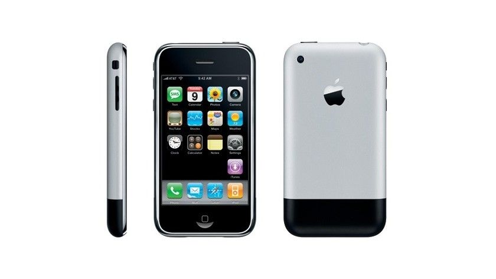
[10 Jahre: Happy Birthday iPhone, www.computerwoche.de, 09.01.2017](https://www.computerwoche.de/article/2751682/10-jahre-happy-birthday-iphone.html){:target="_blank"}

#### VW Käfer
Einprägsame Form + technische Innovation

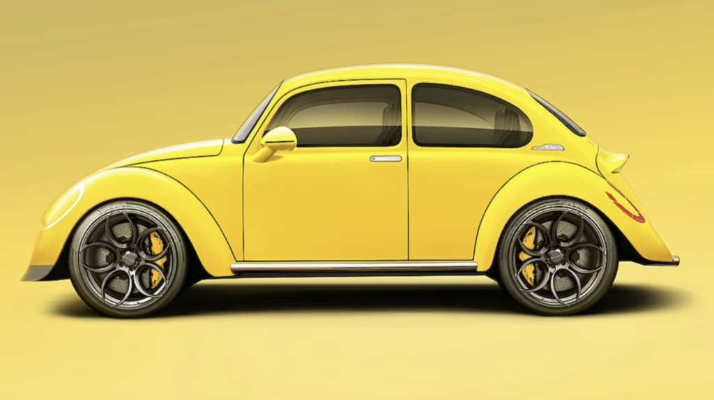
[www.ideenwerkstatt.co.at/was-ist-produktdesign, 20.11.2024](https://www.ideenwerkstatt.co.at/was-ist-produktdesign/){:target="_blank"}

#### Coca-Cola-Flasche
Über 100 Jahre konsistentes, ikonisches Design

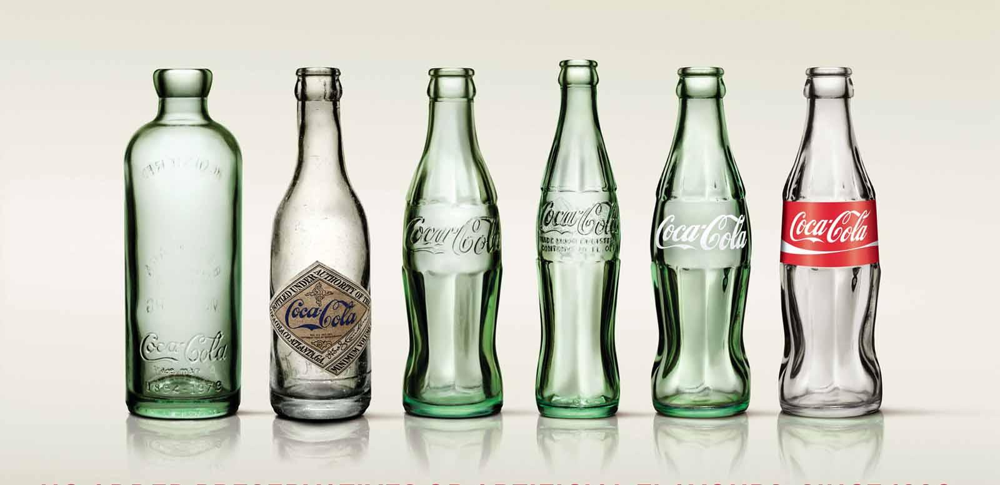
[www.merkur.de/leben, 01.10.2015](https://www.merkur.de/leben/genuss/coca-cola-flasche-wandel-zeit-5577596.html){:target="_blank"}

---

### Fazit

- Erfolgreiches Produktdesign vereint:
    - Ästhetik
    - Benutzerfreundlichkeit
    - Innovation
    - Nachhaltigkeit
- Leitgedanke: **Form follows Function**
- Interdisziplinäres Arbeiten ist entscheidend (Design, Technik, Strategie)

## Beispiel Nike+ Fuelband

#### Ideen und Skizzen
 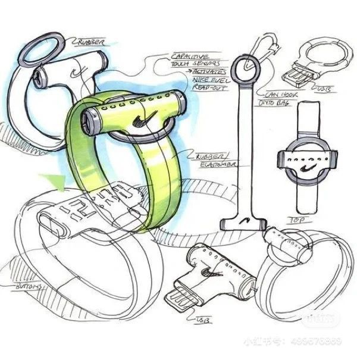 
 [大V柴犬, pinterest.com, 22.06.2025](https://at.pinterest.com/pin/329114685293989434/){:target="_blank"}

#### Prototypen
 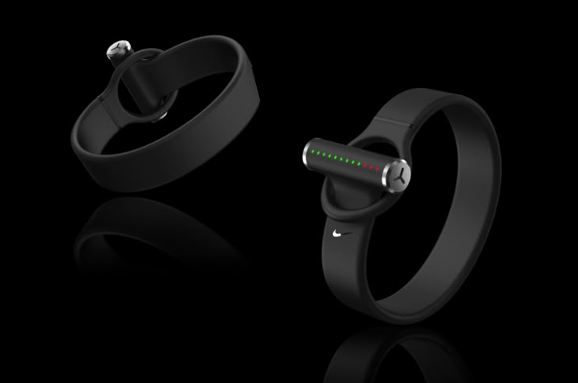 
  [Will Carey, pinterest.com, 22.06.2025](https://at.pinterest.com/pin/329114685293989437/){:target="_blank"}

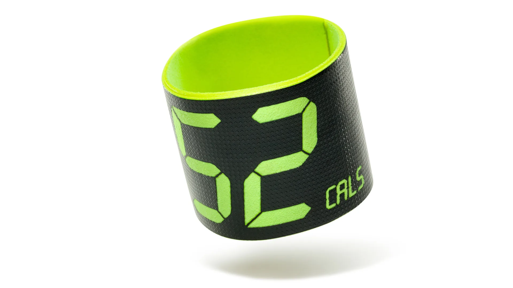 
 [The First FuelBand Prototype Nike CEO Mark Parker Ever Saw, Austin Carr, www.fastcompany.com, 03.08.2013](https://www.fastcompany.com/1682588/the-first-fuelband-prototype-nike-ceo-mark-parker-ever-saw){:target="_blank"}

#### Finales Produkt

 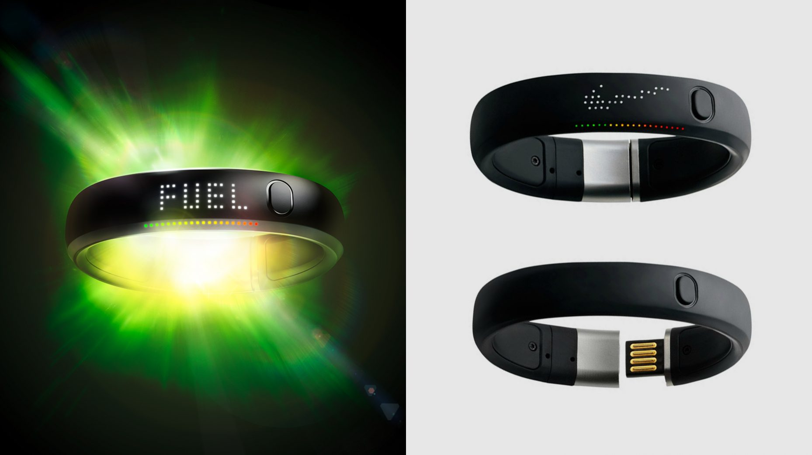 
 [Nike Fuelbands, https://www.whipsaw.com/work/nike-fuelbands, 22.06.2025](https://www.whipsaw.com/work/nike-fuelbands){:target="_blank"}

#### Ian Spalter - Productdesigner

 <video width="832px" style="max-width:100%;" controls>
  <source src="./img/ian_spalter_nikefuelband.mp4" type="video/mp4">
 </video>
 Netflix: Abstrakt - Ian Spalter, Digitales Produktdesign

## Ablauf des Workshops

### 1. Montag
- Einführung
- **Ideenfindung**
    - 6,3,5 er
- **Konzeptentwicklung**:
    - Ideen
        - Sonnenbrille
        - Computermaus
        - Verpackungsdesign
        - Batteriespender, ...
    - Skizzen
    - Konzept
- **Crashkurs Blender Allgemein**

### 2. Dienstag
- **Konzeptentwicklung Fortsetzung:**
    - Designstudien
    - Modellierung Blender (Prototypen)

### 3. Mittwoch

- **Crashkurs Blender Materialien Texturierung**
- **Konzeptentwicklung Fortsetzung:**
    - Modellierung Blender
    - Prototypenbau (Vorbereitung 3D-Druck, 3D-Druck)
    - Testdrucke

### 4. Donnerstag
- **Konzeptentwicklung Finalisierung:**  
  Finalisieren, Optimieren Ausdrucke, Drucke starten
  Erstellen Präsentation / Pitch

### 5. Freitag
**Präsentation der Ergebnisse**

## Workshop - Aufgaben

> ### Konzeptentwicklung - Part 1: Ideenfindung
> 
> 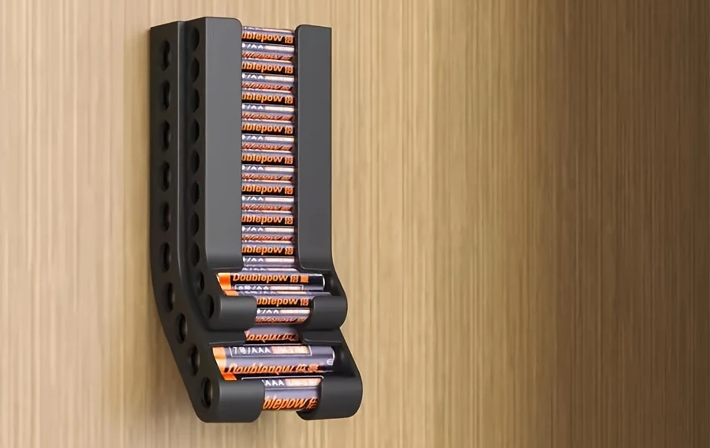 
> [Batterie-Aufbewahrungsorganisator, www.temu.com, 22.06.2025](https://www.temu.com/goods.html?_bg_fs=1&goods_id=601099541534090&_p_rfs_rd=1&refer_page_name=kuiper_default){:target="_blank"}
> 
> 
> 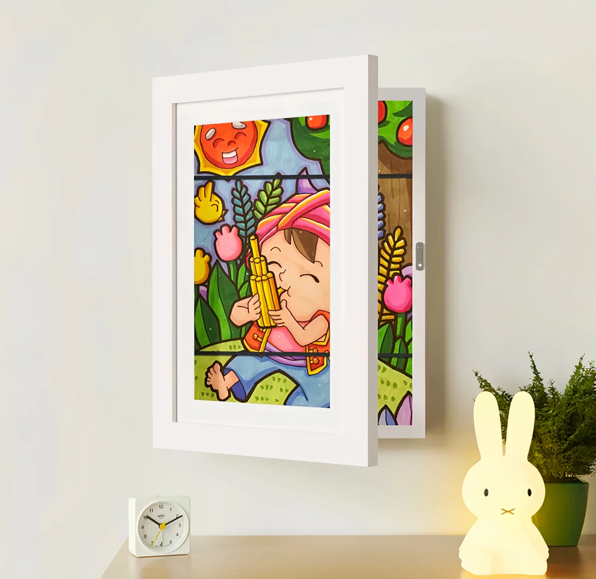 
> [Memory Frame, shopvalcero.com/, 22.06.2025](https://shopvalcero.com/de/products/memory-frame-kids-drawing-frame){:target="_blank"}

> ### Konzeptentwicklung - Part 2: Skizzen und Konzept
> 
>
>  
> [6 TIPS to Draw Better Sketches, youtube.com, 22.06.2025](https://www.youtube.com/watch?v=NPIFH8Xzbr0){:target="_blank"}
> 
> 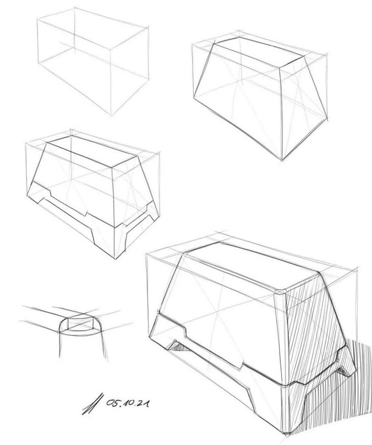 
> [SHADES, pinterest.com, 22.06.2025](https://at.pinterest.com/pin/22799541856448256/){:target="_blank"}
>
> 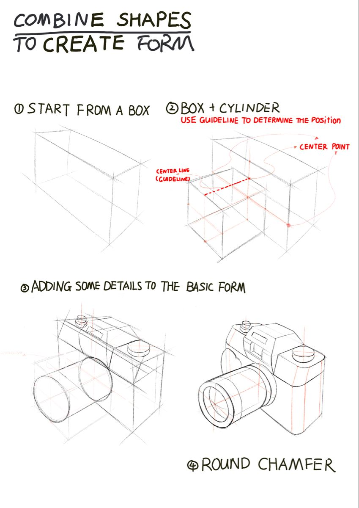 
> [Wang, pinterest.com, 22.06.2025](https://at.pinterest.com/pin/31032684928627916/){:target="_blank"}

> ### Konzeptentwicklung - Part 3: Zeichnung Designstudie 
>
> 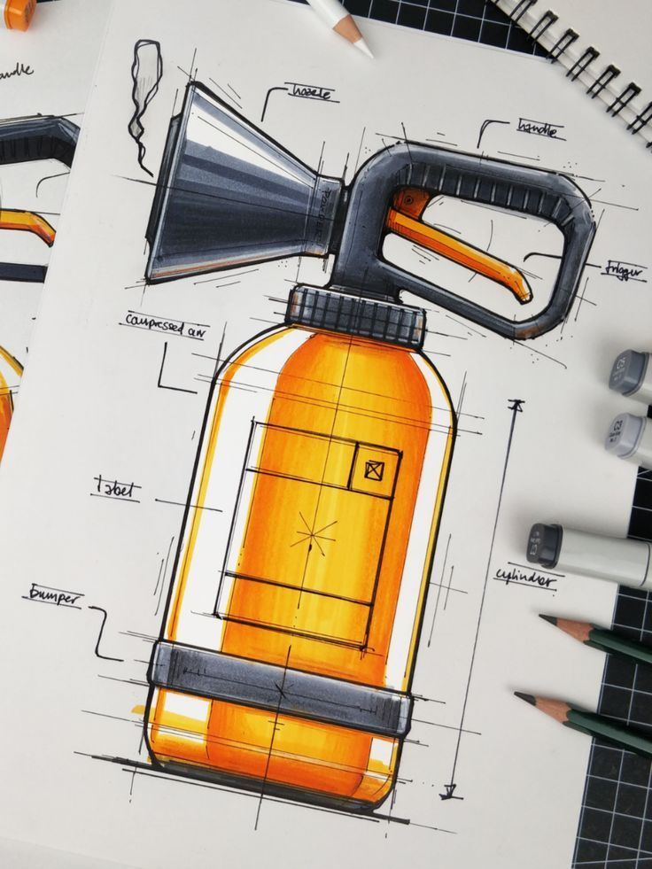 
> [@marius.kindler, pinterest.com, 22.06.2025](https://at.pinterest.com/pin/8373949302428554/){:target="_blank"}
>

> ### Designausarbeitung - Part 1: 3D Modellierung 
> 
> 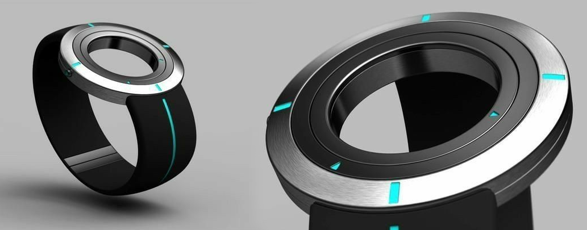 
> [Freylia RK, pinterest.com, 22.06.2025](https://at.pinterest.com/pin/60798663711345782/){:target="_blank"}
>

> ### Designausarbeitung - Part 2: 3D Texturierung
>
> 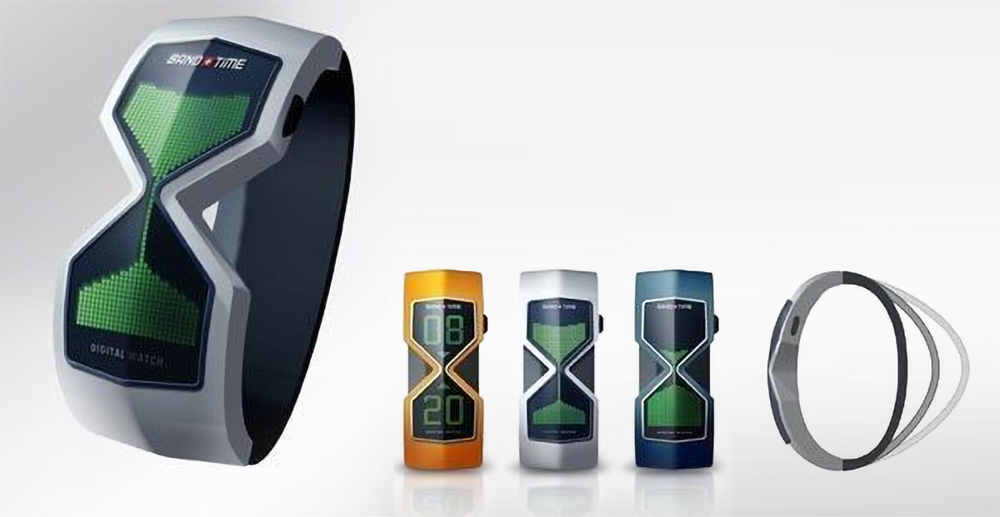
>[Tux Man, pinterest.com, 22.06.2025](https://at.pinterest.com/pin/24277285506970174/){:target="_blank"}

> ### Prototyping - Part 1: 3D Prototypendruck

> ### Prototyping - Part 2: Feedback- und Iterationsschleife

## Ressourcen

### Wireless Mouse Kit Collection
- [Wireless Mouse Kit Collection, store.bambulab.com, 22.06.2025](https://eu.store.bambulab.com/de/products/wireless-mouse-components-kit-002){:target="_blank"}
- [Wireless Mouse Kit Collection, Assembly Guide, .pdf](./assets/Wireless Mouse Components Kit-002 Assembly Guide.pdf){:target="_blank"}
- [Wireless Mouse Kit Collection, 3D Printing Mouse Design Guidelines, .pdf](./assets/Wireless Mouse Components Kit-002 Design Guide.pdf){:target="_blank"}
- [makerworld.com, 3D Modelle für Wireless Mouse Kit Collection](https://makerworld.com/de/models/13716-wireless-mouse-002){:target="_blank"}

### Theorie
- [at.gruender.de/gruendung/produktdesign, 22.06.2025](https://at.gruender.de/gruendung/produktdesign/){:target="_blank"}
- [www.ideenwerkstatt.co.at/was-ist-produktdesign, 22.06.2025](https://www.ideenwerkstatt.co.at/was-ist-produktdesign/){:target="_blank"}

### Awards
- [www.ifdesign.com/de/winner-ranking/winner-overview, 22.06.2025](https://ifdesign.com/de/winner-ranking/winner-overview){:target="_blank"}
- [www.german-design-award.com, 22.06.2025](https://www.german-design-award.com/galerie){:target="_blank"}
