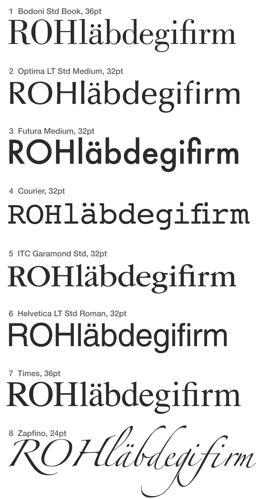
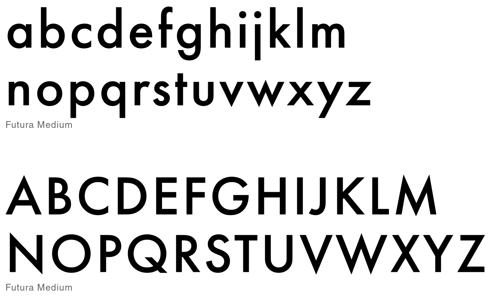

# {{ page.title }}

## Theoretische Grundlagen: Schriftanalyse & Mikrotypografie

Um Schriften fachgerecht analysieren und einsetzen zu können, ist das Verständnis der mikrotypografischen Details und des Liniensystems essenziell.

### 1. Anatomie der Buchstaben
Jeder Buchstabe besteht aus spezifischen Formelementen, die seinen Charakter bestimmen.

* **Stamm & Haarstrich:** Der Stamm ist der senkrechte Hauptstrich; der Haarstrich ist der dünnere Nebenstrich (besonders ausgeprägt bei Antiqua-Schriften).
* **Serifen:** Die Endstriche an den Buchstaben. Man unterscheidet nach Form (eckig, rund, fein) und Typ (Kopf- oder Fußserife).
* **Punze:** Der teilweise oder ganz umschlossene Innenraum eines Buchstabens (z. B. das Innere eines „o“).
* **Schattenachse:** Die Neigung der Rundungen. Eine schräge Achse deutet oft auf einen humanistischen Ursprung hin, eine vertikale Achse auf eine konstruierte Schrift.

### 2. Das typografische Liniensystem
Schriften werden auf einem System von horizontalen Linien aufgebaut, die das Schriftbild ordnen.

* **Grundlinie (Schriftlinie):** Die Standlinie, auf der alle Buchstaben ohne Unterlängen ruhen.
* **x-Höhe (Mittellänge):** Die Höhe der kleinen Buchstaben (Gemeinen) wie „x“, „a“ oder „e“.
* **Versalhöhe:** Die Höhe der Großbuchstaben (Versalien).
* **Oberlänge:** Der Teil von Kleinbuchstaben (z. B. „b“, „d“, „h“), der über die x-Höhe hinausragt.
* **Unterlänge:** Der Teil von Kleinbuchstaben (z. B. „g“, „p“, „y“), der unter die Grundlinie reicht.

### 3. Schriftenmischung und Kontrast
Beim Mischen von Schriften gilt oft die Regel „Harmonie durch Kontrast“.

* **Formkontrast:** Mischen von Schriften aus unterschiedlichen Gruppen (z. B. eine Antiqua mit einer Grotesk).
* **Strichstärkenkontrast:** Kombination von sehr fetten mit sehr feinen Schnitten.
* **Größenkontrast:** Klare Differenzierung zwischen Überschriften und Fließtext.

## Aufgabenstellungen

> ### Aufgabe 1: Systematische Schriftanalyse
> {: .assignment }
> 
> Wähle aus den untenstehenden Schriften drei aus und sie unter Verwendung der gelernten Fachbegriffe (Strichstärke, Serifenform, Schattenachse, Linienverhältnisse):
> 

> ### Aufgabe 2: Digitale Analyse
> {: .assignment }
> 
> Untersuche eine moderne Website (z. B. Apple oder Airbnb) mit Browser-Tools (Inspect Element / WhatFont):
> * Welche Schriftfamilien werden verwendet?
> * Wie ist das Verhältnis von `font-size` zu `line-height` im Fließtext?
> * Handelt es sich um einen **Variable Font** (Suche nach `font-variation-settings`)?

> ### Aufgabe 3: Konstruktions-Skizze
> {: .assignment }
> 
> Skizziere deinen Vor- und Nachnamen zweizeilig in einer simulierten **48pt Futura** mit **120% Zeilenabstand**.
> Trage folgende Größen in die Skizze ein:
> * Versalhöhe, x-Höhe, Grundlinie
> * Oberlänge, Unterlänge
> * Zeilenabstand, Durchschuss, Schriftgröße (Kegelhöhe)
>
> Beantworte die Fragen und halte die Recherche mit Screenshots und Interpretation schriftlich fest.

> ### Aufgabe 4: Schriftenmischung (Kontrast-Prinzip)
> {: .assignment }
> 
> Die Wahl der richtigen Schrift will wohl überlegt sein. Viele Faktoren wie die Zielgruppe oder die Anforderungen, die sich aus der Art des Mediums ergeben, müssen berücksichtigt werden.
>
> Folgende Anforderungen an eine Schrift sind gegeben:
>
> 1. Um jeden Preis auffallen
> 2. Seriosität vermitteln
> 3. Wenig Platz brauchen
> 4. In einem Kinderbuch verwenden
> 5. Auch unter schlechten Bedingungen lesbar
>
> Erstelle ein Indesign Dokument. Lege für jede der Anforderungen einen Blindtext in der Schriftgröße 12 Punkt an, der über mindestens 5 Zeilen geht. Finde eine jeweils passende Schrift, und schreibe am Ende den Name der verwendeten Schrift dazu. Diskutiere die Schriftwahl mit einem Partner oder einer Partnerin.

