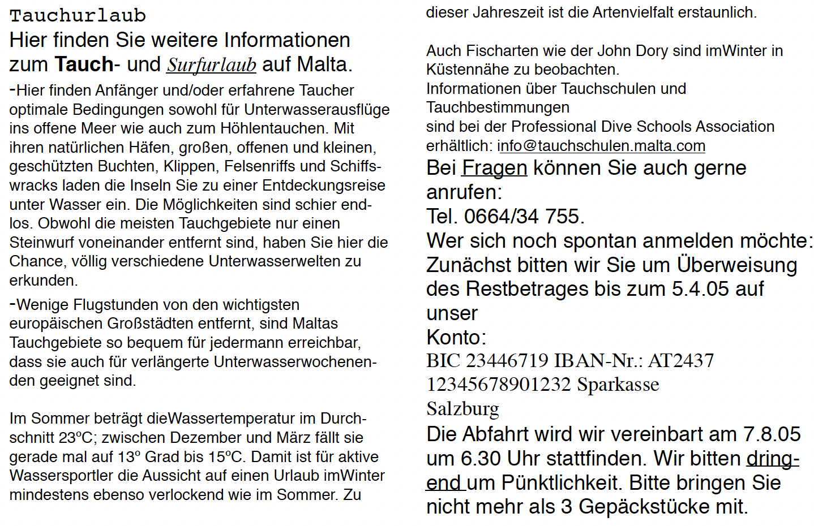

# {{ page.title }}

## Theoretische Grundlagen: Makrotypografie & Advertorials

In dieser Aufgabe verlassen wir die Ebene der reinen Zeichensetzung und widmen uns dem Layout (Makrotypografie). Ziel ist die Erstellung eines **Advertorials** – einer Werbeanzeige, die optisch wie ein redaktioneller Beitrag gestaltet ist.

### 1. Das Rastersystem (Grid System)
Ein Rastersystem ist das unsichtbare Gerüst einer Seite. Es hilft, Texte, Bilder und Grafiken geordnet und professionell zu positionieren. 

* **Spaltenraster:** Teilt die Seite vertikal auf. Gängig sind 3-Spalten-Raster für Zeitschriften oder 12-Spalten-Raster für flexibles Webdesign.
* **Modulares Raster:** Fügt horizontale Linien hinzu, um „Zellen“ zu erstellen, was eine noch präzisere Anordnung von Bildern und Infoboxen ermöglicht.

### 2. Gestaltungselemente im Advertorial
Ein Advertorial nutzt typische redaktionelle Elemente, um Glaubwürdigkeit und Lesefluss zu erzeugen:

* **Headline & Lead-Text:** Eine prägnante Überschrift und ein einführender Absatz, der neugierig macht.
* **Fließtext:** Gut lesbar gesetzter Text, oft im Mehrspaltensatz organisiert.
* **Bilder & Bildunterschriften:** Visuelle Anker, die Informationen transportieren und die Stimmung unterstützen.
* **Infoboxen & Kontakt:** Optisch abgesetzte Elemente für Fakten, Preise oder Adressdaten.

### 3. Mikrotypografische Präzision
Auch in komplexen Layouts müssen die Satzregeln für Zahlen, Einheiten, Datumsangaben und Zeichensetzung (Anführungszeichen, Gedankenstriche) zwingend eingehalten werden, um die professionelle Anmutung zu wahren.

## Die Aufgabe: „Tauchparadies Malta“

Basierend auf dem bereitgestellten Text über Tauchurlaube auf Malta soll ein professionelles, einseitiges Advertorial (DIN A4) erstellt werden.

> ### Aufgabe 1: Mikrotypografische Textaufbereitung
> {: .assignment }
> 
> Korrigiere den Rohtext unter Anwendung der korrekten Satzregeln:
> * **Zahlen & Einheiten:** Korrekte Gliederung und Abstände bei Temperaturen (z. B. 23 °C) und Uhrzeiten (6.30 Uhr).
> * **Bankdaten:** Gliederung von BIC und IBAN in leserliche Vierergruppen.
> * **Satzzeichen:** Verwendung von korrekten Anführungszeichen („ “), Gedankenstrichen (–) statt Bindestrichen bei Einschüben und korrekten Apostrophen.

> ### Aufgabe 2: Bildrecherche & Vorbereitung
> {: .assignment }
> 
> Suche passendes Bildmaterial zum Thema „Tauchen auf Malta“. 
> * Wähle ein **Key-Visual** (Hauptbild) und mindestens zwei unterstützende Detailbilder aus.
> * Achte auf die Bildrechte und eine ausreichende Auflösung (300 dpi) für den Druck.

> ### Aufgabe 3: Layout Version A (Klassisch Redaktionell)
> {: .assignment }
> 
> Erstelle ein Layout basierend auf einem **3-Spalten-Raster**.
> * Setze den Fließtext in einen klassischen **Blocksatz** mit aktivierter Silbentrennung.
> * Integriere die Informationen der „Professional Dive Schools Association“ als separate **Infobox**.
> * Platziere die Kontakt- und Kontodaten in einem dezenten **Serviceblock** am Ende der Seite.

> ### Aufgabe 4: Layout Version B (Modern & Dynamisch)
> {: .assignment }
> 
> Erstelle eine zweite Version basierend auf einem **12-Spalten-Raster** oder einem **modularen Raster**.
> * Experimentiere mit asymmetrischen Anordnungen: Bilder können über mehrere Spalten ragen oder den Rand anschnittgefährdet berühren.
> * Verwende für den Lead-Text einen **Flattersatz**.
> * Hebe die Kontaktbox optisch stärker hervor (z. B. durch eine Hintergrundfarbe, Linien oder eine andere Typografie).

> ### Aufgabe 5: Export & Reflexion
> {: .assignment }
> 
> Exportiere beide Versionen als druckfähige PDFs (inkl. Beschnittzugabe).
> * Vergleiche beide Entwürfe: Welches Rastersystem unterstützt die Leserführung im konkreten Fall besser?
> * Prüfe in der Endkontrolle: Sind unerwünschte Umbruchfehler wie Hurenkinder oder Schusterjungen entstanden?