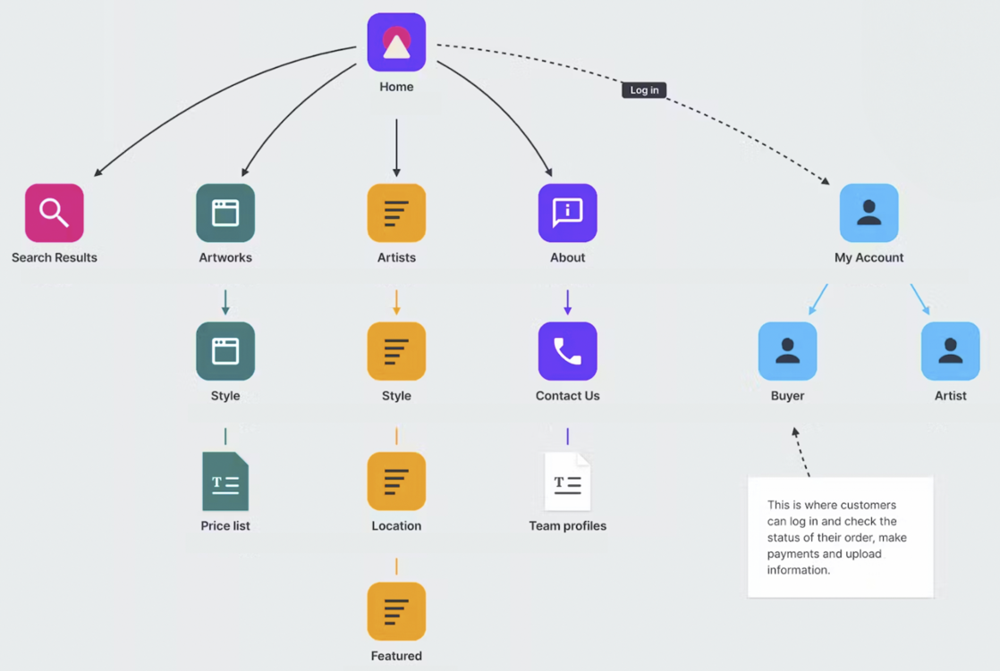
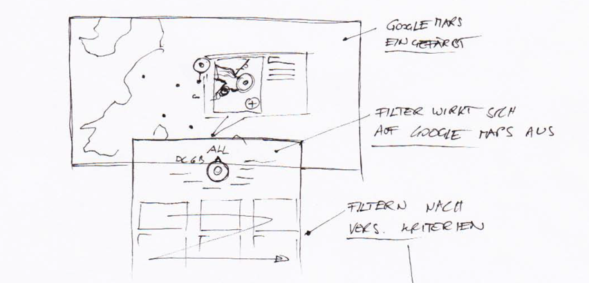

## Aufgabenstellung 1. Block
Dauer: 1 Laborblock (4h) + Fertigstellen der Aufgaben

[99designs.de](https://99designs.de/blog/web-digitales-design/was-ist-webdesign){:target="_blank"}

### 1. Erster Kundenkontakt, Kickoff-Meeting und Besprechungsprotokoll

> #### Aufgabe: Kickoff-Meeting und Besprechungsprotokoll
> Ein Kunde lädt zu einem Pitch ein und schickt [untenstehendes E-Mail](#e-mail-anfrage-durch-den-kunden) an deine Agentur.
>
> Bereite Fragen für das erste Treffen vor, damit anschließend folgende Punkte klar sind, und ein Konzept, ein Angebot und ein erstes Design erstellt werden können.
>
> - Funktionelle Anforderungen
> - Inhaltliche Anforderungen
> - Zielgruppen
> - Zeitplan
> - Weitere Vorgehensweise
> - ...
>
>Führe das Gespräch anhand der vorbereiteten Fragen durch und halte die Ergebnisse in einem [Besprechungsprotokoll](#beispielhafte-struktur-eines-besprechungsprotokolls) schriftlich fest.

---

#### E-Mailanfrage Variante – Fitness & Gesundheit

**Betreff:** Neuer Internetauftritt für Fitnessstudio

Hallo,
mein Name ist **Michael Brandstätter** vom **FitZone Gym**. Wir möchten unsere Website erneuern – sie soll moderner wirken und unsere Mitglieder besser ansprechen.
Könnten Sie uns dazu beraten?

Mit freundlichen Grüßen
Michael Brandstätter
FitZone Gym
[m.brandstaetter@fitzone.at](mailto:m.brandstaetter@fitzone.at)
+43 699 1234567

---

#### E-Mailanfrage Variante – Gastronomie

**Betreff:** Anfrage zur Erstellung einer neuen Website

Sehr geehrte Damen und Herren,
ich bin **Laura Ebner**, Inhaberin des **Café Sonnendeck**. Unsere aktuelle Seite ist etwas in die Jahre gekommen, und wir überlegen, sie komplett neu zu gestalten.
Ich freue mich über einen Terminvorschlag zur Besprechung.

Viele Grüße
Laura Ebner
Café Sonnendeck
[laura.ebner@sonnendeck.at](mailto:laura.ebner@sonnendeck.at)
+43 512 556677

---

#### E-Mailanfrage Variante – Kreativwirtschaft / Mode

**Betreff:** Unterstützung für Mode-Label-Website gesucht

Guten Tag,
mein Name ist **Nina Kovacs** von **Urban Threads**, einem kleinen Modelabel aus Wien. Wir möchten unseren Online-Auftritt überarbeiten, wissen aber noch nicht genau, in welche Richtung es gehen soll.
Könnten Sie uns bei der Planung unterstützen?

Beste Grüße
Nina Kovacs
Urban Threads
[nina@urbanthreads.at](mailto:nina@urbanthreads.at)
+43 1 2223344

---

#### E-Mailanfrage Variante – Hotellerie/Tourismus

**Betreff:** Website-Überarbeitung für Boutiquehotel

Sehr geehrte Damen und Herren,
mein Name ist **Anna Leitner** vom **Hotel Alpenhof**. Wir möchten unseren Webauftritt modernisieren und besser für unsere Gäste nutzbar machen.
Könnten wir einen Termin vereinbaren, um Vorgehen und Möglichkeiten zu besprechen?

Mit freundlichen Grüßen
Anna Leitner
Hotel Alpenhof
[anna.leitner@alpenhof.at](anna.leitner@alpenhof.at)
+43 512 123456

----

#### Beispielhafte Struktur eines Besprechungsprotokolls
- Allgemeine Informationen
    - Thema z.B.: Ersttermin Relaunch Website www.markus-huber.at
    - Datum, Ort z.B.: 23.10.2020, HTL Braunau
    - Anwesende z.B.: Max Mustermann, Firma
- Zusammenfassung
    - z.B.: Besprochen wurden die Anforderungen an die Website, die im Rahmen des Relaunches von
      www.markus-huber.at erfüllt werden sollen.
- Behandelte Themen, z.B.:
    - Funktionelle Anforderungen
    - Inhaltliche Anforderungen
    - Zielgruppen
    - Zeitplan
- Weitere Vorgehensweise: Konkrete Schritte
    - **Wer** macht **was** bis **wann**?

### 2. Inhaltliches Konzept - Sitemap
> #### Aufgabe: Sitemap
> Erstelle eine Sitemap des Webauftritts und stelle ihn in grafisch ansprechender Form dar.

#### Allgemeine Informationen zur Sitemap

Eine Sitemap ist eine strukturierte Darstellung aller Seiten und Unterseiten einer Website, die die Hierarchie und die Verbindungen zwischen den Seiten visualisiert. 

Sie dient als Navigationshilfe für Benutzer und Suchmaschinen, um den Aufbau der Website besser zu verstehen und effizient durch sie zu navigieren und ist auch ein wichtiger Anhaltspunkt für die Angebotserstellung.

Eine Sitemap kann in Form einer Grafik, Tabelle aber auch als einfache hierarchische Liste dargestellt werden:

- Home
- About us
- Referenzen
  - Endkunden
  - Firmenkunden
  - Partner
- Kontakt
  - ...

Beispielhafte Sitemap, [milanote.com](https://milanote.com/templates/marketing/site-map)

### 3. Funktionelles Konzept - Featurelist

> #### Aufgabe: Featurelist
> Fasse die wichtigsten Features in einer Featurelist zusammen. Konzentriere dich dabei auf folgende Kategorien:
> - **Inhalte** (Texte, Bilder, Videos, ...)
> - **Interaktive Elemente** (Kontaktformulare, Bildergalerie, ...)

#### Allgemeine Informationen zur Featurelist
Die **Featurelist** bezieht sich auf eine detaillierte Liste von Funktionen und Eigenschaften, die eine Website oder Webanwendung haben soll. 

Beispielhafte Kateogorien können sein:

1. Design-Features
2. Navigation und Benutzererfahrung (UX)
3. Inhalte
4. Interaktive Elemente
5. SEO (Suchmaschinenoptimierung)
6. Technische Aspekte
7. Integration Dritter
8. Zugänglichkeit
9. Analytik und Reporting
10. Wartung und Support

Jede dieser Kategorien kann spezifischere Features und Details enthalten, je nach den individuellen Bedürfnissen und Zielen des Projekts. Eine gut ausgearbeitete **Featurelist** hilft nicht nur bei der Planung, sondern auch bei der Kommunikation zwischen dem Webdesigner oder der Agentur und dem Kunden, um sicherzustellen, dass alle Parteien die Anforderungen und Erwartungen klar verstehen.

### 4. Erstes grafisches Konzept - Scribbles

> #### Aufgabe: Scribbles
> Erstelle mehrere Scribbles für die wichtigsten Seiten und Inhaltselemente.
> Diskutiere Sie anschließend mit deinem Partner oder deiner Partnerin.

#### Allgemeine Informationen zu Scribbles
Ein Scribble ist eine grobe, handgezeichnete Skizze einer Webseite, die dazu dient, die grundlegenden Designideen, Layouts und Platzierungen von Elementen wie Texten, Bildern und Links visuell darzustellen. 

Es ist ein frühzeitiger Schritt im Designprozess, der hilft, Konzepte schnell zu visualisieren und zu kommunizieren, bevor detaillierte Designarbeiten beginnen.

Beispielhaftes Scribble einer Detailseite

## Abgabe
Beginne ein Webdesign-Portfolio mit folgenden Inhalten:
- **Deckblatt**
- **Besprechungsprotokoll** Inhalt wie angegeben, Umfang ca. 1 Seite A4
- **Inhaltliches Konzept**
  - **Sitemap** in grafisch ansprechender Form
  - **Featurelist** funktionelle Anforderung an die Website in Form einer Liste
- **Grafisches Konzept** 
  - **Scribbles** aufbereitete Fotos der Scribbles auf Papier oder Screenshots der Scribbles inklusive der Erläuterungen, was bezweckt werden soll.