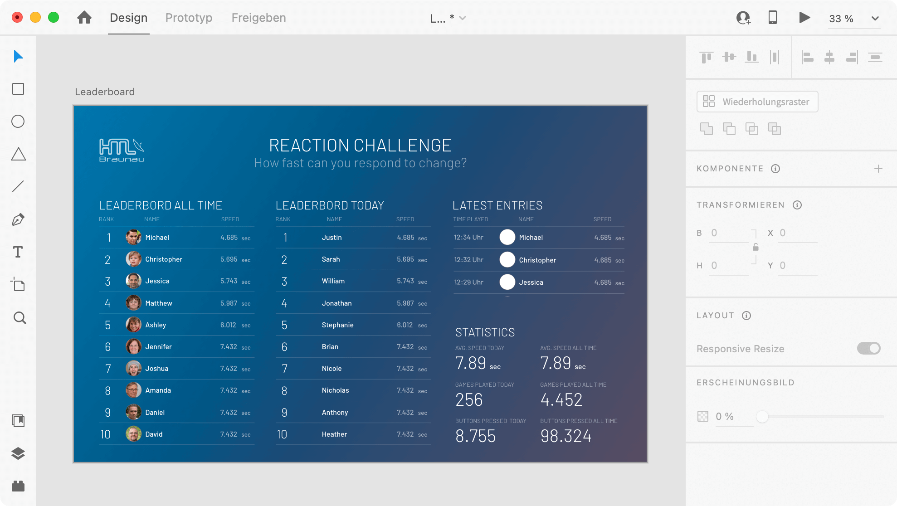
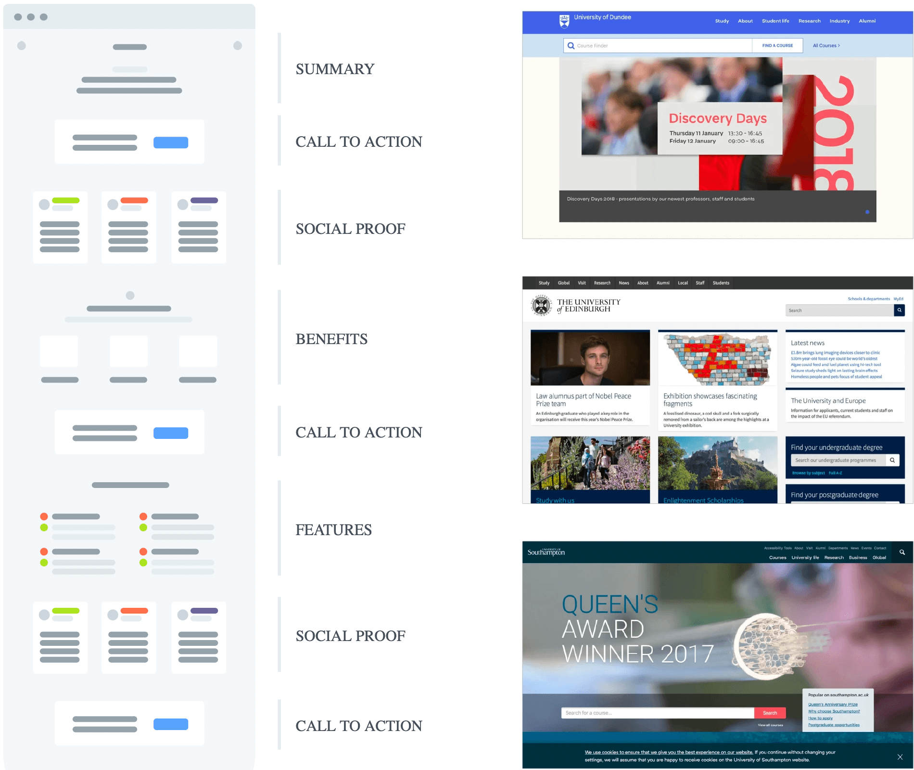

## Aufgabenstellung 2. Block
Dauer: 1 Laborblock (1x4h) + Fertigstellen der Aufgaben

Benutzeroberfläche von Adobe XD

### 5. Umsetzen des grafischen Konzepts

> #### Aufgabe: Erstellen eines grafischen Konzepts in Adobe XD
> Setze die erstellten Scribbles als Design in Adobe XD um. Beginne dabei mit der Startseite. Erst wenn das Design der Startseite soweit passt, werden die weiteren Seiten hinzugefügt.
> 
> Was eine gute Startseite ausmacht, ist in dem Artikel [Smashing Magazine - How To Create A Compelling Landing Page](https://www.smashingmagazine.com/2020/04/landing-page-design/) gut zusammengefasst. Hier ist auch eine mögliche Struktur der Startseite (Screenshot untenstehend) angegeben.

 
#### Beispielhafte Startseiten

[Smashing Magazine - How To Create A Compelling Landing Page](https://www.smashingmagazine.com/2020/04/landing-page-design/)

#### Adobe XD Tutorials

Für Adobe XD gibt es eine Reihe [sehr guter Tutorials](https://helpx.adobe.com/at/xd/tutorials.html) von Adobe:

* Empfehlung: [Kurzanleitung für Adobe XD - helpx.adobe.com](https://helpx.adobe.com/at/xd/how-to/make-prototype.html){:target="_blank"}
* [Zeichenflächen hinzufügen und bearbeiten - helpx.adobe.com](https://helpx.adobe.com/at/xd/how-to/add-and-edit-artboards.html){:target="_blank"}
* [Mit Wiederholungsrastern wiederkehrende Elemente erstellen - helpx.adobe.com](https://helpx.adobe.com/at/xd/how-to/repeating-elements.html){:target="_blank"}
* [Mit Komponenten arbeiten - helpx.adobe.com](https://helpx.adobe.com/at/xd/how-to/consistent-design-components.html){:target="_blank"}

## Abgabe
Erweitere das Webdesign-Portfolio mit folgenden Inhalten:

- **Grafisches Konzept** 
   - **Layout und Design** Screenshots des, in Adobe XD umgesetzten, Design inklusive der Erläuterungen, welche Ziele mit dem Layout/Design verfolgt werden. Keine reine Beschreibung der Screenshots.

