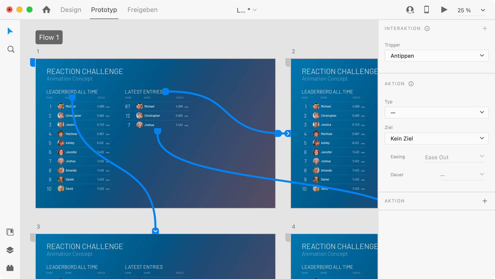

## Aufgabenstellung 3. Block
Dauer: 1 Laborblock (4h) + Fertigstellen der Aufgaben

Prototyp-Modus von Adobe XD
### 6. Erstellen eines interaktiven Prototyps

> #### Aufgabe: Erstellen eines interaktiven Prototyps in Adobe XD
> Das erstellte Design soll in Form eines interaktiven Prototyps umgesetzt werden, damit sich der Kunde vorstellen kann, wie die fertige Website aussehen und funktionieren kann.
>
> Der Prototyp soll die wichtigsten Seiten, Funktionen und Inhalte der Website beinhalten. Starte zuerst mit der Navigation und erweitere dann den Prototyp um zusätzliche Funktionalitäten.
>
> Die wichtigsten Schritte zum Erstellen eines Prototyps ist auf der Seite [Erstellen interaktiver Prototypen](https://helpx.adobe.com/at/xd/help/create-prototypes.html) von Adobe zu finden.

#### Adobe XD Tutorials

Mit Adobe XD gibt es sehr viele Möglichkeiten. Nutze so, um einen Prototyp so realitätsnah wie möglich umzusetzen:

* Empfehlung: [Erstellen interaktiver Prototypen - helpx.adobe.com](https://helpx.adobe.com/at/xd/help/create-prototypes.html){:target="_blank"}
* [Scrollbare Zeichenflächen - helpx.adobe.com](https://helpx.adobe.com/at/xd/how-to/scrollable-artboards.html){:target="_blank"}
* [Links auf vorhergehene Zeichenflächen - helpx.adobe.com](https://helpx.adobe.com/in/xd/user-guide.html/in/xd/help/create-prototypes.ug.html#previous-artboard){:target="_blank"}
* [Animationen - helpx.adobe.com](https://helpx.adobe.com/in/xd/user-guide.html/in/xd/help/animate-prototypes.ug.html){:target="_blank"}
