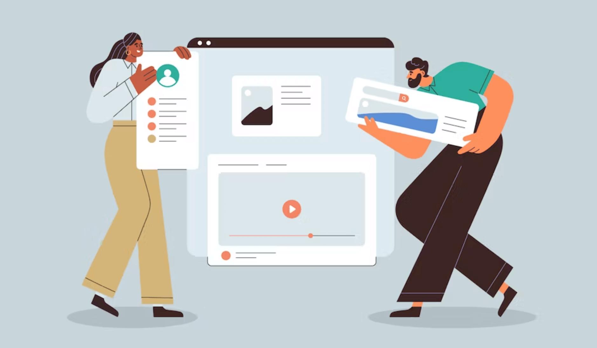

## Aufgabenstellung 4. Block
Dauer: 1 Laborblock (1x4h) + Fertigstellen der Aufgaben

[99designs.de - Der UX-Design-Prozess](https://99designs.de/blog/web-digitales-design/was-ist-webdesign){:target="_blank"},  Illustration von [OrangeCrush](https://99designs.de/profiles/1193222){:target="_blank"}

### 7. Präsentation des Prototypen

> #### Aufgabe: Präsentation
> Das erstellte Design und der Prototyp sollen dem Kunden präsentiert werden.
> 
> Präsentiert werden sollen das Konzept (Sitemap, Featurelist, ...) basierend auf den Anforderungen des Kunden sowie der daraus erstellte Prototyp.
> 
> Erstellt dazu in der Gruppe eine Präsentation. Folgende Kriterien werden beurteilt:
> - Zeitdisziplin
> - Form der Präsentation (Sprache, Umgang mit Medien, Ablauf, ...)
> - Umfang der präsentierten Inhalte
> - Qualität der präsentierten Inhalte
>
> Präsentationsdauer: 12 Minuten

### 8. Conclusio

> #### Aufgabe: Conclusio
> Fasse deine Erkenntnisse aus den Übungen bezüglich dem Besprechungsprotokoll, den
eingesetzten Werkzeugen (Adobe XD, Illustrator, Photoshop, …), Design und Layout sowie auch dem
Prototyping und der Präsentation zusammen.
> 
> Umfang: mind. 1/2 Seite

## Abgabe
Erweitere das Webdesign-Portfolio mit folgenden Inhalten:
- **Feedback zur Präsentation** 
- **Eventuelle Anpassungen aufgrund des Feedbacks** 
- **Conclusio** 

### Alle Inhalte des Besprechungsprotokolls
1. **Deckblatt** Namen der Protokollverfasser, Datum der Abgabe, Titel, Name der Website, eventuell Kunden-Logo
2. **Inhaltsverzeichnis**
2. **Besprechungsprotokoll** Inhalt wie angegeben, Umfang ca. 1 Seite A4
3. **Inhaltliches Konzept**
- **Sitemap** in grafisch ansprechender Form
- **Featurelist** funktionelle Anforderung an die Website in Form einer Liste
4. **Grafisches Konzept** 
- **Scribbles** aufbereitete Fotos der Scribbles auf Papier oder Screenshots der Scribbles inklusive der Erläuterungen, was bezweckt werden soll.
- **Layout und Design** Screenshots des, in Adobe XD umgesetzten, Design inklusive der Erläuterungen, welche Ziele mit dem Layout/Design verfolgt werden. Keine reine Beschreibung der Screenshots.
5. **Feedback zur Präsentation** Zusammenfassung des Feedback zum Prototypen und eventuelle daraus resultierende Anpassungen
6. **Conclusio** 

### Form
Neben dem Inhalt wird auch die Form des Protokolls bewertet. Hierbei ist deine Kreativität in
keiner Weise eingeschränkt.

Folgende Punkte sind jedoch zu beachten:
- Typografie (im Stil der Website)
- Farbgebung (im Stil der Website)
- Formales: Bildunterschriften, Seitennummern, eventuelle Zitate und Querverweise

### Dateiformate
- Portfolio im `.pdf`-Format
- Adobe XD Prototype im `.xd`-Format