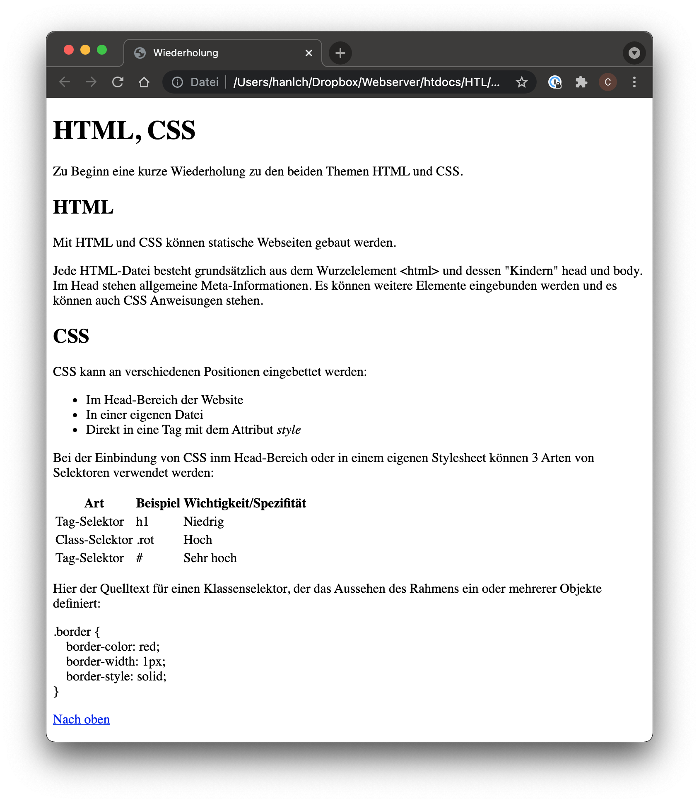
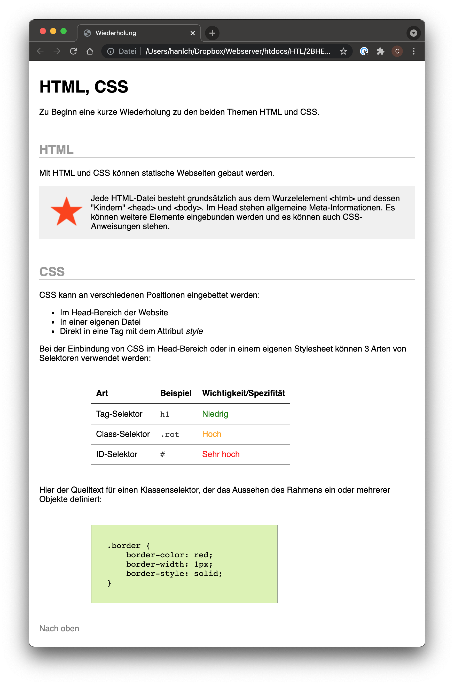

# HTML und CSS

## Wiederholung HTML und CSS

Es ist eine HTML-Seite zu erstellen und das Design an eine vorgegeben Vorlage anzupassen.

### 1. Inhalt mit HTML

Umsetzen der Seite in HTML:
* Verwende unterschiedliche Tags (`
`, `<h1>`, `<table>`, ...) um die untenstehende Ausgabe zu erreichen
* Achte auf sauberen Quelltext

### 2. Aussehen mit CSS

Passe das Aussehen der Seite so an, dass sie der Vorlage entspricht.

* Lege eine externe Style-Datei an und binde sie in die HTML-Seite ein
* Verwende die verschiedenen Arten von Selektieren sinnvoll
  - Tag-Selektoren, z.B.: `h1 { ... }`
  - Klassen-Selektoren, z.B.: `.rot { ... }`
  - ID-Selektoren, z.B.: `#container { ... }`
* Achte auf eine saubere Ordnerstruktur (eigene Verzeichnisse für CSS-Dateien und Bilder)

Ressourcen:

* [.zip des leeren Projekts](./assets/recap_html_empty.zip){:target="_blank"}
* [star.png](./assets/star.png){:target="_blank"}
* [heart.png](./assets/heart.png){:target="_blank"}
* [search.png](./assets/search.png){:target="_blank"}
* [tune.png](./assets/tune.png){:target="_blank"}