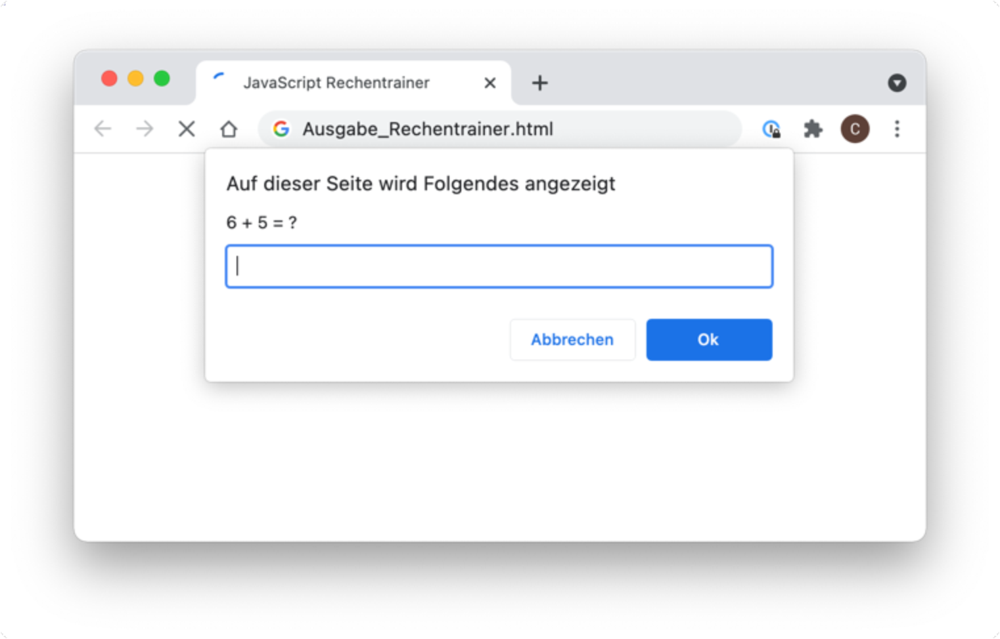

## Allgemeines zu JavaScript

JavaScript ist eine vielseitige und weit verbreitete Programmiersprache, die in erster Linie für Webentwicklung verwendet wird, aber auch darüber hinaus Anwendung findet. Hier sind einige der wichtigsten Einsatzgebiete von JavaScript:
- Interaktive Webseiten
- Webanwendungen (SPAs, PWAs)
- Serverseitige Programmierung (Node.js)
- Cross-Plattform-Entwicklung (Mobile Apps)
- IoT-Anwendungen
- Spieleentwicklung
- ...

Die Syntax von **JavaScript** entspricht im Großen und Ganzen der Syntax von **C**.

### Variablen in JavaScript
Eine Variable in JavaScript kann unterschiedliche Datentypen annehmen. Bei der Deklaration werden dafür die Schlüsselwörter `let` und `const` verwendet. 
Das Schlüsselwort `var` ist nicht mehr gebräuchlich.

```javascript
// Veränderliche Variablen
let zahl = 1;
let komma = 2.456;
let nickname = "Eva";
let flag = true;

const PI = 3.1415;
```

### Kontrollstrukturen

Bedingungen, Schleifen, logische Operatoren, Switch-Anweisung funktionieren ebenfalls wie in **C**.
```javascript
// Bedingungen
if (alter > 18) {
  console.log (name + " ist volljährig.");
} else {
  console.log (name + " ist noch nicht volljährig.");
}

// Schleifen
for (let i = 0; i < 5; i++) {
  console.log("Durchlauf Nummer: " + i);
}
```

### Funktionen in JavaScript
Funktionen werden mit dem Schlüsselwort `function` definiert und werden oft auch Methoden genannt.

Die Angabe eines Datentyps für den Rückgabewert ist nicht notwendig. 
Hat eine Methode kein `return`-Statement, dann handelt es sich um eine Methode keinen Rückgabewert. 
Ist das `return`-Statement vorhanden, so liefert die Methode einen Rückgabewert zurück.

```javascript
// Funktion ohne Rückgabewert
function gibSummeAus (a, b){
    alert ("Summe" + (a+b))M
}

// Funktion mit Rückgabewert
function berechneSumme (a,b){
    return (a + b);
}

// Funktionsaufrufe
gibSummeAus (7, 11); // Gib 18 aus
let summe = berechneSumme (9, 12); // Speichert den Wert 21 in der Variable summe
```


## Aufgabenstellung
{: .assignment }

Es ist eine einfache Webapp zu erstellen, mit der die Grundrechnungsarten trainiert werden können.


*Der Rechentrainer soll über Dialog-Boxen realisiert werden.*


### 1. Addition
{: .assignment }

* Dem Benutzer werden 5 Additionen zur Aufgabe gestellt, die er beantworten muss. Setze das Programm mit Hilfe des Befehls `prompt()` um.

* Gib im Anschluss die Anzahl der richtig beantworteten Aufgaben mit Hilfe des Befehls `alert()` aus.

* Verwende die Funktionen `Math.random()` (Zufallszahl generieren) und `Math.floor()` (Abrunden), um eine Zufallszahl zu generieren.

```javascript
// JavaScript
let zahl;
zahl = Math.random() * 10; // Math.random() liefert eine Kommazahl zwischen 0 - 1
zahl = Math.floor( zahl ) + 1; // Math.floor() rundet eine Kommazahl ab
```
* Verwende die Funktion `parseInt()`, um die Eingaben des Benutzers in Zahlen umzuwandeln.

```javascript
// JavaScript
let zahl;

// Einlesen eines Strings - Annahme: "123"
zahl = prompt ("Gib eine Zahl ein ...");
alert ( zahl + 2 ); // Ausgabe: "1232"

// Umwandeln des Strings in eine Zahl (typecast auf Number() funktioniert auch)
zahl = parseInt ( zahl ); 
alert ( zahl + 2 ); // Ausgabe: 125
```

### 2. Freie Anzahl der Fragen
{: .assignment }

* Der Benutzer soll die Anzahl der Fragen selbst bestimmen können.

### 3. Weitere Grundrechnungsarten
{: .assignment }

* Es sollen Aufgaben aus den verschiedenen Grundrechenarten zufällig gestellt werden.
* Gib den Zwischenstand nach jeder Frage aus.

### 4. Auswahl der Grundrechenarten
{: .assignment }

* Der Benutzer soll eingeben können, welche Rechenart er trainieren möchte:
  * Addition
  * Subtraktion
  * Multiplikation
  * Division
  * Mischung aus dem 4 Grundrechenarten

### 5. Zusatz / Erweiterungen
{: .assignment }

* Zeige das Ergebnis des Rechentrainers mit den Befehlen `document.write()` und `document.writeln()` direkt im Browser an.
* Zeige das Ergebnis in Form eines Balkens an.

## Ressourcen
* [mozilla.org - alert()](https://developer.mozilla.org/en-US/docs/Web/API/Window/alert){:target="_blank"}
* [mozilla.org - prompt()](https://developer.mozilla.org/en-US/docs/Web/API/Window/prompt){:target="_blank"}
* [mozilla.org - confirm()](https://developer.mozilla.org/en-US/docs/Web/API/Window/confirm){:target="_blank"}
* [mozilla.org - parseInt()](https://developer.mozilla.org/en-US/docs/Web/JavaScript/Reference/Global_Objects/parseInt){:target="_blank"}
* [mozilla.org - Math.random()](https://developer.mozilla.org/de/docs/Web/JavaScript/Reference/Global_Objects/Math/random){:target="_blank"}
* [mozilla.org - Math.floor()](https://developer.mozilla.org/de/docs/Web/JavaScript/Reference/Global_Objects/Math/floor){:target="_blank"}
* [mozilla.org - Document.write()](https://developer.mozilla.org/en-US/docs/Web/API/Document/write){:target="_blank"}
* [mozilla.org - Document.writeln()](https://developer.mozilla.org/en-US/docs/Web/API/Document/writeln){:target="_blank"}