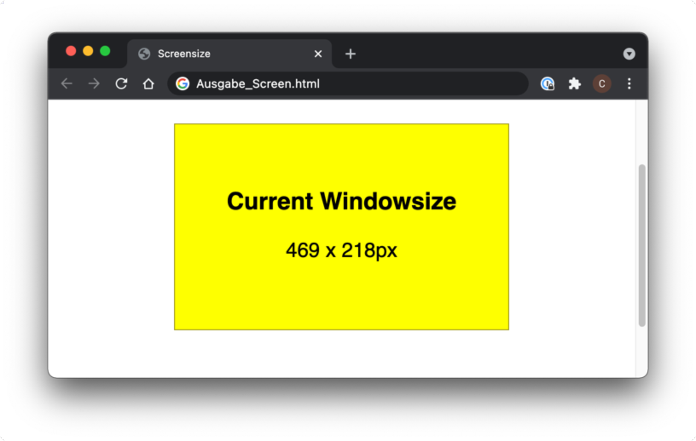
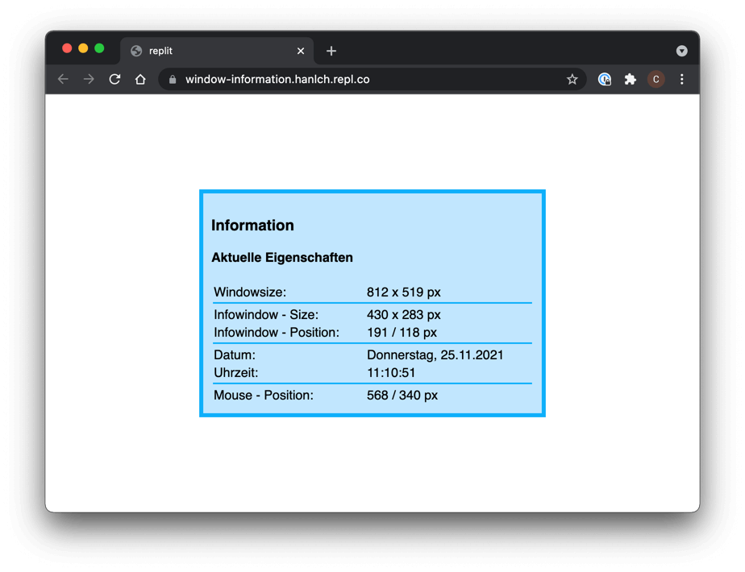

## Allgemeines

## Aufgabenstellung
Es ist eine einfache Web-Applikation zu erstellen, mit der Informationen, wie zum Beispiel die aktuelle Auflösung des Browserfensters, angezeigt werden können.


*Die Informationen über den Browser sollen in einem `<div>`-Element angezeigt werden.*

### 1. Framework

* Lege die Dateien `screen.css` und `functions.js` an und binde die beiden Dateien in die Datei `index.html` ein.
* Teste, ob die beiden Dateien richtig eingebunden sind, indem du die Hintergrundfarbe des `<body>`-Tags auf
rot setzt und eine Alertbox aufrufst.

### 2. Auslesen der Informationen / Verarbeiten von Events

* Schreibe in der Datei `functions.js` eine Funktion `getDimensions()`. Die Funktion ermittelt die aktuellen Abmessungen des Browserfensters mit den Funktionen `window.innerWidth()` und `window.innerHeight()` und gibt das Ergebnis in der Konsole aus.

```javascript
// JavaScript
function getDimensions() {
    
    // Auslesen der Abmessungen
    var width = window.innerWidth;
    var height = window.innerHeight;
    
    // ...
}
```
* Rufe die Funktion auf, sobald das HTML-Dokument geladen ist. Verwende dazu das Event `onload()`.

```html
<!-- HTML -->
<body onload="getDimensions()">
```

* Erweitere die Funktionalität der App so, dass bei einer Größenänderung des Browserfensters die neuen Abmessungen in der Konsole ausgegeben werden.

### 3. Ausgeben im HTML-Dokument
* Erstelle im html-Dokument ein `<div id="info">`, in dem die Informationen dargestellt werden sollen. Passe das Aussehen des `<div>`-Elements so an, dass es in etwa der Abbildung entspricht. Schreibe die Abmessungen des Browserfensters in das `<div>`-Element.

```html
<!-- HTML -->
<div id="info">Lorem ipsum</div>
```

```javascript
// JavaScript

// Referenz auf das gewünschte Objekt herstellen
var divInfo = document.getElementById ("info");

// Lesend auf den Inhalt zugreifen
var inhalt = divInfo.innerHTML; // inhalt enthält jetzt "Lorem ipsum"

// Schreibend auf den Inhalt zugreifen
divInfo.innerHTML = "Neuer Inhalt"; // <div id="info"> enthält jetzt "Neuer Inhalt"
```
### 4. Zusatz / Erweiterungen
* Ermittle die Position und die Abmessungen des `<div>`-Elements und gib dessen Größe im `<div id="info">` aus
* Zeige das aktuelle Datum im Format `Wochentag, dd.mm.yyyy` an.
* Zeige die aktuelle Uhrzeit im Format `hh:mm:ss` an
* Zeige die Mausposition an.


*Erweiterte Ausgabe.*

## Ressourcen

* [W3 schools - HTML DOM Events](https://www.w3schools.com/jsref/dom_obj_event.asp){:target="_blank"}
* [W3 schools - The HTML DOM Element Object](https://www.w3schools.com/jsref/dom_obj_all.asp){:target="_blank"}
