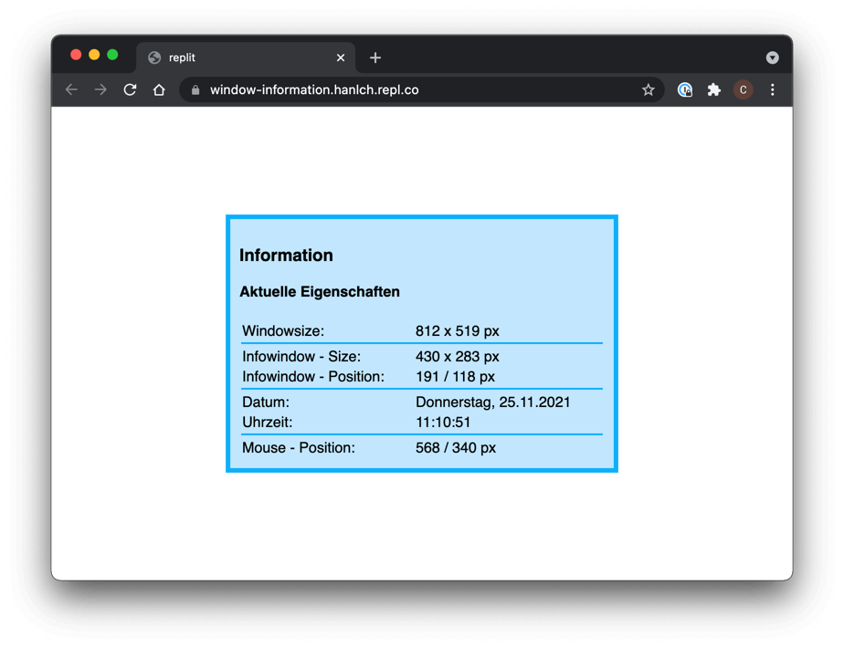

## JavaScript und das Verändern von HTML-Inhalten

### Wie können Webseiten zur Laufzeit verändert werden?

JavaScript ermöglicht es, dynamische Änderungen an der Struktur und dem Aussehen einer Webseite vorzunehmen, ohne die Seite neu laden zu müssen. Dies geschieht durch Manipulation des Document Object Models (DOM). Der Browser bemerkt die Änderungen und stellt sie direkt im Browser-Fenster dar.

Die Vorgehensweise ist dabei immer die gleiche:
1. Auf ein oder mehrere Elemente zugreifen
2. Elemente verändern


```html
<div id="info"><p>Dieser Text hier wird ausgetauscht...</p></div>
```
```javascript
// 1. Auf ein Element über dessen Id zugreifen
let divInfo = document.getElementById("info");

// 2. Element verändern
divInfo.innerHTML = "<p>Jetzt stehtwas anderes drinnen ... </p>";
```
*Die Eigenschaft `innerHTML` verändert den Inhalt zwischen dem öffnenden und schließenden Tag des ausgewählten Objekts*

### Zugriff auf HTML-Elemente

Neben der Funktion `document.getElementById()` gibt es verschiedene Methoden, um auf HTML-Elemente zugreifen zu können:

- `document.getElementById(id)`: Greift auf ein Element zu, das eine spezifische ID hat.
- `document.getElementsByTagName(name)`: Liefert eine Liste aller Elemente eines bestimmten Tags.
- `document.getElementsByClassName(name)`: Liefert eine Liste aller Elemente, die eine bestimmte Klasse haben.
- `document.querySelector(selector)`: Liefert das erste Element, das einem bestimmten CSS-Selektor entspricht.
- `document.querySelectorAll(selector)`: Liefert eine Liste aller Elemente, die einem bestimmten CSS-Selektor entsprechen.

### Ändern von Inhalten

Nachdem Sie Zugriff auf ein oder mehrere Elemente haben, können Sie deren Inhalt auf verschiedene Weise ändern:

- `.innerHTML`: Erlaubt das Hinzufügen oder Ändern von HTML-Inhalt. Kann Sicherheitsrisiken bergen, wenn der Inhalt Benutzereingaben enthält.
- `.textContent`: Ändert den Textinhalt eines Elements. Sicherer als `innerHTML`, da es keinen HTML-Code interpretiert.
- `.setAttribute(name, value)`: Ändert oder setzt ein Attribut des Elements.
- `.style.property`: Erlaubt das Ändern von CSS-Eigenschaften.

### Beispiele

#### Text eines Elements ändern

```javascript
let element = document.getElementById("meinElement");
element.textContent = "Neuer Textinhalt";
```

#### HTML-Inhalt eines Elements ändern

```javascript
let container = document.getElementById("meinContainer");
container.innerHTML = "<p>Neuer Absatz</p>";
```

#### CSS-Stil eines Elements ändern

```javascript
let element = document.getElementById("meinElement");
element.style.color = "red";
element.style.backgroundColor = "black"; // Camel-Cased-Notation
```
*Verändert das Aussehen eines Elements*

Das Verändern der Styles passiert per Inline-Style – die Angaben werden also direkt in das `style`-Attribut geschrieben und habe somit die höchste Spezifität.

Die Schreibweise der Style-Attribute in JavaScript wird als *Camel-Cased* bezeichnet:

* CSS: `background-color: red;` &rarr; JavaScript: `backgroundColor = "red";`
* CSS: `border-left-width: 2px;` &rarr; JavaScript: `borderLeftWidth = "2px";`

#### Ein Attribut eines Elements ändern

```javascript
let element = document.querySelector(".meineKlasse");
element.setAttribute("href", "https://neue.url");
```
*Verändert das erste Element mit der Klasse `meineKlasse` und setzt das `href`-Attribut auf `https://neue.url`.*


## Aufgabenstellung
{: .assignment }

Erweitere die Aufgabenstellung aus der vorherigen Aufgabe so, dass die Anzeige der Informationen direkt im Browser-Fenster dargestellt werden.


*Die Informationen über den Browser sollen in einem `<div>`-Element angezeigt werden.*


### 1. Ausgeben im HTML-Dokument
{: .assignment }

 * Erstelle im html-Dokument ein `<div id="info">`, in dem die Informationen dargestellt werden sollen. Passe das Aussehen des `<div>`-Elements so an, dass es in etwa der Abbildung entspricht. Schreibe die Abmessungen des Browserfensters in das `<div>`-Element.

### 2. Zusatz / Erweiterungen
{: .assignment }

* Erweitere die Ausgabe, um folgendes Aussehen zu erzeugen:

*Erweiterte Ausgabe.*

## Ressourcen

* [W3 schools - HTML DOM Events](https://www.w3schools.com/jsref/dom_obj_event.asp){:target="_blank"}
* [W3 schools - The HTML DOM Element Object](https://www.w3schools.com/jsref/dom_obj_all.asp){:target="_blank"}
