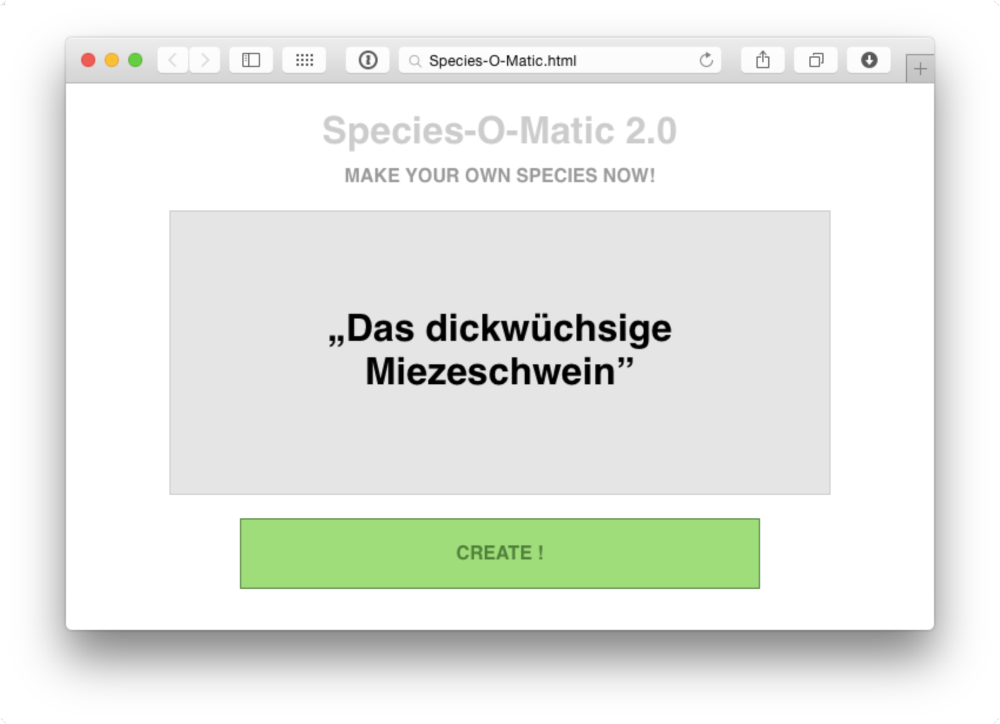
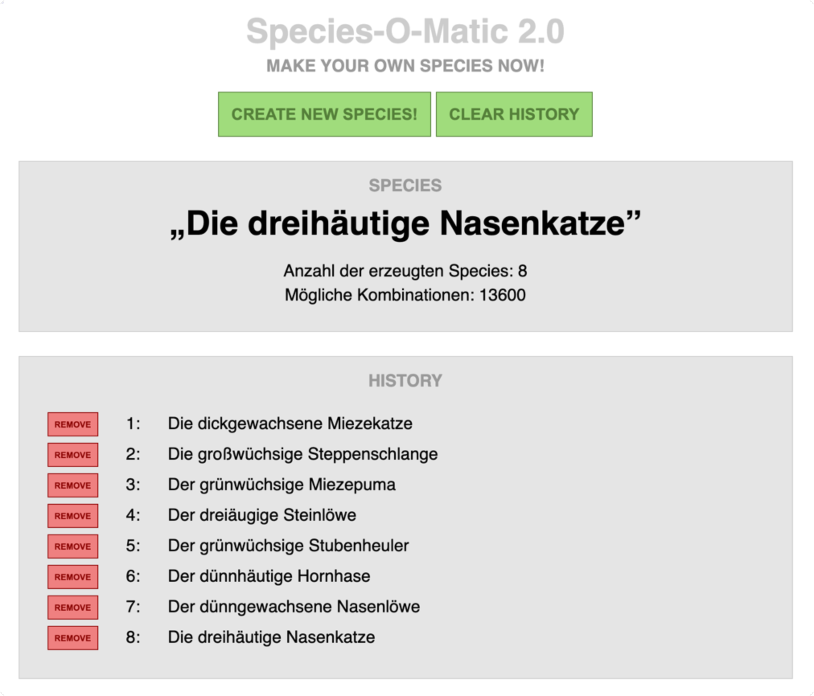

## Arrays in JavaScript

Ein Array ist eine Sammlung von Daten, die in einer einzigen Variablen gespeichert werden können. Jedes Element in einem Array kann einen beliebigen Datentyp haben, einschließlich Strings, Zahlen, Booleans, Objekte und sogar andere Arrays.

### Erstellen eines Arrays
Arrays können auf verschiedene Arten erstellt werden:

```javascript
// Literal-Methode
let myArray = [1, 'zwei', true, 4.5];

// Konstruktor-Methode
let myArray = new Array(1, 'zwei', true, 4.5);
```

### Zugriff auf Array-Elemente
Auf jedes Element eines Arrays wird durch seinen Index zugegriffen, wobei der Index immer mit 0 beginnt.

```javascript
console.log(myArray[0]); // Gibt 1 aus
```

### Länge eines Arrays
Die Länge eines Arrays (Anzahl der Elemente) kann mit der `length`-Eigenschaft ermittelt werden:

```javascript
console.log(myArray.length); // Gibt die Anzahl der Elemente im Array aus
```

### Hinzufügen und Entfernen von Elementen
Arrays in JavaScript sind dynamisch, was bedeutet, dass Elemente hinzugefügt oder entfernt werden können.

```javascript
// Hinzufügen eines Strings am Ende
myArray.push('Neues Element');

// Entfernen vom Ende und Zuweisen in eine Variable
let lastElement = myArray.pop(); 

// Hinzufügen eines Strings am Anfang
myArray.unshift('Startelement'); 

// Entfernen vom Anfang und Zuweisen in eine Variable
let firstElement = myArray.shift(); 
```

### Durchlaufen eines Arrays
Es gibt verschiedene Methoden, um über die Elemente eines Arrays zu iterieren.

```javascript
// for-Schleife
for (let i = 0; i < myArray.length; i++) {
    console.log(myArray[i]);
}

// forEach-Methode
myArray.forEach(element => {
    console.log(element);
});
```

## Aufgabenstellung
Es ist eine Webanwendung zu erstellen, die aus unterschiedlichen Zeichenketten eine zufällige Spezies generiert und als HTML in einem `<div>`-Element anzeigt. Überlege dir bevor du loslegst, wie sich die gesamte
Bezeichnung der Spezies zusammensetzt, und wie du die Daten abbilden wirst. Skizziere die Struktur auf
einem Blatt Papier.


*Beispielhafte Umsetzung*

### 1. Framework

* Lege die Dateien `screen.css` und `functions.js` an und binde die beiden Dateien in die Datei `index.html` ein.

* Teste, ob die beiden Dateien richtig eingebunden sind, indem du die Hintergrundfarbe des `<body>`-Tags auf
rot setzt und eine Alertbox aufrufst.

### 2. Auslesen der Informationen / Verarbeiten von Events

* Schreibe in der Datei `functions.js` eine Funktion `generateSpecies()`. In der Funktion   werden die Arrays für die verschiedenen Teilstrings angelegt und initialisiert. 

* Erstelle für jeden Teilstring eine Zufallszahl, die auf die Anzahl der Elemente im jeweiligen Teilstring
  begrenzt ist. Verwende die Zufallszahlen als Index, um eine zufällige Spezies zu erschaffen und gibt das
  Ergebnis in der Konsole aus.

* Rufe die Funktion auf, sobald die Seite geladen wird.


```javascript
// JavaScript
function generateSpecies() {
    // Jedes Element des Arrays kann verschiedene Datentypen speichern - auch Strings
    let gattung = [
    "hase",
    "schlange",
    "fuchs",
    "schwein",
    "katze" ];

    // In der Eigenschaft "length" ist die aktuelle Anzahl der Elemente im Array gespeichert
    let anzahl = gattung.length;
    console.log ( "Es sind " + anzahl + " Elemente im Array enthalten" );
}
```

### 3. Ausgeben im HTML-Dokument

* Erstelle die notwendigen HTML-Elemente und rufe die Funktion auf, sobald den Button `CREATE!` gedrückt
  wurde. Schreibe das zufällig generierte Tier als HTML in das dafür vorgesehene `<div>`.

* Passe die Seite so an, dass sie in etwa der Abbildung entspricht.


### 4. Zusatz / Erweiterungen
* Erstelle ein weiteres `<div>`-Element, in dem eine "History" der erstellten Spezies auflistet.
* Erstellen einen Button `CLEAR HISTORY`, der die "History" der erstellen Species wieder löscht
* Gib die Anzahl der Species an, die ingesamt erstellte wurde
* Gib die Anzahl der möglichen Kombinationen an – sie ergibt sich aus den Längen der einzelnen Arrays und kann über die Eigenschaft `.length` abgefragt werden.
* Schwierig: Erstelle in der "History" neben jedem Eintrag einen Button `REMOVE`. Beim Klick auf diesen Button soll nur dieser eine Eintrag gelöscht werden.


*Umsetzung mit Erweiterungen*
## Ressourcen

* [W3 schools - JavaScript Arrays](https://www.w3schools.com/js/js_arrays.asp){:target="_blank"}
* [W3 schools - JavaScript Events](https://www.w3schools.com/js/js_events.asp){:target="_blank"}
* [W3 schools - The Window Object](https://www.w3schools.com/jsref/obj_window.asp){:target="_blank"}
* [mozilla.org - Introduction to events](https://developer.mozilla.org/en-US/docs/Learn/JavaScript/Building_blocks/Events){:target="_blank"}
* [mozilla.org - Window](https://developer.mozilla.org/en-US/docs/Web/API/Window){:target="_blank"}