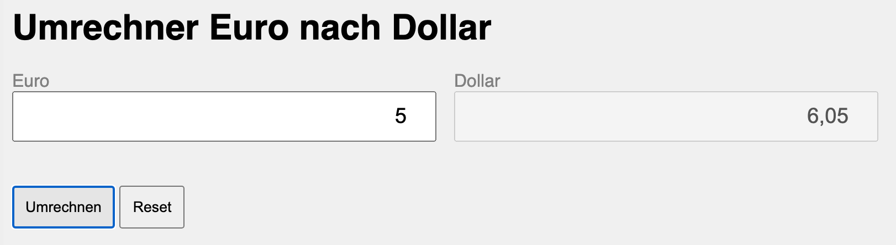
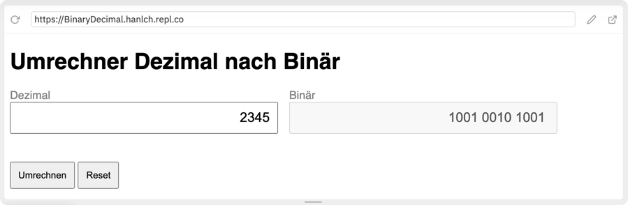

## Formularbehandlung in JavaScript

### Grundlagen

Ein HTML-Formular besteht typischerweise aus verschiedenen Arten von Eingabefeldern, wie `text`, `radio`, `checkbox`, `select` usw. JavaScript kann verwendet werden, um auf die Werte dieser Felder zuzugreifen und sie zu ändern.

### Zugriff auf Formularelemente

Zuerst müssen Sie das Formularelement in Ihrem JavaScript-Code erfassen. Dies kann auf verschiedene Weisen erfolgen, z.B. durch die Verwendung von `document.getElementById()` oder `document.forms[]`:

```html
<!-- HTML -->
<form id="myform">
  <input type="text" id="mytextid" name="mytextname" value="Beispieltext">
  <input type="submit" value="Absenden">
</form>
```
```javascript
/* JavaScript */

// Zugriff auf das Textfeld durch die ID
let textfeld = document.getElementById("mytextid");

// Alternativ: Zugriff auf das Textfeld durch den Namen innerhalb des Formulars
let formular = document.getElementById("myform");
let textfeld = formular.elements["mytextname"];
```

### Lesen von Formularwerten

Um den Wert eines Formularelements zu lesen, kann die Eigenschaft `.value` des Elements verwendet werden:

```javascript
let aktuellerText = textfeld.value;
console.log(aktuellerText); // Gibt den aktuellen Wert des Textfelds aus
```

### Ändern von Formularwerten

Um den Wert eines Formularelements zu ändern, kann der Eigenschaft `.value` ein Wert zugewiesen werden. Der Browser interpretiert die Änderung sofort und zeigt den neuen Inhalt auf der Website entsprechend an.

```javascript
textfeld.value = "Neuer Inhalt"; // Ändert den Inhalt des Textfeldes
```

### Umgang mit anderen Elementtypen

#### Checkboxen und Radiobuttons

Zugriff auf den Zustand (ausgewählt oder nicht) über die `.checked` Eigenschaft.

```html
<!-- HTML -->
<form id="myform">
  <label>
    <input type="checkbox" id="mycheckboxid" name="mycheckboxname" value="Wert"> Option 1
  </label>
</form>
```
```javascript
/* JavaScript */
let checkbox = document.getElementById("mycheckboxid");

if (checkbox.checked) {
  // Checkbox ist ausgewählt
} else {
  // Checkbox ist nicht ausgewählt
}

// Zustand ändern
checkbox.checked = true; // oder false
```

#### Select (Dropdown-Listen)
Zugriff auf den ausgewählten Wert über `.value` oder den ausgewählten Index über `.selectedIndex`.
```html
<!-- HTML -->
<form id="myform">
  <label for="myselectid">Wähle eine Option:</label>
  <select id="myselectid" name="myselectname">
    <option value="Wert1">Option 1</option>
    <option value="Wert2">Option 2</option>
    <option value="Wert3">Option 3</option>
  </select>
</form>
```
```javascript
/* JavaScript */
let myselect = document.getElementById("myselectid");
let selectedValue = myselect.value;	// Wert der ausgewählten Option
let selectedIndex = myselect.selectedIndex; // Index der ausgewählten Option

// Ändern der Auswahl
myselect.value = "Wert2"; // Auswahl nach Wert
myselect.selectedIndex = 2; // Auswahl nach Index
```

### Event Listener

Um auf Benutzeraktionen, wie das Absenden eines Formulars oder das Ändern eines Feldwertes, zu reagieren, wird ein EventListener verwendet:

#### Variante: EventListener
```javascript
// Eventlistener auf das gesamte Formular legen, 
// um z.B. auf Abschicken des Formulars zu reagieren
formular.addEventListener("submit", function(event) {
    
    // Standard-Formularabsendung verhindern
    event.preventDefault(); 
    
    // Code, um auf das Absenden zu reagieren, z.B. Werte validieren
});

// Eventlistener auf ein Element des Formular legen, 
// um auf Änderugen dieses einen Elements zu reagieren
textfeld.addEventListener("change", function() {
    
    console.log("Der Wert hat sich geändert zu: " + this.value);
});
```

#### Variante: Zuweisen einer Funktion
```javascript
let textfeld = document.getElementById("mytextid");
textfeld.onchange = function (){
	console.log("Der Wert hat sich geändert zu: " + this.value);   
};
```


## Aufgabenstellung
{: .assignment }

Es ist ein einfaches Formular zu erstellen, mit dessen Hilfe man Euro nach Dollar umrechnen kann.

> 
> *Beispielhafte Umsetzung*

### 1. HTML und CSS
{: .assignment }

Umsetzen des Umrechners in HTML, Stylen der Elemente mit CSS:
* Eingabe mittels Formularfelder und Buttons
* Ausgabe über ein Formularfeld, das Attribut `disable="true"` gesetzt hat
* Einfaches Styling mittels CSS

### 2. JavaScript
{: .assignment }

Umsetzen der Funktionalität in JavaScript:

* Bei Klick auf den Button `Umrechnen` wird der Dollarwert entsprechend dem akutellen Dollarkurs berechnet und ausgegeben. Definiere den aktuellen Dollarkurs mit einer globalen Variable.
* Bei Klick auf den Button `Reset` sollen die beiden Formularfelder gelöscht werden.


### 3. Zusatz / Erweiterungen
{: .assignment }

Implementiere weitere Funktionalitäten:
* Zusätzliches Formularfeld, um den aktuellen Dollarkurs anpassen zu können
* Umschalter `Dollar > Euro` und `Euro > Dollar` 
* Zusätzliche Währungen dazugeben (z.B.: Pfund)
* Umrechner zwischen Zahlensystemen ...

> 
> *Beispielhafte Umsetzung der Umrechnung von Dezimal nach Binär*
 

## Ressourcen
* [mozilla.org - HTMLFormElement](https://developer.mozilla.org/de/docs/Web/API/HTMLFormElement){:target="_blank"}