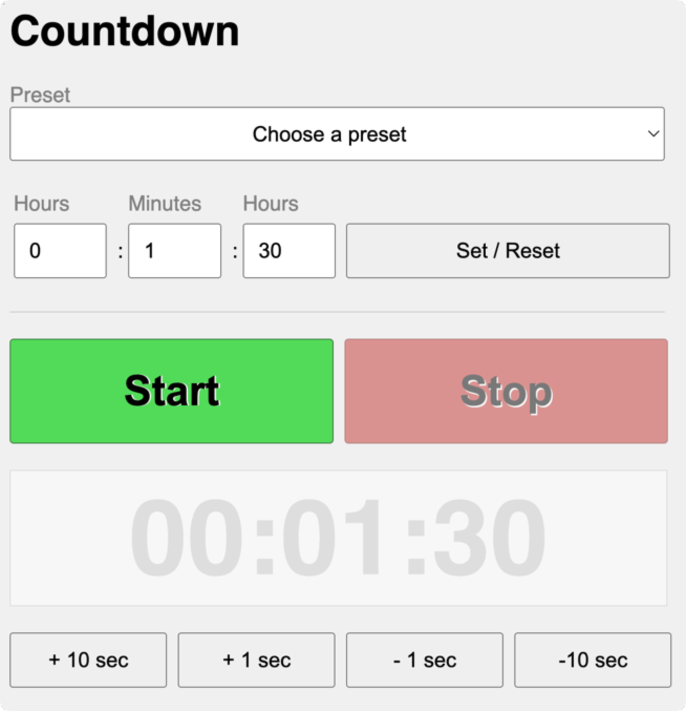

## Zeitliche Steuerung von Aktionen

Timeouts und Intervalle sind zentrale Mechanismen in JavaScript, die für das zeitliche Steuern von Aktionen verwendet werden. Sie ermöglichen es, Funktionen zu verzögern oder regelmäßig auszuführen.

### Timeouts

Durch die Verwendung von Timeouts kann eine Funktion einmalig nach einer spezifizierten Verzögerung aufgerufen werden. Es wird häufig genutzt, um Aktionen zu verzögern.

Ein Timeout wird in JavaScript mit der Funktion `setTimeout()` erstellt. Diese nimmt zwei Argumente: eine Callback-Funktion und eine Verzögerung in Millisekunden.

```javascript
// Die Funktion "doLater" wird mit einer Zeitverzögerung von 5000ms aufgerufen
function doLater(){
    console.log ("Diese Nachricht erscheint nach 5 Sekunden.");
}
setTimeout (doLater, 5000);

// Zeitverzögerter Aufruf mittels anonymer Funktion
setTimeout(function() {
	console.log("Diese Nachricht erscheint nach 5 Sekunden.");
}, 5000);
```

### Intervalle

Intervalle ermöglichen es, eine Funktion in regelmäßigen Abständen **wiederholt** auszuführen.

Ein Intervall wird in JavaScript mit der Funktion `setInterval()` erstellt. Wie bei `setTimeout()`, nimmt auch `setInterval()` zwei Argumente: eine Callback-Funktion und das Intervall in Millisekunden zwischen den Ausführungen der Funktion.

```javascript
// Die Funktion "doAgain" wird alle 2000ms aufgerufen
function doAgain(){
	console.log("Diese Nachricht erscheint alle 2 Sekunden.");
}
setTimeout (doLater, 2000);

// Wiederholter Aufruf mittels anonymer Funktion
setInterval (function() {
	console.log("Diese Nachricht erscheint alle 2 Sekunden.");
}, 2000);
```


### Beenden von Intervallen und Timeouts

Das Beenden eines Intervalls oder das Abbrechen eines Timeouts kann mit den Funktionen `clearInterval()` bzw. `clearTimeout()` erreicht werden. Jeder Aufruf von `setTimeout()` oder `setInterval()` gibt einen eindeutigen Identifier zurück, der verwendet werden kann, um das Timeout oder Intervall zu stoppen.


```javascript
let count = 1;

// Die Funktion "doAgainUntilCount" wird alle 3000ms aufgerufen
function doAgainUntilCount(){
	console.log("Diese Funktion wurde " + count + " mal aufgerufen.");
    
    // Ist count größer als 3, wird das Intervall beendet
    if ( ++ count > 3 ) {
        clearInterval(intervalId);
	}
}

// Die id des Intervalls wird gespeichert
let intervalId = setInterval (doAgainUntilCount, 3000);
```


## Aufgabenstellung
{: .assignment }
Es ist eine einfache Webapp zu erstellen, die einen Countdown realisiert.

> 
> *Beispielhafte Umsetzung*

### 1. HTML und CSS
{: .assignment }
Umsetzen des Umrechners in HTML:
* Eingabe mittels Formularfelder und Buttons
* Ausgabe über ein `<div>`
* Einfaches Styling mittels CSS


### 2. JavaScript
{: .assignment }
Umsetzen der Funktionalität in JavaScript:

* Im Textfeld links oben kann die Startzeit eingegeben werden.
* Bei Klick auf den Button `Start` startet der Countdown. Die verbleibende Zeit wird in einem `<div>` ausgegeben.
* Bei Klick auf den Button `Stop` wird der Countdown pausiert.
* Bei Klick auf den Button `Reset` wird der Countdown auf die im Textfeld eingegebene Zeit zurückgesetzt.
* Bei Klick auf die Buttons `+ 10 sec` `+ 1 sec` `- 1 sec` `- 10 sec` soll die verbleibende Zeit im `<div>` entsprechend angepasst werden.

Dokumentation:

* [mozilla.org - setTimeout()](https://developer.mozilla.org/en-US/docs/Web/API/WindowOrWorkerGlobalScope/setTimeout){:target="_blank"}
* [mozilla.org - setInterval()](https://developer.mozilla.org/en-US/docs/Web/API/WindowOrWorkerGlobalScope/setInterval){:target="_blank"}
* [mozilla.org - clearTimeout()](https://developer.mozilla.org/en-US/docs/Web/API/WindowOrWorkerGlobalScope/clearTimeout){:target="_blank"}
* [mozilla.org - clearInterval()](https://developer.mozilla.org/en-US/docs/Web/API/WindowOrWorkerGlobalScope/clearInterval){:target="_blank"}


### 3. Zusatz / Erweiterungen
{: .assignment }

Implementiere folgende Erweiterungen:
* Zeige **Zehntelsekunden** im Timer mit an
* Erweitere den Timer um **Minuten** und **Sekunden**

> 
> *Beispielhafte Umsetzung der Erweiterungen*

## Abgabe

### Abgabeplattform
Die Plattform der Abgabe wird im Unterricht besprochen.

#### Abgabe über Teams
Eine `.zip`-Datei mit allen Dateien und Verzeichnissen. Entpacke die Datei vorher testweise auf deinem Rechner. Der entpackte Inhalt muss vom Browser geöffnet und fehlerfrei dargestellt werden können.

#### Abgabe über Repl.it
Alternativ kann die Abgabe über [replit.com](https://replit.com){:target="_blank"} erfolgen.

### Bewertungskriterien
* Umfang und Komplexität
* Seitenstruktur (Dateien und Ordner)
* Sauberkeit des Quelltextes
* Dokumentation des Quelltextes

## Ressourcen
* [mozilla.org - setTimeout()](https://developer.mozilla.org/en-US/docs/Web/API/WindowOrWorkerGlobalScope/setTimeout){:target="_blank"}
* [mozilla.org - setInterval()](https://developer.mozilla.org/en-US/docs/Web/API/WindowOrWorkerGlobalScope/setInterval){:target="_blank"}
* [mozilla.org - clearTimeout()](https://developer.mozilla.org/en-US/docs/Web/API/WindowOrWorkerGlobalScope/clearTimeout){:target="_blank"}
* [mozilla.org - clearInterval()](https://developer.mozilla.org/en-US/docs/Web/API/WindowOrWorkerGlobalScope/clearInterval){:target="_blank"}