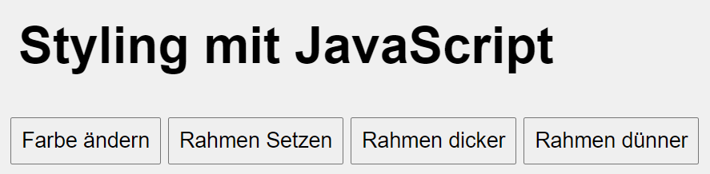
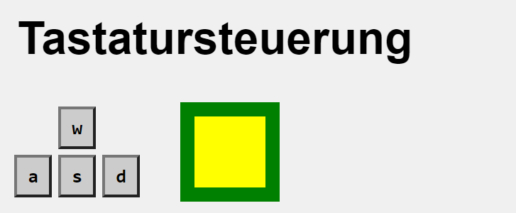
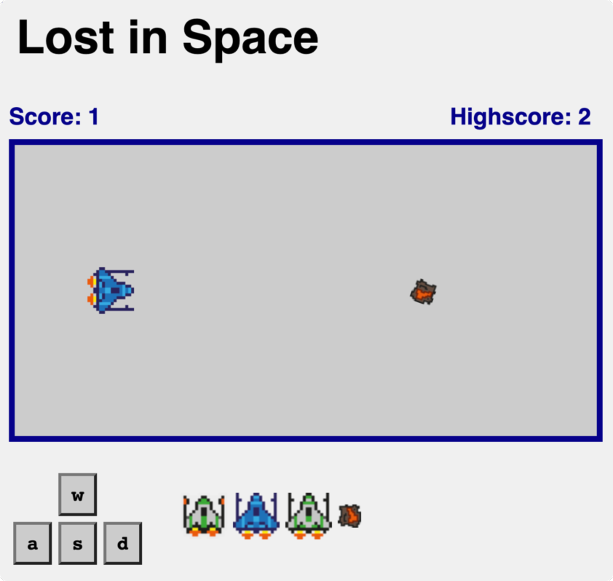

## Allgemeines

Die CSS-Eigenschaften von Elementen im HTML können einfach per JavaScript verändert werden.

### Zugreifen auf Elemente und Verändern von CSS-Eigenschaften
```html
<!-- HTML -->
<h1 id="headline">Styling mit JavaScript</h1>
```
```javascript
/* JavaScript */
// 1. Auf die Überschrift zugreifen
var hl = document.getElementById("headline");

// 2. Aussehen verändern
hl.style.color = "blue";
hl.style.backgroundColor = "yellow";
```

Die CSS-Anweisungen werden dann per _Inline-Style_ in das `style`-Attribut geschrieben und vom Browser sofort interpretiert und dargestellt:

```html
<!-- HTML -->
<h1 id="headline" style="color:blue; background-color:yellow;">Styling mit JavaScript</h1>
```

### CamelCased-Notation

Die Schreibweise der unterschiedlichen Eigenschaften (Attribute) unterscheidet sich von der Schreibweise in CSS.

Es werden die Bindestriche weggelassen und stattdessen die Anfangsbuchstaben danach groß geschrieben.

**CSS-Schreibweise**

```
 background-color
```

**JavaScript-Schreibweise**:
```
backgroundColor
```
### Setzen von Styles mittels Klasse
Um das Aussehen von der Funktionalität trennen zu können, empfiehlt es sich Klassen in `CSS` zu definieren und diese per `JavaScript` zu setzen bzw. wieder zu nehmen.

```css
/* CSS */
.active {
	color: red;
}
```

```JavaScript
// JavaScript

// Klasse setzen
ele.classList.add ("active");

// Klasse wegnehmen
ele.classList.remove ("active");
```

## Aufgabe 1 - Überschrift anpassen


### Setzen von Styles
Es soll das Aussehen eines `<h1>`-Tags verändert werden.

- Durch Klick auf den Button `Farbe ändern` sollt sich die Schriftfarbe auf rot ändern
- Durch Klick auf den Button `Rahmen setzen` soll ein Rahmen um die Überschrift gesetzt werden (`1px solid black`).
- Durch Klick auf den Button `Rahmen dicker` soll der Rahmen um `1px` dicker werden.
- Durch Klick auf den Button `Rahmen dünner` soll der Rahmen um `1px` dünner werden.
- Erweiterungen:
	- Lege eine Array mit mehreren Farbwerten an und rotiere durch die verschiedenen Farbwerten
	- Verändere weitere Attribute der Überschrift

### Erweiterungen Styles
- Lege eine Array mit mehreren Farbwerten an und rotiere durch die verschiedenen Farbwerten
- Verändere weitere Attribute der Überschrift
- Erstelle die Buttons `Klasse setzen` und `Klasse wegnehmen`. Bei Klick auf diese Buttons soll dass Aussehen der Überschrift per `classList` verändert werden:

		- `Klasse setzen` – die Überschrift soll unterstrichen werden
- `Klasse wegnehmen` – die Überschrift soll wieder "normal" aussehen

## Aufgabe 2 - Tastatursteuerung


Es soll die Position eines Elements mittels CSS-Anpassungen mit JavaScript verändert werden können.

- HTML-Elemente anlegen
	- Erstellen ein `div`-Element und passe das Aussehen per CSS so an, damit es wie oben abgebildet aussieht. Weise dem `div`-Element das CSS-Attribut `position: relative;` zu
	- Lege die Buttons `w`, `a`, `s` und `d` an.
- Bei Klick auf die Buttons `w`, `a`, `s` und `d` soll das Objekte in die entsprechende Richtung bewegt werden. Die dafür notwendigen CSS-Attribute sind `top` und `left`.
- Erweiterungen:
	- Implementiere die Steuerung per Tastendruck durch das Event `keypress` (Quelltext untenstehend).
	- Verändere das Aussehen der Buttons `w`, `a`, `s` und `d` so, dass diese mit dunkelgrauem Hintergrund und weißer Schrift dargestellt werden, sobald die entsprechende Taste auf der Tastatur gedrückt ist.

```javascript
// Event anlegen und auf den Tastendruck reagieren
document.addEventListener("keypress", function onPress(event) {
		console.log ( "Key:" + event.key );
});
```

## Aufgabe 3 - Zusatz: Einfaches Game


Erweitere die Tastatursteuerung so, dass ein einfaches Spiel entsteht:
### a. Spielfläche anlegen
Lege ein `<div>`-Element an, das das Spielfeld darstellt und passe das Aussehen per CSS an

Verwende globale Variablen, um die Spielfeldabmessungen festzulegen:
```javascript
var universWidth = 400;
var universHeight = 200;
```

### b. Raumschiff per Tastensteuerung bewegen
Style das zu bewegende Objekt so, dass ein Raumschiff angezeigt wird.

Begrenze die Bewegung des Raumschiffs auf die Abmessungen der Spielfläche.

### c. Asteroid
Füge ein weiteres `<div>`-Element ein und bewege es kontinuierlich mittels einer `setIntervall()`-Funktion.

### d. Collision detection
Implementiere die Kollisionserkennung und starte das Spiel erneut, wenn eine Kollision auftritt.

### e. Score und Highscore
Implementiere Score und Highscore und zeige sie am oberen Spielfeldrand an.

### f. Beliebige weitere Erweiterungen
- Der Spieler hat 3 Leben
- Implementiere mehrere Objekte mit denen das Raumschiff kollidieren kann
- Animationen beim Raumschiff
  - Triebwerke zünden, wenn man sich nach vor bewegt
  - Andere Sprites, wenn sich das Raumschiff nach oben/unten bewegt
- Animationen beim Asteroiden
  - Lass den Asteroiden rotieren
  - Asteroid zieht eine Rauchspur hinter sich her
- ...


## Ressourcen
* [W3 schools - JavaScript HTML DOM - Changing CSS](https://www.w3schools.com/js/js_htmldom_css.asp){:target="_blank"}
* [developer.mozilla.org - classList: Add and Remove Classes](https://developer.mozilla.org/de/docs/Web/API/Element/classList){:target="_blank"}