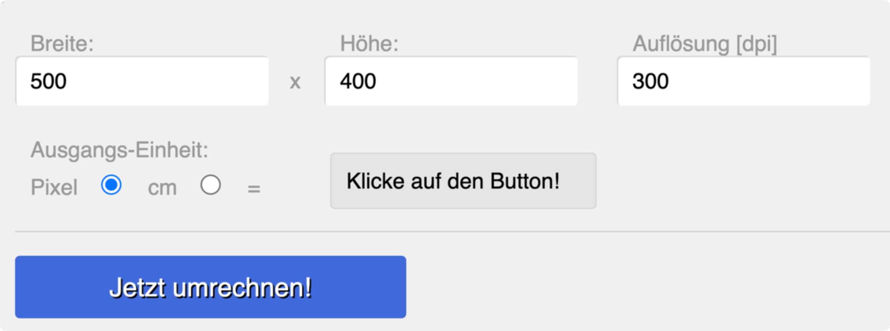

# Javascript

## Eingabe und Ausgabe (Übungen – DTP-Einheitenumrechner)

Es ist ein einfaches Formular zu erstellen, mit dessen Hilfe man Bildgrößen basierend auf der Auflösung des Dokuments in dpi von Pixel nach cm umrechnen kann und umgekehrt.

### 1. HTML und CSS

Umsetzen des Umrechners in HTML, Stylen der Elemente mit CSS:
* Eingabe mittels Formularfelder und Buttons
* Ausgabe über ein Formularfeld, das Attribut `disable="true"` gesetzt hat
*	Stylesheets in eigener Datei
*	Einsatz von verschiedenen „CSS-Arten“
	* Element – z.B.: `h1 { ... }`
	* Klasse – z.B.: `.rounded {}`
	* Id – z.B.: `#container {}`

### 2. JavaScript

Umsetzen der Funktionalität in JavaScript:

**Umrechnungsbasis**
* Pixelanzahl in der Breite = Breite [cm] / 2,54 [cm/i] x Auflösung [dpi]
* Pixelanzahl in der Höhe = Höhe [cm] / 2,54 [cm/i] x Auflösung [dpi]

***Funktionsweise***

* Breite, Höhe und Auflösung des Bildes in die entsprechenden Felder eingeben.
* Ausgangseinheit auswählen (Pixel oder cm) ⟹ Button Klicken ⟹ im Feld ganz
rechts erscheint die Bildgröße umgerechnet in die jeweils andere Einheit.

### 3. Erweiterungen

Implementiere weitere Erweiterungen:
* Vertauschen von Breite um Höhe mittels zusätzlichem Button (Hochformat`<>`Querformat)  
* Zusätzliches Formularfeld (`<select>`) mit dem man Presets auswählen kann
	* A2 Druck (300 dpi)
	* A3 Druck (300 dpi)
	* A4 Druck (300 dpi)
	* HD Video (1920 x 1080 px, 96 dpi)
	* 4K Video (3840 x 2160 px, 96 dpi)
	* Foto (13 x 9 cm, 250 dpi)
	* Foto (15 x 10 cm, 250 dpi)
	* Foto (18 x 13 cm, 250 dpi)
* Grafische Darstellung der eingegebenen Form mittels einem entsprechend gestyltem `
`