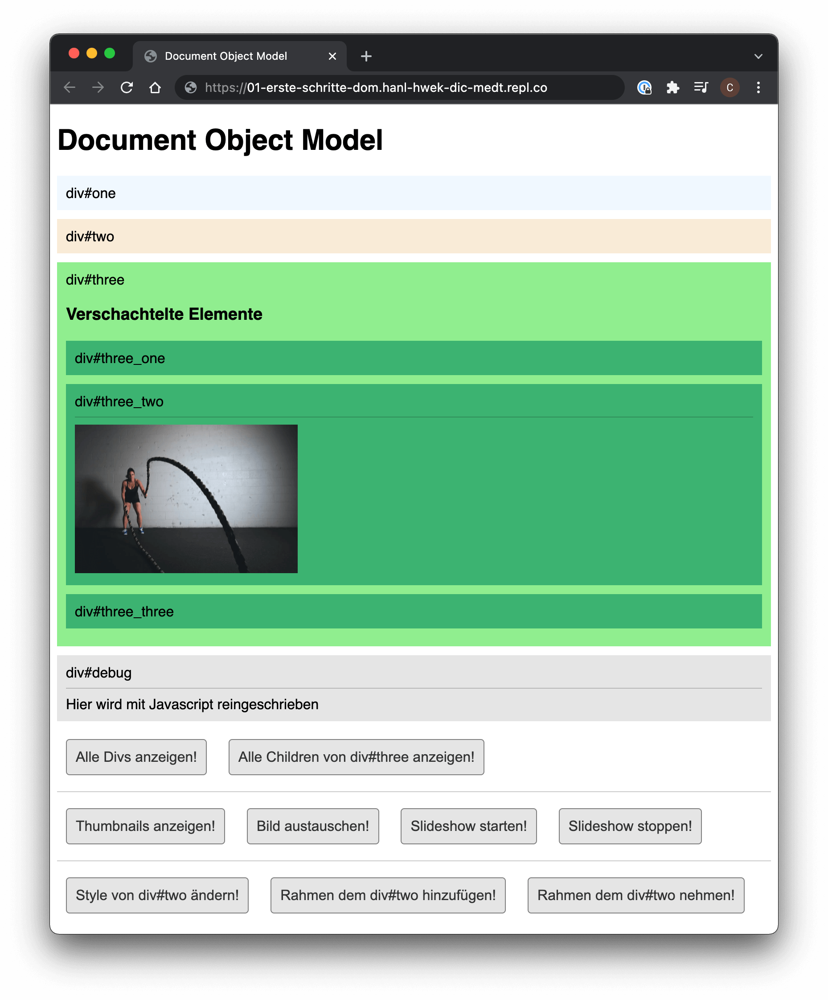

## Aufgabenstellung


Das *Document Object Model* stellt den Aufbau einer Website dar.
Sobald eine Webseite geladen ist, interpretiert der Browser den Quelltext und erstellt das *Document Object Model* der Seite.

Mit JavaScript können wir nun dynamische Webseiten erstellen:
- HTML-Elemente auf der Seite verändern
- Eigenschaften der Elemente verändern
- CSS-Style der Elemente anpassen
- HTML Elemente löschen oder neue erstellen
- Auf bestehende Events reagieren oder neue Events erstellen

Erstelle ein Projekt entsprechend der Vorlage in der Datei [dom_examples_emtpy.zip](./assets/dom_examples_empty.zip){:target="_blank"}.

### 1. Zugriff auf HTML Elemente

#### Aufgabe 1: Auf alle Elemente eines bestimmten Tags zugreifen
* Beim Klick auf den Button `Alle Divs anzeigen!` sollen die Anzahl aller, auf der Seite enthaltenen, `<div>`-Elemente sowie deren `id` in der Konsole ausgegeben werden.
  ```console
  > // Konsole
  > Anzahl der div-Elemente auf der Seite: 7
  > div - id: one
  > div - id: two
  > div - id: three
  > div - id: three_one
  > div - id: three_two
  > div - id: three_three
  > div - id: debug
  ```
  
#### Aufgabe 2: Auf die children eines Objekts zugreifen
* Beim Klick auf den Button `Alle Children von div#three` sollen die Anzahl der im `<div id="three">` enthaltenen Kinder sowie deren Tag in der Konsole ausgegeben werden:
  ```console
  > // Konsole
  > Anzahl der Children von div#three: 5
  > 1. Element:SPAN
  > 2. Element:H3
  > 3. Element:DIV
  > 4. Element:DIV
  > 5. Element:DIV 
  ```


#### Ressourcen
- [W3 schools - Finding HTML Elements](https://www.w3schools.com/js/js_htmldom_elements.asp){:target="_blank"}
- [mozilla.org - Element.children](https://developer.mozilla.org/en-US/docs/Web/API/Element/children){:target="_blank"}


### 2. Elemente verändern und erzeugen

#### Aufgabe 3: Erzeugen von TextNodes
* Erweitere die Aufgaben 1 und 2 aus _Zugriff auf HTML Elemente_ so, dass die Ausgabe nicht in der Konsole passiert, sondern im `<div>` mit der `id="debug"`. Verwende die Befehle `document.createTextNode()` und `appendChild()`, um die einzelnen Zeilen zu erstellen und dem `div` hinzuzufügen.
  ```javascript
  // JavaScript

  // TextNode erzeugen
  let text = document.createTextNode ("Text der Zeilen ...");

  // Text dem <div> mit der id="debug" hinzufügen
  let debug = document.getElementById("debug");
  debug.appendChild ( text );
  ```

#### Aufgabe 4: Erzeugen der Thumbnails
* Beim Klick auf den Button `Thumbnails anzeigen!` sollen Thumbnails aller Bilder angezeigt werden, die im globalen Array `imageUrls` definiert sind. Die erstellten Bilder sollen in einem neu erzeugten `<div>` nach dem `<div id="three_three">` mit einer Breite von jeweils `150px` angezeigt werden.
  


#### Aufgabe 5: Verändern von Objekt-Eigenschaften
* Beim Klick auf den Button `Bild austauschen!` soll das Bild  im `` ausgetauscht werden. Die Pfade zu den Bildern sind bereits im globalen Array `imageUrls` angelegt.
* Nach Klick auf den Button `Slideshow starten!` soll das Bild  im `` alle 3 Sekunden ausgetauscht werden. Ist das Ende des Arrays erreicht, so soll wieder beim ersten Bild begonnen werden.
* Nach Klick auf den Button `Slideshow stoppen!` soll der automatische Bildwechsel beendet werden.


#### Ressourcen
- [mozilla.org - Document.createTextNode()](https://developer.mozilla.org/de/docs/Web/API/Document/createTextNode){:target="_blank"}
- [W3 schools - Image Object](https://www.w3schools.com/jsref/dom_obj_image.asp){:target="_blank"}
- [W3 schools - Image src Property](https://www.w3schools.com/jsref/prop_img_src.asp){:target="_blank"}

### 3. CSS-Style von HTML-Elementen verändern

#### Aufgabe 6: Verändern des Aussehen eines Elements
* Beim Klick auf den Button `Style von div#two` ändern soll die Hintergrundfarbe des `<div>` mit der `id="two"` geändert werden. Verwende dazu die Eigenschaft `style`.
* Beim Klick auf den Button `Rahmen dem div#two hinzufügen!` soll dem `<div>` mit der `id="two"` die Klasse `.border` hinzugefügt werden. Die Klasse soll in `CSS` angelegt werden, so dass ein Rahmen um das `<div>` dargestellt wird. Verwende dazu die Eigenschaft `classList`.
* Beim Klick auf den Button `Rahmen dem div#two nehmen!` soll dem `<div>` mit der `id="two"` die Klasse `.border` entfernt werden, so dass das `<div>` wieder ohne Rahmen dargestellt wird.


#### Ressourcen
- [W3 schools - Element.classList](https://www.w3schools.com/js/js_htmldom_css.asp){:target="_blank"}
- [mozilla.org - Document.createTextNode()](https://developer.mozilla.org/de/docs/Web/API/Element/classList){:target="_blank"}
