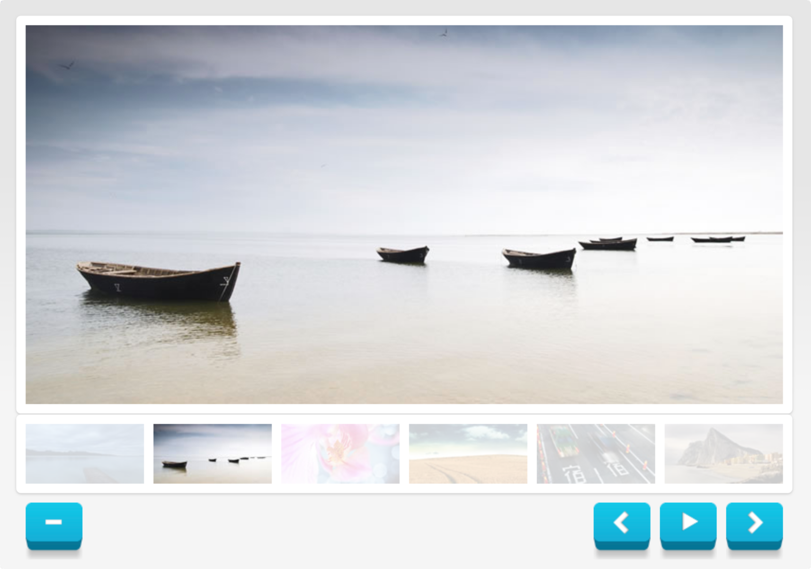

# Javascript

## Document Object Model (Übungen – Bildergalerie)


Es ist eine einfache Website zu erstellen, die eine vorgegebene Anzahl an Bilder in Form einer Bildergalerie darstellt.

### 1. HTML

Erstelle ein Projekt entsprechend der Vorlage in der Datei [dom_gallery_emtpy.zip](./assets/dom_gallery_empty.zip){:target="_blank"}.

Setze die Bildergalerie in HTML zu um, dass ein großes Bild sowie die sechs Thumbnails dargestellt werden können. Die Bilder sind im Ordner `./pics` zu finden. 

Verwende entsprechende `<div>`-Elemente als Container, um dann später einfacher mittels JavaScript auf die einzelnen Element zugreifen zu können.

### 2. JavaScript

Setze die Funktionalität mittels JavaScript um. Die Namen der Bilder sowie die Namen der Thumbnails sind bereits in globalen Arrays angegeben:
```javascript
var gImages = new Array ("./pics/img_01.jpg", 
		"./pics/img_02.jpg", 
		"./pics/img_03.jpg", 
		"./pics/img_04.jpg", 
		"./pics/img_05.jpg", 
		"./pics/img_06.jpg");

var gThumbs = new Array ("./pics/thumb_01.jpg", 
		"./pics/thumb_02.jpg", 
		"./pics/thumb_03.jpg", 
		"./pics/thumb_04.jpg", 
		"./pics/thumb_05.jpg", 
		"./pics/thumb_06.jpg");
```

#### Funktionalität der Thumbnails 
Bei Klick auf eines der Thumbnails soll sich das große Bild in der Detailansicht austauschen.

#### Durchschalten der Bilder
* Erstelle die Buttons `Next Image` und `Previous Image`.
* Bei Klick auf diese Buttons soll das große Bild mit dem jeweils darauf folgenden oder dem vorangehenden ausgetauscht werden.
* Am Ende angelangt soll dann wieder das erste Bild angezeigt werden, ...

#### Slideshow
* Erstelle die Buttons `Start Slideshow` und `Stop Slideshow`.
* Bei Klick auf den Button `Start Slideshow` soll der Bildwechsel beginnen und das Bild alle 5 Sekunden wechseln. Verwende dazu die Funktion `setInterval()`.
* Bei Klick auf den Button `Stop Slideshow` soll der Bildwechsel unterbrochen werden. Verwende dazu die Funktion `clearInterval()`.
* Stelle sicher, dass ein mehrfaches Klicken der beiden Buttons die Funktionalität nicht beeinträchtigt.


### 3. Styling mit CSS
Passe das Aussehen der Bildergalerie mittels CSS an:
* Stylesheets in eigener Datei
* Einsatz von verschiedenen „CSS-Arten“
	 * Element – z.B.: `h1 { ... }`
	 * Klasse – z.B.: `.rounded {}`
	 * Id – z.B.: `#container {}`
* Hebe das aktuelle Bild in der Vorschau hervor (Deckkraft oder Rahmen, ...)	
* Verwende die Bilder `plus.png`,`minus.png`, etc.,  die sich im Ordner `./img` befinden, um das Aussehen der Buttons zur Steuerung der Galerie anzupassen

### 4. Erweiterungen

Implementiere weitere Erweiterungen:
* Erweitere die Bildergalerie um die Möglichkeit den Bereich für die Thumbnails ein- und ausblenden zu können.
* Erweitere die Bildergalerie um die Möglichkeit die Zeit zwischen den Bildwechseln angeben zu können (`<select>` oder als Eingabefeld) 
* Styling der Buttons ohne Hintergrundbild, nur mittels CSS und CSS-Transitions ([https://www.w3schools.com/css/css3_transitions.asp](https://www.w3schools.com/css/css3_transitions.asp){:target="_blank"})
* Verwende CSS-Transitions, um unterschiedliche Effekt beim Bildübergang zu implementieren

### Ressourcen

* [.zip des leeren Projekts](./assets/dom_gallery_empty.zip){:target="_blank"}
* [W3 schools - Document Object Model](https://www.w3schools.com/js/js_htmldom.asp){:target="_blank"}
* [W3 schools - CSS3 Transitions](https://www.w3schools.com/css/css3_transitions.asp){:target="_blank"}