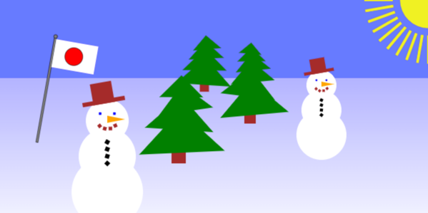

## Aufgabenstellung



Es ist eine einfache Website zu erstellen, die eine Winterlandschaft mit Hilfe einer Canvas2D zeichnet. 

Das `<canvas>`-Element stellt eine Zeichenfläche (_Leinwand_) zur Verfügung, auf die mittels JavaScript dynamische Bitmap-Grafiken gezeichnet werden können.


### 1. Projekt anlegen
Erstelle ein Projekt entsprechend der Vorlage in der Datei [canvas_draw_empty.zip](./assets/canvas_draw_empty.zip){:target="_blank"}.

### 2. Erste Schritte
Sieh dir den Quelltext des Programms an und versuche die Befehle nachzuvollziehen.

Erstelle weitere grafische Primitive und andere Formen. Experimentiere mit den Transformationen und den Eigenschaften der Objekte (Farben, Linien, etc.).

### 3. Japanische Flagge
Erweitere das Programm um eine Funktion `drawJapaneseFlag()`, die die japanische Flagge auf das `<canvas>`-Objekt zeichnet.


### 4. Schneemann

Zeiche einen Schneemann, der aus mehreren Teilen besteht. Zeichne sich wiederholende Elemente, wie zum Beispiel die Knöpfe, mit Hilfe einer Schleife.
```javascript
/* JavaScript */

// Zeichen von 4 Knöpfen, die untereinander liegen
for (let i = 0; i < 4; i++) {
    context.translate(0, 10);
    context.fillRect(-3, -3, 6, 6);
}
```
### Erweiterungen

Implementiere weitere Grafiken wie zum Beispiel:
* Hintergrund mit Sonne
* Bäume
* Implementiere Verläufe
* ...

## Abgabe

### Abgabeplattform
Die Plattform der Abgabe wird im Unterricht besprochen.

#### Abgabe über Teams
Eine `.zip`-Datei mit allen Dateien und Verzeichnissen. Entpacke die Datei vorher testweise auf deinem Rechner. Der entpackte Inhalt muss vom Browser geöffnet und fehlerfrei dargestellt werden können.

#### Abgabe über Repl.it
Alternativ kann die Abgabe über [replit.com](https://replit.com){:target="_blank"} erfolgen.

### Bewertungskriterien
* Umfang und Komplexität
* Sauberkeit des Quelltextes
* Dokumentation des Quelltextes


## Allgemeines und Quelltextbeispiele

### Das Canvas-Element ### 

Das `<canvas>`-Element stellt eine Zeichenfläche (_Leinwand_) zur Verfügung, auf die mittels JavaScript dynamische Bitmap-Grafiken gezeichnet werden können.
```html
<!-- HTML -->
<canvas id="myCanvas" width="600" height="400">
    Fallback content, in case the browser does not support Canvas.
</canvas>
```
Ein `<canvas>`-Element ist für sich alleine leer und muss per JavaScript gefüllt werden. Um einfach auf das Objekt zugreifen zu können, wurde die id `"myCanvas"` vergeben.

__Rendering Context__

Um auf ein `<canvas>`-Objekt zeichnen zu können, stellt das Objekt eine Schnittstelle zur Verfügung, genannt _Rendering Context_. Dieser _Rendering Context_ muss immer angegeben werden, wenn auf die Canvas zugegriffen werden soll.

```javascript
/* JavaScript */
let canv = document.getElementById("myCanvas");
let context = canv.getContext("2d");
```

__Einfache Formen zeichnen__
```javascript
/* JavaScript */

// Ein Rechteck zeichnen
context.fillStyle = "red";	// Zeichenfarbe ist jetzt rot
context.fillRect ( 25, 25, 100, 50 ); // x, y, Breite,  Höhe

// Einen Kreis zeichnen
context.beginPath ();	// Ein neuer Pfad beginnt
context.fillStyle = "green";	// Zeichenfarbe ist jetzt grün
context.arc ( 180, 50, 25, 0, 2 * Math.PI, true); 
    // x, y, Radius,  Startwinkel, Endwinkel, Uhrzeigersinn	
context.fill();		// Pfad ausfüllen
context.closePath ();	// Pfad schliessen
```

__Einbinden von Bitmap-Grafiken__
```javascript
/* JavaScript */

// Image-Objekt anlegen und Bildquelle angeben
image = new Image();
image.src = "./logo.png"

// Bitmap-Grafik zeichnen
context.drawImage 	( image, 50, 50, 200, 100 );
    // Bildobjekt, x, y, Breite, Hoehe
```

__Farbangaben__

Für alle Farbangaben Strings verwendet werden, die CSS3-Farbangaben entsprechen. Alles was in einem Stylesheet stehen würde, funktioniert auch beim `<canvas>`-Element.
```javascript
/* JavaScript */

// Angabe mit Schlüsselwoerter
context.fillStyle = "red";

// RGB mit numerischen Farbwerten 
context.fillStyle = "#00ff00";                 // #rrggbb
context.fillStyle = "rgb(255,0,0)";            // Integer
context.fillStyle = "rgb(100%,0,0)";           // Prozent
context.fillStyle = "rgba(0,0,255,0.5)";       // Mit Transparenz
context.fillStyle = "rgba(0,0,100%,0.5)";      // Mit Transparenz

// Farbton, Luminanz und Sättigung (hue, saturation, lightness)
context.fillStyle = "hsl(0, 100%, 50%)";       // rot
context.fillStyle = "hsl(120, 100%, 50%)";     // grün
context.fillStyle = "hsl(120, 100%, 25%)";     // dunkelgrüen 
context.fillStyle = "hsl(120, 100%, 75%)";     // hellgrüen
```

__Löschen des Canvas__

Um Teilbereiche oder die gesamte Zeichenfläche zu löschen kann der Befehl `clearRect()` verwendet werden:
```javascript
/* JavaScript */

// Löschen eines Teilbereichs des Canvas-Objekts
lContext.clearRect( 10, 10, 50, 50 );	// x, y, Breite,  Hoehe

// Löschen der gesamten Zeicheflaeche
lContext.clearRect( 0, 0, context.canvas.width, context.canvas.height );
```

### Das Koordinatensystem und die Transformationsmatrix ### 

Das Koordinatensystem für das `<canvas>`-Objekt kann man sich als Gitternetz vorstellen. Dieses Gitternetz liegt unsichtbar über dem Bitmap und wird durch die _Transformationsmatrix_ abgebildet.

Zu Beginn entspricht die _Transformationsmatrix_ der _Einheitsmatrix_ und weist folgende Eigenschaften auf:
* Der Nullpunkte `(x=0, y=0)` liegt in der linken oberen Ecke des`<canvas>`-Objekts.
* Die Breite und die Höhe des Koordinatensystems stimmen mit der Breite und der Höhe des `<canvas>`-Objekts überein.


#### Transformationen

Die _Transformationsmatrix_ und somit das Gitternetz können durch __Skalieren__, __Translieren__ und __Rotieren__ verändert werden. Werden danach Objekte gezeichnet, so werden diese Transformationen auf die Objekte angewendet.

```javascript
/* JavaScript */

// Skalieren
context.scale(.9, .9);
context.strokeStyle = "red";
context.strokeRect(100, 50, 100, 100);

// Rotieren
context.rotate(30 * Math.PI / 180);
context.strokeStyle = "green";
context.strokeRect(100, 50, 100, 100);

// Translieren
context.translate(150, -50);
context.strokeStyle = "blue";
context.strokeRect(100, 50, 100, 100);
```
#### Zusammenspiel mehrerer Transformationen

Das Koordinatensystem kann mehrfach transformiert werden. Soll zum Beispiel ein Objekt gedreht und verschoben werden, so müssen die Transformationen `rotate` und `translate` angewendet werden. Diese Transformationen sind dann für alle Objekte gültig, die danach gezeichnet werden. So macht auch die Reihenfolge der Transformationen einen Unterschied.

Soll danach das Koordinatensystem wieder zurückgesetzt werden, so müssen die angewandten Transformationen wieder rückgängig gemacht werden. Das passiert, indem die Transformationen in umgekehrter Reihenfolge angewendet werden:

#### Zurücksetzen der Tranformationsmatrix

Soll danach das Koordinatensystem wieder zurückgesetzt werden, so müssen die angewandten Transformationen wieder rückgängig gemacht werden. Das passiert, indem die Transformationen in umgekehrter Reihenfolge angewendet werden:
```javascript
/* JavaScript */

lContext.rotate ( 25 * Math.PI / 180 );     // Drehen des Gitternetzes
lContext.translate ( 50, 50 );              // Verschieben des Gitternetzes
lContext.fillRect ( 25, 25, 100, 50 );      // Rechteck schräg zeichnen
lContext.translate ( -50, -50 );            // Zurück schieben 
lContext.rotate ( -25 * Math.PI / 180 );    // Zurück drehen

```

Eine andere Möglichkeit ist das __Speichern und Wiederherstellen__ der Transformationsmatrix:
```javascript
/* JavaScript */

// Aktuelle Transformationen speichern
context.save();

// Diverse Änderungen an der Matrix
lContext.rotate ( 25 * Math.PI / 180 );     // Drehen des Gitternetzes
lContext.translate ( 50, 50 );              // Verschieben des Gitternetzes
lContext.fillRect ( 25, 25, 100, 50 );      // Rechteck schräg zeichnen

// Gespeicherte Transformationen auf den Stand von vor context.save() wiedeherstellen
context.restore();
```


## Weitere Ressourcen

* [.zip des leeren Projekts](./assets/canvas_draw_empty.zip){:target="_blank"}
* [MDN Web Docs - CanvasRenderingContext2D](https://developer.mozilla.
  org/de/docs/Web/API/CanvasRenderingContext2D){:target="_blank"}
* [Wikimedia Commons - File:2D affine transformation matrix.svg](https://commons.wikimedia.org/wiki/File:2D_affine_transformation_matrix.svg){:target="_blank"}
* [Opera Canvas Tutorial](https://dev.opera.com/articles/html5-canvas-basics/){:target="_blank"}
* [Breakout Game Tutorial](https://billmill.org/static/canvastutorial/bricks.html){:target="_blank"}
