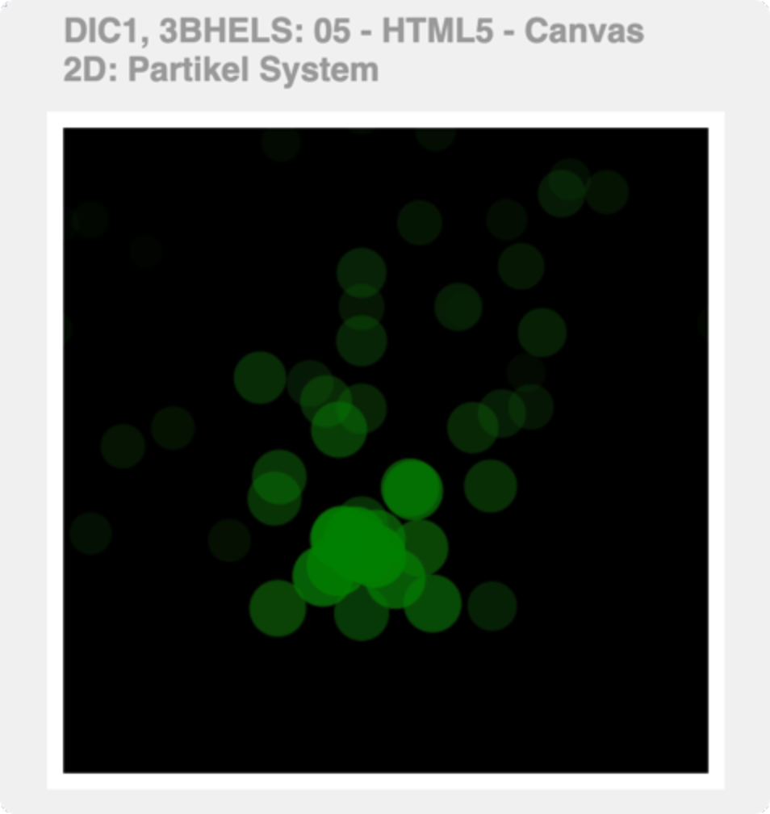

# Aufgabenstellung

Es soll ein einfaches Partikelsystem erstellt werden.

### 1. HTML

Erstelle ein Projekt entsprechend der Vorlage in der Datei [canvas_clock_emtpy.zip](./assets/canvas_clock_emtpy.zip){:target="_blank"}.

### 2. JavaScript

Setze die Funktionalität mittels JavaScript um. Achte bei der Programmierung darauf, die Funktionalität soweit möglich zu gliedern und in Funktionen auszulagern.

#### Darstellung des Ziffernblatts
* Verwende für die Abmessungen der Uhr [Konstanten](https://developer.mozilla.org/de/docs/Web/JavaScript/Reference/Statements/const){:target="_blank"}, damit die Größe der Uhr einfach an einer Stelle angepasst werden kann.
* Erstelle eine Funktion `drawClockFace()`, die den Hintergrund und die Einteilung in Minuten und Stunden abbildet.
* Rufe die Funktion beim Laden der Seite auf.

#### Darstellen der Uhrzeit über die Zeiger
* Erstellen eine Funktion `drawClockHands()`, die die Uhrzeiger darstellt
* Lese die aktuelle Uhrzeit aus. Verwende dazu die [`Date.now()`](https://developer.mozilla.org/de/docs/Web/JavaScript/Reference/Global_Objects/Date/now#){:target="_blank"}, um die Uhrzeit auszulesen und die Zeiger entsprechend zu positionieren.
* Rufe die Funktion beim Laden der Seite auf.

#### Bewegen der Zeiger
Implementiere die Bewegung der Zeiger. Der Sekundenzeiger soll jede Sekunde weiterspringen, die Minuten- und Stundenzeiger sollen sich kontinuierlich bewegen.

 Damit die Bewegung dargestellt wird muss die Uhr immer wieder gelöscht und neu gezeichnet werden. Erstelle dazu eine Funktion `clearCanvas()`, die die gesamte Zeichenfläche löscht.

Verwende die Methode `setInterval()` um jede Sekunde die Uhr neu zu zeichnen:
1. Löschen der Canvas
2. Zeichnen des Ziffernblattes
3. Ermitteln der Systemzeit und Zeichnen der Zeiger

### Erweiterungen

Implementiere weitere Erweiterungen:
* Das aktuelle Datum wird dargestellt.
* Der aktuelle Wochentag wird dargestellt.
* Die aktuelle Mondphase wird dargestellt.
* ...

## Abgabe

### Abgabeplattform
Die Plattform der Abgabe wird im Unterricht besprochen.

#### Abgabe über Teams
Eine `.zip`-Datei mit allen Dateien und Verzeichnissen. Entpacke die Datei vorher testweise auf deinem Rechner. Der entpackte Inhalt muss vom Browser geöffnet und fehlerfrei dargestellt werden können.

#### Abgabe über Repl.it
Alternativ kann die Abgabe über [replit.com](https://replit.com){:target="_blank"} erfolgen.

### Bewertungskriterien
* Umfang und Komplexität
* Seitenstruktur (Dateien und Ordner)
* Sauberkeit des Quelltextes
* Dokumentation des Quelltextes

## Ressourcen

* [.zip des leeren Projekts](./assets/canvas_clock_empty.zip){:target="_blank"}
* [MDN Web Docs - CanvasRenderingContext2D](https://developer.mozilla.org/de/docs/Web/API/CanvasRenderingContext2D){:target="_blank"}