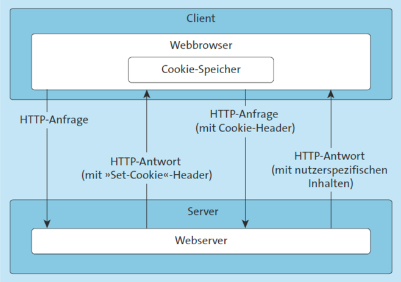
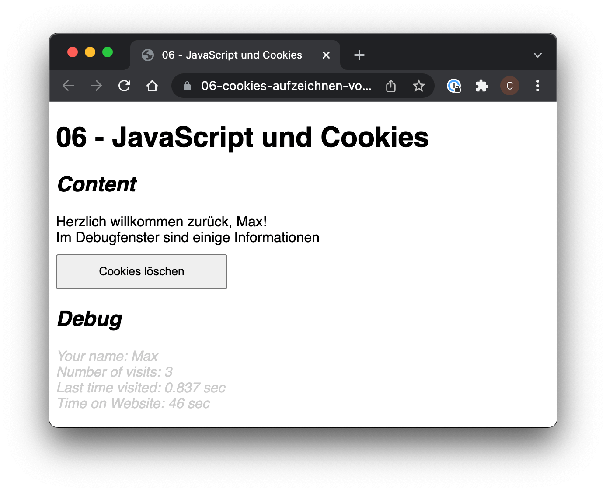
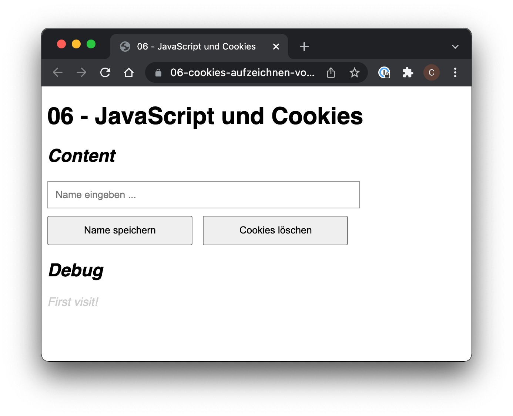
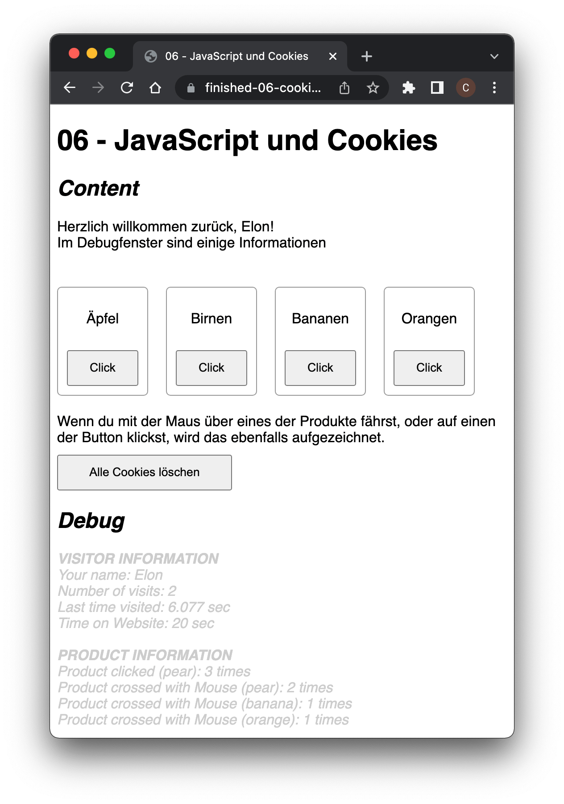

## Cookies

### Was sind Cookies?

Cookies sind kleine Dateien, die auf dem Computer, genauer gesagt im Browser gespeichert werden. In einem Cookie können neben der Adresse der Website, zusätzliche Informationen gespeichert werden. Cookies beinhalten normalerweise keine persönlichen Daten und sind somit ungefährlich und in den meisten Fällen auch nützlich.

Der Browser schickt das Cookie in jeder Anfrage mit:



### Wofür kann man Cookies verwenden?

Normalerweise werden Cookies verwendet, um Benutzerverhalten in irgendeiner Weise aufzuzeichnen. Ist bei einer Website zum Beispiel eine Anmeldung notwendig, so kann in einem Cookie gespeichert werden, ob sich der Benutzer schon einmal angemeldet hat und gegebenenfalls eine erneute Anmeldung übersprungen werden kann.

Bei Online-Shops kann zum Beispiel aufgezeichnet werden, welche Produkte sich der Kunde angesehen hat. So können genau diese Produkte bei einem neuen Besuch der Website wieder aufgelistet werden.

#### First-Party-Cookies vs. Third-Party-Cookies

First-Party-Cookies und Third-Party-Cookies sind beides Arten von Cookies, die beim Besuch einer Webseite im Browser des Nutzers gespeichert werden können. Sie unterscheiden sich jedoch hinsichtlich ihrer Herkunft und Verwendung.


First-Party-Cookies und Third-Party-Cookies sind beides Arten von Cookies, die beim Besuch einer Webseite im Browser des Nutzers gespeichert werden können. Sie unterscheiden sich jedoch hinsichtlich ihrer Herkunft und Verwendung.

##### First-Party-Cookies

**Definition:** First-Party-Cookies werden von der Webseite gesetzt, die der Nutzer gerade besucht. Sie sind direkt mit dieser Domain verknüpft.

**Verwendungszweck:** Diese Cookies werden meistens verwendet, um Benutzereinstellungen, Anmeldeinformationen oder andere Daten zu speichern, die das Nutzererlebnis auf der besuchten Webseite verbessern. Sie ermöglichen es der Webseite, sich an die Aktionen und Präferenzen des Nutzers über einen bestimmten Zeitraum zu erinnern.

**Beispiele:**
- Speicherung von Anmeldestatus, so dass der Nutzer bei einem erneuten Besuch der Seite nicht erneut sein Passwort eingeben muss.
- Beibehaltung von Spracheinstellungen oder anderen Präferenzen.
- Tracking des Nutzerverhaltens für die Verbesserung der Webseite durch die Webseitenbetreiber.

##### Third-Party-Cookies

**Definition:** Third-Party-Cookies werden von einer anderen Domain als der gesetzt, die der Nutzer besucht. Diese Cookies werden oft von Werbenetzwerken oder Analysediensten gesetzt, die mit der besuchten Webseite zusammenarbeiten.

**Verwendungszweck:** Sie werden hauptsächlich für Cross-Site-Tracking, Werbung und Analytik verwendet. Diese Cookies ermöglichen es Drittanbietern, Informationen über das Surfverhalten des Nutzers über verschiedene Webseiten hinweg zu sammeln, um personalisierte Werbung zu schalten oder umfangreiche Nutzerprofile zu erstellen.

**Beispiele:**
- Anzeigen personalisierter Werbung basierend auf den besuchten Seiten und den gezeigten Interessen.
- Sammeln von Daten über die Webseite-Nutzung für Analysezwecke durch Dienste wie Google Analytics.
- Tracking-Cookies, die von sozialen Netzwerken gesetzt werden, wenn Inhalte der besuchten Seite geteilt werden.

#### Datenschutzaspekte

Datenschutzgesetze und -richtlinien wie die DSGVO in der EU haben den Umgang mit Cookies, insbesondere Third-Party-Cookies, verschärft. Nutzer müssen oft ihre Zustimmung geben, bevor solche Cookies gesetzt werden dürfen.

---
### Cookies schreiben

#### Session-Cookies
In einem Cookie werden Daten als String in Form von Wertepaaren gespeichert. Ein Wertepaar besteht immer aus einem Namen und dem zugehörigen Wert.

Folgende Zuweisung legt ein Wertepaar mit dem Namen `user` und dem Wert `max` an:

```javascript
document.cookie = "user=max";
```

Cookies, die auf diese Weise angelegt werden nennt man Session-Cookies. Das bedeutet, dass das Cookie nur so lange gültig ist, wie der Browser geöffnet ist. Wird der Browser geschlossen, so werden alle Session-Cookies gelöscht.

#### Cookies mit Ablaufdatum
Optional kann mit dem Parameter `expires` angegeben werden, bis zu welchem Zeitpunkt das Cookie gültig ist. Ist der Zeitpunkt erreicht, wird der Eintrag aus dem Cookie gelöscht.

```javascript
document.cookie = "user=max;expires=Wed, 06 Feb 2013 12:10:53 GMT";
```

Um ein Cookie anzulegen, dass für eine Stunde Gültigkeit hat, muss dieser Zeitpunkt ermittelt werden:

```javascript
var date = new Date();
date.setTime(date.getTime() + (60 * 60 * 1000)); // 1 Stunde hinzufügen
var expires = "; expires=" + date.toUTCString();
document.cookie = "user=max" + expires;
```

#### Cookie-Domain und Cookie-Pfad
Neben den Wertepaaren und dem Ablaufdatum werden für ein Cookie zusätzliche Daten gespeichert.

So wird die Domain gespeichert, von der aus dieses Cookie angelegt wird. Ebenfalls gespeichert wird der Pfad, in dem sich die Datei befindet, die das Cookie anlegt. Pro Domain dürfen bis zu 20 Cookies gesetzt werden.

Auf die Cookie-Domain kann kein Einfluss genommen werden. Der Cookie-Pfad kann über den optionalen Parameter `path` angegeben werden:

```javascript
document.cookie = "user=max;path=/";
```

---
### Cookies lesen

In `document.cookie` sind alle Wertepaare in einem String aufgelistet. Die Trennung der Wertepaare erfolgt mit einem `;`.

Um auf den Wert eines bestimmten Wertepaares zugreifen zu können, müssen alle Wertepaare durchlaufen werden. Stimmt der Name des aktuellen Elements mit dem gesuchten Namen überein, kann der Wert ermittelt werden:

```javascript
var cookies = document.cookie.split(';');
for(var i = 0; i < cookies.length; i++) {
    var c = cookies[i];
    while (c.charAt(0) == ' ') c = c.substring(1, c.length);
    if (c.indexOf(name) == 0) return c.substring(name.length, c.length);
}
```

---
### Cookies löschen

Ein *Cookie* wird automatisch vom Browser gelöscht, sobald die Gültigkeit erloschen ist. Um ein *Cookie* sofort zu löschen, muss also nur die Gültigkeit auf einen Zeitpunkt gesetzt werden, der in der Vergangenheit liegt:

```javascript
// Ablaufdatum auf vergangene Zeit setzen
var lExpires = "; expires=Thu, 01-Jan-70 00:00:01 GMT";

// Cookie setzen
document.cookie = user + "=" + lExpires + "; path=/";
```

### Cookies mit Sonderzeichen

Ein Cookie-Wert sollte möglichst keine Leerzeichen, Semikolons, Kommata und dergleichen enthalten.

Wenn solche Zeichen verwendet werden sollen, muss der String mit der Funktion `escape()` kodiert werden. Nach dem Auslesen erhält man mit `unescape()` wieder die ursprüngliche Zeichenkette.

```javascript
// String kodieren
var lValue = escape("Test mit Sonderzeichen"); 
                    // "Test%20mit%20Sonderzeichen"

// String dekodieren und ausgeben
var lText = unescape(lValue);
                    // "Test mit Sonderzeichen"
```


## Aufgabenstellung

Es ist eine einfache Website zu erstellen, die das Benutzerverhalten eines Besuchers aufzeichnet.



> **ACHTUNG: Chrome erlaubt keine lokalen Daten**
>
> Workaround:
>
> * chrome: `--enable-file-cookies`
> * repl: Open in new Tab (Icon rechts oben)

### 1. Framework
Erstelle alle notwendigen HTML-Element, wie in der Abbildung dargestellt.

Setze die Funktionalität mittels JavaScript um. Achte bei der Programmierung darauf, die Funktionalität soweit möglich zu gliedern und in Funktionen auszulagern.

### 2. Personalisierung
Es soll erkannt werden, ob ein Benutzer schon einmal auf der Seite war oder neu auf der Seite ist.



1. Ist der Benutzer das erste Mal auf der Seite, soll er mit `Neu hier? Trag doch gleich deinen
Namen ein!` begrüßt werden.

2. Auf der Website kann der Benutzer seinen Namen über ein Textfeld eingeben. Der Name soll anschließend in einem Cookie abgespeichert werden.

3. Hat ein Besucher seinen Namen eingegeben und besucht die Website ein weiteres Mal, soll er mit seinem Namen begrüßt werden (z.B. `Hallo Max!`).

### 3. Löschen von Cookies
Bei Klick auf den Button `Cookies löschen` sollen alle Cookies gelöscht werden, in dem deren `expires`-Wert auf einen Zeitpunkt in der Vergangenheit gesetzt wird.

### 4. Aufzeichnung weiterer Informationen

Zeichne weitere Informationen mit Hilfe von Cookies auf. Alle aufgezeichneten Informationen sollen beim Laden der Seite in einem `<div id="debug">...</div>` ausgegeben werden.

1. Anzahl der Besuche
2. Zeit, die seit dem letzten Besuch vergangen ist
3. Gesamte Zeit, die der Besucher auf der Website gebraucht hat

### 5. Zusatz/Erweiterungen Aufzeichnung von Produkt

Zeichne weitere Informationen über das Benutzerverhalten auf. Simuliere dazu einen einfachen Shop mit einigen Produkten.

* Wie oft hat der Benutzer auf ein Produkt geklickt
* Wie oft hat der Benutzer die Maus über ein Produkt bewegt



## Ressourcen

* [MDN Web Docs - Document.cookie](https://developer.mozilla.org/en-US/docs/Web/API/Document/cookie)