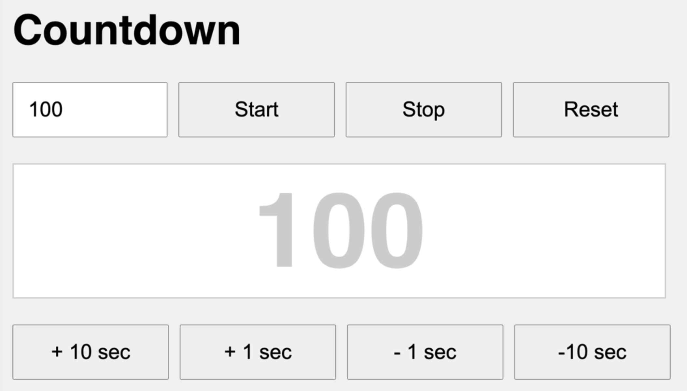

# Javascript

## Eingabe und Ausgabe (Übungen – Countdown)

----

Es ist eine einfache Webapp zu erstellen, die einen Countdown realisiert.

### 1. HTML und CSS

Umsetzen des Umrechners in HTML:
* Eingabe mittels Formularfelder und Buttons
* Ausgabe über ein `
`

----

### 2. JavaScript

Umsetzen der Funktionalität in JavaScript:

* Im Textfeld links oben kann die Startzeit eingegeben werden
* Bei Klick auf den Button `Start` startet der Countdown. Die verbleibende Zeit wird in einem `
` ausgegeben.
* Bei Klick auf den Button `Stop` wird der Countdown pausiert.
* Bei Klick auf den Button `Reset` wird der Countdown auf die im Textfeld eingegebene Zeit zurückgesetzt.
* Bei Klick auf die Buttons `+ 10 sec` `+ 1 sec` `- 1 sec` `- 10 sec` soll die Zeit verbleibende Zeit im `
` entsprechend angepasst werden.

Dokumentation:

* [setTimeout()](https://developer.mozilla.org/en-US/docs/Web/API/WindowOrWorkerGlobalScope/setTimeout)
* [setInterval()](https://developer.mozilla.org/en-US/docs/Web/API/WindowOrWorkerGlobalScope/setInterval)
* [clearTimeout()](https://developer.mozilla.org/en-US/docs/Web/API/WindowOrWorkerGlobalScope/clearTimeout)
* [clearInterval()](https://developer.mozilla.org/en-US/docs/Web/API/WindowOrWorkerGlobalScope/clearInterval)

---

### 3. CSS

Stylen der Elemente mit CSS:

* Stylesheets in eigener Datei
* Einsatz von verschiedenen „CSS-Arten“
	- Element     	z.B.: h1 { ... }
	- Klasse		z.B.: .rounded {}
	- Id			z.B.: #container {}

----

### 4. Erweiterungen

Implementiere folgende Erweiterungen:
* Zeige **Zehntelsekunden** im Timer mit an
* Erweitere den Timer um **Minuten** und **Sekunden**
