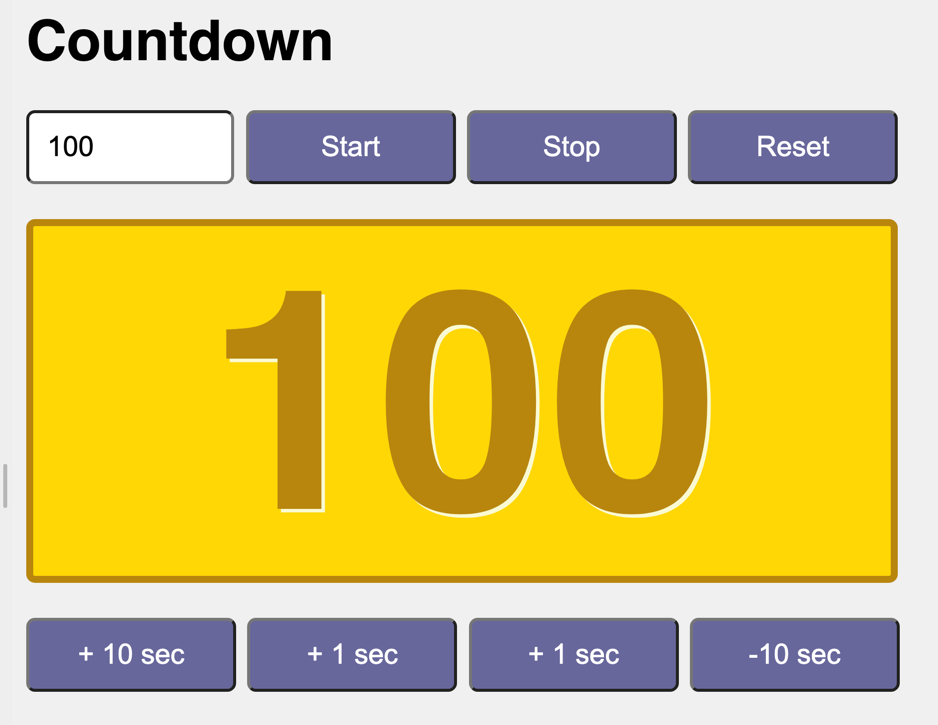

# Javascript

## Eingabe und Ausgabe (Übungen – Währungsumrechner)

{:width="480px"}

_Beispielhafte Umsetzung_

----

Es ist eine einfache Webapp zu erstellen, die einen Countdown realisiert.

### 1. HTML und CSS

Umsetzen des Umrechners in HTML, Stylen der Elemente mit CSS:
* Eingabe mittels Formularfelder und Buttons
* Ausgabe über ein `
`

----

### 2. JavaScript

Umsetzen der Funktionalität in JavaScript:

* Im Textfeld links oben kann die Startzeit eingegeben werden
* Bei Klick auf den Button `Start` startet der Countdown. Die verbleibende Zeit wird in einem `
` ausgegeben.aktuellen Dollarkurs mit einer globalen Variable.
* Bei Klick auf den Button **Reset** sollen die beiden Formularfelder gelöscht werden.

---

### 3. CSS

Passe das Aussehen per CSS an.

* Stylesheets in eigener Datei
* Einsatz von verschiedenen „CSS-Arten“
	- Element     	z.B.: h1 { ... }
	- Klasse		z.B.: .rounded {}
	- Id			z.B.: #container {}

----

### 4. Erweiterungen

Implementiere weitere Erweiterungen:
* Zusätzliches Formularfeld, um den aktuellen Dollarkurs anpassen zu können
* Umschalter **Dollar -> Euro** und **Euro -> Dollar** 
* Zusätzliche Währungen dazugeben (z.B.: Pfund)
* Umrechner zwischen Zahlensystemen ...