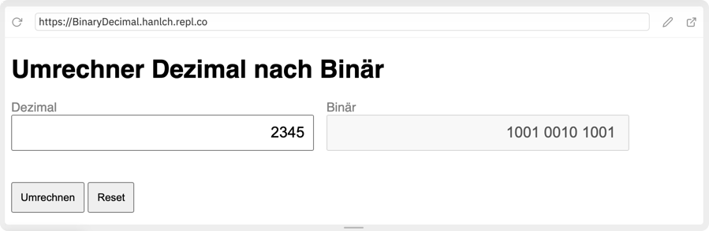

# Javascript

## Eingabe und Ausgabe (Übungen – Währungsumrechner )

----

Es ist ein einfaches Formular zu erstellen, mit dessen Hilfe Euro nach Dollar umrechnen kann.

### 1. HTML und CSS

Umsetzen des Umrechners in HTML, Stylen der Elemente mit CSS:
* Eingabe mittels Formularfelder und Buttons
* Ausgabe über ein Formularfeld, das Attribut `disable="true"` gesetzt hat
*	Stylesheets in eigener Datei
*	Einsatz von verschiedenen „CSS-Arten“
	* Element     	z.B.: h1 { ... } 
	* Klasse		z.B.: .rounded {}
	* Id			z.B.: #container {}

----

### 2. JavaScript

Umsetzen der Funktionalität in JavaScript:

* Bei Klick auf den Button **Umrechnen** wird der Dollarwert entsprechend dem akutellen Dollarkurs berechnet und ausgegeben. Definiere den aktuellen Dollarkurs mit einer globalen Variable.
* Bei Klick auf den Button **Reset** sollen die beiden Formularfelder gelöscht werden.

----

### 3. Erweiterungen

Implementiere weitere Erweiterungen:
* Zusätzliches Formularfeld, um den aktuellen Dollarkurs anpassen zu können
* Umschalter **Dollar -> Euro** und **Euro -> Dollar** 
* Zusätzliche Währungen dazugeben (z.B.: Pfund)
* Umrechner zwischen Zahlensystemen ...
{:width="480px"}