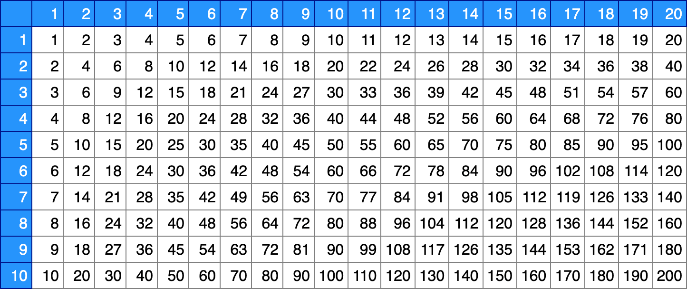

## Funktionsweise von PHP

PHP (rekursives Akronym für PHP: Hypertext Preprocessor) ist eine weit verbreitete und für den allgemeinen Gebrauch bestimmte Open Source-Skriptsprache, welche speziell für die Webprogrammierung geeignet ist und in HTML eingebettet werden kann. PHP kann auf alle gängigen Betriebssystemen verwendet werden.

Eine PHP-Datei endet mit der Extension `.php` und besteht meistens aus mehreren `HTML`- und `PHP`-Bereichen. In einer PHP-Datei können sich beliebig viele HTML- und PHP-Bereiche befinden.

* Der PHP-Code steht zwischen speziellen Anfangs- und Abschluss-Verarbeitungsinstruktionen `<?php ` und `?>`. Dieser PHP-Quelltext scheint nicht im HTML-Quelltext auf, der vom Server generiert und and den Client geschickt wird.
* Alles, das ausserhalb dieser Verarbeitungsinstruktionen steht, wird in den generierten HTML-Quelltext übernommen. 

```php
<?php // PHP 
?>
<html>
  <body>
  <?php
      echo ("Hello World!");
  ?>
</body>
</html>
```
Mit dem Befehl `echo ()` kann HTML-Quelltext erzeugt werden. Der PHP-Interpreter fügt den Output an der Stelle in den HTML-Code ein, wo der PHP-Code war; das Ergebnis sieht wie folgt aus:
```html
<!-- HTML -->
<html>
  <body>
    Hello World!
  </body>
</html>
```


### Variablen, Operatoren, Ausgabe, Kontrollstrukturen und Schleifen

#### Variablen
Variablen beginnen in PHP mit `'$'`. Variablen haben in PHP keinen expliziten Datentyp und werden automatisch angelegt, sobald es einen Variablennamen noch nicht gibt.
```php
<?php // PHP
$myString = "Hello World";
$myNumber = 44;

$a = 3;
$b = 4;
$c = sqrt ($a*$a + $b*$b);
```
* [https://www.php.net/manual/de/ - php.net Manual: Variablen](https://www.php.net/manual/de/language.variables.variable.php){:target="_blank"}
* [https://www.php.net/manual/de/ - php.net Manual: Variablentypen](https://www.php.net/manual/de/language.types.php){:target="_blank"}

#### Kommentare
Kommentare werden so wie in C, Java oder Javascript gesetzt:
```php
// Kommentar über eine Zeile oder
/* Ein längerer
   Kommentar, der sich über
   mehrere Zeilen erstreckt*/
```

#### Ausgabe und Berechnungen
Bei der Ausgabe mit `echo` gibt es mehrer Möglichkeiten. Die Verwendung von Klammern ist nicht zwingend erforderlich.
Variablen können einfach in die Ausgabe miteingebunden werden, mehrere Strings werden mit `.` miteinander verbunden.
```php
echo ("Hello");
echo ' World!';

$a = 44;
$b = 22;
$c = $a + $b;
echo "Die Summe aus $a und $b ist $c";
```

Wenn ein Dollarzeichen `$` vorkommt, nimmt der Parser gierig so viele Token wie möglich, um einen gültigen Variablennamen zu bilden. Um das Ende des Variablennamen explizit anzugeben, können geschweifte Klammern verwendet werden.
```php
<?php
$juice = "apple";

echo "He drank some $juice juice.";

// Ungültig. "s" ist ein gültiges Zeichen für einen Variablennamen, aber die
// Variable ist $juice.
echo "He drank some juice made of $juices.";

// Gültig. Geben Sie das Ende des Variablennamens explizit an, indem Sie ihn
// in geschweifte Klammern einschließen:
echo "He drank some juice made of ${juice}s.";
?>
```
Das oben gezeigte Beispiel erzeugt folgende Ausgabe:
```
He drank some apple juice.
He drank some juice made of .
He drank some juice made of apples.
```

* [https://www.php.net/manual/de/ - php.net Manual: Ausgabe mit echo](https://www.php.net/manual/de/function.echo.php){:target="_blank"}
* [https://www.php.net/manual/de/ - php.net Manual: Strings (Zeichenketten)](https://www.php.net/manual/de/language.types.string.php){:target="_blank"}


#### Kontrollstrukturen und Schleifen
Kontrollstrukturen wie `if`, `switch` oder Schleifen wie `while`, `for` können genau so wie in der Programmiersprache C oder Java verwendet werden.
Die Vergleichsoperatoren `==` `!=` `<` `<=` `=>` `>` und die logischen Operatoren `&&` und `||` sind ebenfalls gleich.
* [https://www.php.net/manual/de/ - php.net Manual: Kontrollstrukturen](https://www.php.net/manual/de/language.control-structures.php){:target="_blank"}

### Funktionen
Funktionen können ähnlich wie in C oder JavaScript verwendet werden.
```php
<?php
function sum ($a, $b, $c=10)
{
    return $a + $b + $c;
}

echo sum (5, 10, 20) . '<br>'; // gibt 35 aus
echo sum (6, 8) . '<br>'; // gibt 24 aus
?>
```


* [https://www.php.net/manual/de/ - php.net Manual: Funktionen](https://www.php.net/manual/de/language.functions.php){:target="_blank"}

## Aufgaben

### 1. Parität

Gib die Zahlen von 1 bis 20 untereinander aus und gib neben der jeweiligen Zahl an, ob sie gerade oder ungerade ist:
```
Die Zahl 1 ist ungerade
Die Zahl 2 ist gerade
Die Zahl 3 ist ungerade
Die Zahl 4 ist gerade
Die Zahl 5 ist ungerade
Die Zahl 6 ist gerade
Die Zahl 7 ist ungerade
Die Zahl 8 ist gerade
Die Zahl 9 ist ungerade
Die Zahl 10 ist gerade
Die Zahl 11 ist ungerade
Die Zahl 12 ist gerade
Die Zahl 13 ist ungerade
Die Zahl 14 ist gerade
Die Zahl 15 ist ungerade
Die Zahl 16 ist gerade
Die Zahl 17 ist ungerade
Die Zahl 18 ist gerade
Die Zahl 19 ist ungerade
```

### 2. Multiplikationstabelle

Erstelle eine Multiplikationstabelle, die die Zahlen von `1` bis `10` mit den Zahlen von `1` bis `20` miteinander multipliziert. 

Verwende dazu eine Funktion, die die `Höhe` und die `Breite` der Tabelle als Parameter übernimmt.
Passe das Aussehen der Tabelle mittels CSS an.


*Beispielhafte Umsetzung der Multiplikationstabelle*

### 3. Begrüßung je nach Tageszeit
Es soll die aktuelle Uhrzeit (vom Server) angezeigt werden. Zusätzlich soll 
der Benutzer gleich zu Beginn der Seite anhängig von der Tageszeit begrüßt werden.

* *"Guten Morgen Josef!"* zwischen 6 Uhr und Mittag
* *"Guten Tag Josef!"*		zwischen Mittag und 19 Uhr
* *"Guten Abend Josef!"*	wenn es nach 19 Uhr ist
* *"Gute Nacht Josef!"*		von 23 bis 6 Uhr

Verwende dazu die Funktion `date()` um die aktuelle Serverzeit zu ermitteln.

Verwende unterschiedliche Zeitzonen (USA, China, Australien, Europa, ...), um die Funktionalität zu Testen.

[https://www.php.net/manual/de/ - php.net Manual: date](https://www.php.net/manual/de/function.date.php)


**Erweiterung:**
- Zeige je nach Tageszeit unterschiedliche Icons an
- Passe das Aussehen (Hintergrund, Schriftfarbe) mit Hilfen von CSS-Klassen (`.day`, `.night`, ...) auf dem `<html>`-Element an.

## Ressourcen
* [W3 schools - PHP Tutorial](https://www.w3schools.com/php/default.asp){:target="_blank"}

* [https://www.php.net/manual/de/ - php.net Manual: Das PHP Handbuch](https://www.php.net/manual/de/){:target="_blank"}
* [https://www.php.net/manual/de/ - php.net Manual: Kontrollstrukturen](https://www.php.net/manual/de/language.control-structures.php){:target="_blank"}
* [https://www.php.net/manual/de/ - php.net Manual: Funktionen](https://www.php.net/manual/de/language.functions.php){:target="_blank"}
* [https://www.php.net/manual/de/ - php.net Manual: Arrays](https://www.php.net/manual/de/intro.array.php){:target="_blank"}
* [https://www.php.net/manual/de/ - php.net Manual: Klassen und Objekte](https://www.php.net/manual/de/language.oop5.php){:target="_blank"}
* [https://www.php.net/manual/de/ - php.net Manual: Exceptions (Ausnahmen)](https://www.php.net/manual/de/language.exceptions.php){:target="_blank"}
* [https://www.php.net/manual/de/ - php.net Manual: Fehlerbehandlung mit PHP](https://www.php.net/manual/de/language.errors.basics.php){:target="_blank"}

* [https://web-development.github.io/php/ - PHP Basics](https://web-development.github.io/php/){:target="_blank"}
* [https://phptherightway.com/ - PHP The Right Way](https://phptherightway.com/){:target="_blank"}