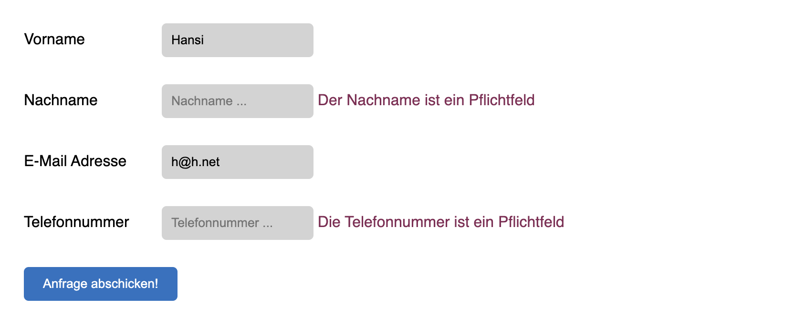

# Formulare in PHP

## Erstellung eines HTML-Formulars

Ein HTML-Formular dient als Schnittstelle für die Benutzereingabe. Es kann verschiedene Typen von Eingabeelementen enthalten, wie `input`, `textarea`, `select` etc. Die Attribute `action` und `method` im `<form>`-Tag definieren, wohin und wie die Daten gesendet werden.

```html
<form action="submit.php" method="post">
  Name: <input type="text" name="name">
  Email: <input type="email" name="email">
  <input type="submit" value="Submit">
</form>
```
## Verarbeitung von Formulardaten in PHP

Wenn der Benutzer das Formular absendet, werden die Daten an das in der `action` angegebene PHP-Skript gesendet. Das `method`-Attribut bestimmt, ob die Daten über `$_GET` oder `$_POST` zugänglich sind.

- **Verwendung von `$_GET`:** Die Daten werden in der URL übertragen. Geeignet für Suchformulare oder wenn die Daten nicht sensibel sind.
- **Verwendung von `$_POST`:** Die Daten werden im Anfragekörper (request body) übertragen. Geeignet für das Übermitteln sensibler Informationen, wie Passwörter.

```php
<?php
if ($_SERVER["REQUEST_METHOD"] == "POST") {
  // Sammeln der Formulardaten
  $name = $_POST['name'];
  $email = $_POST['email'];

  // Verarbeiten der Daten hier
  echo "Name: $name<br>Email: $email";
}
?>
```

### Validierung von Formulareingaben
Die Validierung von Formulareingaben ist ein kritischer Schritt, um sicherzustellen, dass die Daten, die von den Benutzern übermittelt werden, sicher, korrekt und nützlich sind. PHP bietet verschiedene Funktionen und Techniken zur Validierung von Eingaben an, wie zum Beispiel die Funktionen `filter_var()` oder `preg_match()`. 

#### Beispiel: Validierung einer E-Mail-Adresse
```php
$email = $_POST['email'];
if (!filter_var($email, FILTER_VALIDATE_EMAIL)) {
  echo "Ungültige E-Mail-Adresse";
} else {
  echo "Gültige E-Mail-Adresse";
}
```
Weitere Parameter neben `FILTER_VALIDATE_EMAIL` sind `FILTER_VALIDATE_INT` oder `FILTER_VALIDATE_FLOAT`.

#### Beispiel: Validierung eines Passwort mit regulären Ausdrücken
```php
$password = $_POST['password'];
$pattern = "/^(?=.*[a-z])(?=.*[A-Z])(?=.*[0-9])[a-zA-Z0-9]{8,}$/";
if (!preg_match($pattern, $password)) {
  echo "Das Passwort erfüllt nicht die Anforderungen.";
} else {
  echo "Gültiges Passwort.";
}

```
Beispiel, um zu überprüfen, ob ein Passwort bestimmte Anforderungen erfüllt (mindestens 8 Zeichen, mindestens ein Großbuchstabe, ein Kleinbuchstabe und eine Zahl)


## Formularübermittlung per GET
### Übermittlung der Variablen
```php
<form action="http://localhost/willkommen.php" method="get">
```
Mit der Übermittlung der Informationen per *GET* werden die Formulardaten an die URL angehängt, bevor die Anfrage an der Server geschickt wird:<br>
`http://localhost/willkommen.php?name=Christian`

Hinter dem `?` am Ende der URL kommen die Variablenname/Variablenwerte-Paare. Werden mehrere Variablen angegeben, so sind diese durch ein `&` voneinander getrennt:<br>
`http://localhost/willkommen.php?name=Christian&user_id=123`

**Achtung: Die Daten, die an den Server geschickt werden, können in der URL verändert werden!**


### Das superglobale Array $_GET
[https://www.php.net/manual/de/ - php.net Manual: Superglobals](https://www.php.net/manual/de/language.variables.superglobals.php){:target="_blank"}

Das Array `$_GET` ist superglobal, das heißt es ist immer verfügbar. Bei `$_GET` handelt es sich um ein assoziatives Array von Variablen. Assoziativ bedeutet, dass auch ein `String` als Index verwendet werden kann. 

Der `name` des Input-Elements, dessen Inhalt beim Senden übergeben wird, wird als Index verwendet:
```html
<input type="text" name="nickname">
```
```php
<?php
    // Alle GET Variablen werden in einem Array $_GET gespeichert
    echo 'Hallo ' . $_GET["nickname"] . '!';
?>
```
Obiger Quelltext erzeugt die Ausgabe
```html
Hallo Christian!
```


### Überprüfen der Eingabe

Je nach Einstellung des Servers kommt es zu einem Fehler, wenn eine Variable ausgelesen wird, die nicht gesetzt wurde. Daher sollte immer eine Überprüfung mit `isset()` durchgeführt werden.

```php
<?php 
    // Überprüfen, ob es das Element im Array gibt
    if ( isset ($_GET[ "nickname" ]) ) {
        $name = $_GET[ "nickname" ]; 
    } else {
        // Fehlerbehandlung
        // ...
    }
    
    if ( $name ) {
        echo "Hallo $name!<br><br>";
    }		
?>
<form action="<?php echo $_SERVER['PHP_SELF']; ?>" method="get">

    <label>Nickname</label><br>
    <input type="text" name="nickname" value="<?php echo $name;?>">
    <br>
    <input type="submit" value="Per GET abschicken!">
    
</form>
```
*Beispiel eines Formulars mit Überprüfung der Daten*

Die globale Variable `$_SERVER['PHP_SELF']` enthält den Pfad zur aktuellen Datei.


## Formularübermittlung per POST
### Übermittlung der Variablen
Passwörter oder andere Informationen, die nicht ersichtlich sein sollen, dürfen nicht per GET übertragen werden, da sie sonst für alle ersichtlich sind und auch verändert werden können.

`<form action="http://localhost/login.php" method="post">`

### Das superglobale Array $_POST

Auch das Array `$_POST` ist superglobal und assoziativ. Die Daten werden *"unsichtbar"* an den Server übergeben. So kann man darauf reagieren, ohne dass jeder sieht, welche Werte und Variablen verwendet werden.

### Vereinfachtes Beispiel einer Login-Seite

```php
<?php
    // Passwörter kommen üblicherweise aus der Datenbank 
    // und sind verschlüsselt
    $hiddenUser = "admin";
    $hiddenPassword = "12345678";

    // Benutzer und Password aus dem Array auslesen
    $password = $_POST["password"];
    $user = $_POST["user"];

    // Passwort und Benutzer überprüfen
    if (( strcmp ($user, $hiddenUser) == 0) && 
        ( strcmp ($password, $hiddenPassword) == 0 )) {
        // Login erfolgreich
        // ...
        
    } else {
        // Login-Formular anzeigen
?>
<form action="<?php echo $_SERVER['PHP_SELF'];?>" method="post">
    <label>Benutzer</label>
    <input type="text" name="user"><br>

    <label>Password</label>
    <input type="type" name="password"><br>
    
    <input type="submit" value="Logindaten per POST übermitteln!">
</form>
<?php
    }
?>
```

## Aufgaben

### Aufgabe 1. Kontaktformular per GET



*Beispielhafte Umsetzung*

Erstelle ein Kontaktformular, das die einzelnen Felder auf die Syntax hin überprüft:

* Vorname – mindestens 3 Buchstaben
* Nachname – mindestens 3 Buchstaben
* E-Mail Adresse
* Telefonnummer – nur Zahlen

Sind alle Felder richtig ausgefüllt, so soll statt dem Formular eine Erfolgsmeldung angezeigt werden:


#### Funktionalität

* Bereits richtige Eingaben sollen erhalten bleiben.
* Es sollen sprechende Fehlerhinweise direkt über den jeweiligen Formularfeldern angezeigt werden.
* Erweiterung: Passe das Aussehen des Formulars per *CSS* an.


### Aufgabe 2. Login-Formular per POST

Erstelle eine Login-Formular, dass den Benutzernamen und das zugehörige Passwort überprüft. Nur wenn Passwort und Benutzer richtig eingegeben werden, sollen geschützte Daten angezeigt werden.

Verwende [*Passwort-Hashing*](https://www.php.net/manual/de/book.password.php){:target="_blank"} für das Überprüfen des Passworts. Experimentiere mit verschiedenen Hashing-Algorithmen.

##### Hashing
```php
echo "Franz in MD5: " . hash('md5', 'Franz');
```
ergibt
```html
Franz in MD5: 13dd8a4dcb6c8720f0d67396d4d87fab
```


##### Password Hashing

Um die Sicherheit zu erhöhen, wird beim Passwort-Hashing zusätzlich zum *Hash* ein zufälliges *Salt* (*random salt*) gespeichert. So ergibt sich mit jedem Aufruf ein anderer Hash.
```php
echo "Default-Algorithmus für Passwort-Hashing: " . PASSWORD_DEFAULT . "<br>";
echo "Franz in " . PASSWORD_DEFAULT . ": " . 
        password_hash("Franz", PASSWORD_DEFAULT)."<br>";
echo "Franz in " . PASSWORD_DEFAULT . ": " . 
        password_hash("Franz", PASSWORD_DEFAULT);
```
ergibt
```html
Default-Algorithmus für Passwort-Hashing: 2y
Franz in 2y: $2y$10$3ry1mwAwToA7uz3UXu8gUOs10fPLCmf/W3T95dudPZeyr2ZntsRcm
Franz in 2y: $2y$10$t5kArDQ66XsOS2lPDsS0n.qhewWEFsrzaQgk./elN33QEdFwNnnkO
```


Um das gehashte Passwort zu überprüfen, kann jetzt nicht mehr einfach der generierte *Hash* direkt mit dem (in der Datenbank) gespeicherten *Hash* verglichen werden.

Die Überprüfung erfolgt mit `password_verify()`:
```php
// Passwort generieren (wird beim Erzeugen des Passworts gemacht)
$storedHash = password_hash("Franz", PASSWORD_DEFAULT);

// Passwort überprüfen (wird beim Überprüfen des Passworts gemacht)
if ( password_verify ( "Franz", $storedHash) ) {
    echo "Passwort ist richtig: " . $storedHash;
} else {
    echo "Passwort ist falsch";
}
```


#### Funktionalität
* Bereits richtige Eingaben sollen erhalten bleiben.
* Ermögliche mehrere Benutzer. Lege die notwendigen Daten dazu in einem Array ab.
* Es sollen sprechende Fehlerhinweise direkt über den jeweiligen Formularfeldern angezeigt werden.
* Passe das Aussehen des Formulars per *CSS* an.


## Ressourcen
* [https://web-development.github.io/php/ - PHP Basics](https://web-development.github.io/php/){:target="_blank"}
* [https://www.php.net/manual/de/ - php.net Manual: Superglobals](https://www.php.net/manual/de/language.variables.superglobals.php){:target="_blank"}
* [https://www.php.net/manual/de/ - php.net Manual: $_GET](https://www.php.net/manual/de/reserved.variables.get.php){:target="_blank"}
* [https://www.php.net/manual/de/ - php.net Manual: $_POST](https://www.php.net/manual/de/reserved.variables.post.php){:target="_blank"}
* [https://www.php.net/manual/de/ - php.net Manual: String-Funktionen](https://www.php.net/manual/de/ref.strings.php){:target="_blank"}
* [https://www.php.net/manual/de/ - php.net Manual: Password Hashing](https://www.php.net/manual/de/book.password.php){:target="_blank"}
* [https://www.php.net/manual/de/ - php.net Manual: Einfaches Formular Tutorial](https://www.php.net/manual/de/tutorial.forms.php){:target="_blank"}
