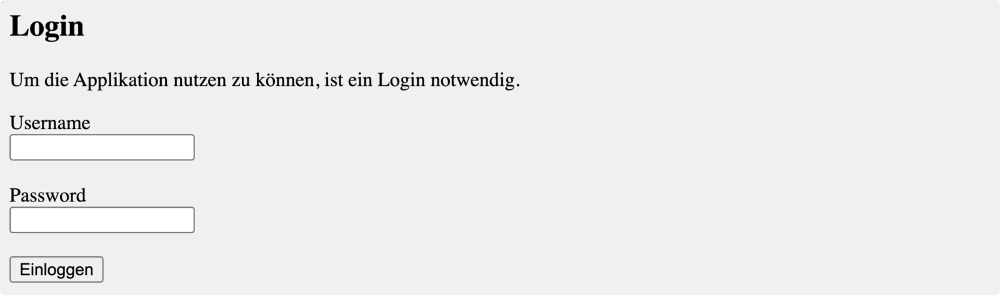
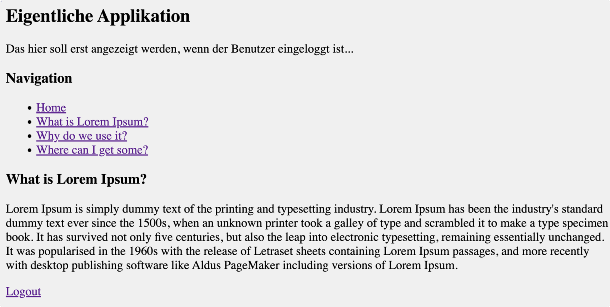

# Benutzeridentifikation und Weitergabe von Daten

Wenn ein Benutzer auf die Website kommt, dann ist jeder Zugriff unabhängig von jedem anderen Zugriff. Die PHP-Applikation weiß nicht, ob 10 verschiedene Benutzer die Webseite abrufen oder ob ein Benutzer die Seite 10 mal lädt.

Das bezeichnet man als *stateless (zustandslos)*. Das Gegenteil ist *stateful (zustandsbehaftet)*, wobei die Applikation die Benutzer wiedererkennt.

## Lokale Datenhaltung – Cookies in PHP
So wie in *JavaScript* können Cookies auch über *PHP* gesetzt und gelesen werden.

Ein Cookie besteht aus bis zu 4096 Bytes, die der Server auf dem Client (Webbrowser) lokal speichern lassen kann. Bei jedem Zugriff auf den Webserver werden die Cookies wieder an den Server mitgeschickt. 

Dabei werden nur diejenigen Cookie zurückgeschickt die der jeweilige Server gesetzt hat, der Browser sendet die Cookies nie an andere Server.

### Setzen und Löschen von Cookies

Neue Cookies können mit [`setcookie()`](https://www.php.net/manual/de/function.setcookie.php){:target="_blank"} gesetzt werden. Sie werden mit den Header-Informationen übertragen.
```
Set-Cookie: style=yellow
Set-Cookie: style=yellow; path=/admin/
Set-Cookie: style=yellow; expires=Tue, 29-Dec-2022 19:30:42 GMT; path=/admin/
```
[`setcookie()`](https://www.php.net/manual/de/function.setcookie.php){:target="_blank"} definiert ein mit den HTTP-Header-Informationen zu übertragendes Cookie. Wie andere Header auch, müssen Cookies vor jeglicher Ausgabe des Skripts gesendet werden (dies ist eine Einschränkung des Protokolls). Das bedeutet, dass diese Funktion **vor** jeglicher Ausgabe, einschließlich der Ausgabe von `<html>`- oder `<head>`-Tags sowie jeder Art von Whitespace, aufgerufen werden muss.
```php
$value = 'Some Value';

setcookie("TestCookie", $value);
setcookie("TestCookie", $value, time() + 3600);  /* verfällt in 1 Stunde */
setcookie("TestCookie", $value, time() + 3600, "/some_path/", "example.com", 1);
```

Um ein Cookie zu löschen muss der  Verfallszeitpunkt auf die Vergangenheit gesetzt werden.
```php
setcookie("DeleteMe", 123, time() + (3600 * 24) );

// Löschen eines Cookies: Verfallszeitpunkt auf die Vergangenheit setzen
setcookie("DeleteMe", "", time() - 3600);
```

### Das superglobale Array $_COOKIE
Sind die Cookies einmal gesetzt, kann beim nächsten Seitenaufruf anhand des `$_COOKIE`-Arrays auf diese zugegriffen werden. Die Cookie-Werte können auch in `$_REQUEST` (Sammlung von `$_GET` und `$_POST`) vorhanden sein.

```php
// ein bestimmtes Cookie ausgeben
echo $_COOKIE["TestCookie"];

// Ein anderer Weg zu Debuggen/Testen ist, alle Cookies anzuzeigen
print_r($_COOKIE);
```

## Serverseitige Datenhaltung - Sessions in PHP

### Beginnen einer Session

Mit Hilfe einer Session können unterschiedliche Daten anhängig vom Benutzer auf dem Server gespeichert werden.

Mit dem Befehl [`session_start()`](https://www.php.net/manual/de/function.setcookie.php){:target="_blank"} passiert folgendes ...
* ... beim ersten Aufruf:
  * Es wird automatische ein Cookie `PHPSESSID` auf dem Client gesetzt.
  * Danach können Daten auf dem Server ins Array `$_SESSION` gespeichert werden, die dieser Session-ID zugwiesen werden.
* ... bei jedem weiteren Aufruf:
  * Die Session wird anhand des Cookies `PHPSESSID` wieder erkannt.
  * Es kann auf die entsprechenden Daten Array `$_SESSION` auf dem Server zugegriffen werden.

```php
<?php
  session_start();
  
  if ( !isset ($_COOKIE["PHPSESSID"] )) {
      echo "Zum ersten Mal auf der Seite ...";
  } else {
      echo ("Session-ID: " . $_COOKIE["PHPSESSID"] );
  }
?>
```
ergibt beim ersten Aufruf
```
Zum ersten Mal auf der Seite ...
```
Beim jedem weieren Aufruf
```
Session-ID: dc863c7ed80085be1553e33ab48765ef
```


### Setzen und löschen von Informationen im superglobalen Array $_SESSION

```php
<?php
  // Session beginnen
  session_start();
  
  // Zähler erhöhen, wenn dieser bereits in der Session gespeichert ist
  if (!isset($_SESSION['zaehler'])) {
    $_SESSION['zaehler'] = 0;
  } else {
    $_SESSION['zaehler']++;
  }
  
  // Beenden der Session und Speichern der Variablen
  //(wird am Ende der Seite automatisch gemacht)
  session_write_close(); 
?>
<p>
    Sie haben die Seiten <?php echo $_SESSION['zaehler']; ?> mal aufgerufen.
</p>
```

Um einen Wert zu Löschen kann der Befehl `unset()` verwendet werden. 
```php
<?php
  session_start();
  unset($_SESSION['zaehler']);
?>
```

## Aufgaben

### Webapplikation mit geschütztem Bereich

Erstelle eine Webapplikation, deren Inhalte nur angezeigt werden, wenn sich der Benutzer einloggt.

Die Applikation besteht aus mehreren Dateien:


* `index.php`<br>
Diese Seite wird standardmäßig aufgerufen und lädt die entsprechenden Daten, je nach dem ob der Benutzer eingeloggt ist oder nicht.
Mit dem Befehl  `header()` können Headerinformationen gesendet werden. So kann z.B. auf die Login-Seite weitergeleitet werden:    `header("Location: login.php");exit;`.


* `functions.php`<br>
Diese Datei wird von den Dateien `index.php`, `login.php` und `logout.php` über den Befehl `include "functions.php";` eingebunden. In dieser Datei wird die Session gestartet und sie beinhaltet alle Funktionen.


* `login.php`<br>
Hier ist das Login-Formular zu sehen. Der Benutzername und das Passwort werden per Post an die Datei 
geschickt. Ist die Eingabe korrekt, wird auf die `index.php` weitergeleitet.


* `logout.php`<br>
Diese Seite setzt die Session zurück und löscht das entsprechende Cookie.


* `content/what.php`, `content/why.php`, `content/where.php`<br>
  In diesen Dateien ist er eigentliche Inhalt enthalten.

<br>

#### 1. Aufgabe: Login-Screen
Beim Starten der Applikation soll automatisch der Login-Screen angezeigt werden:


In der Datei `index.php` wird dazu die Session-Variable `$_SESSION["user"]` abgefragt. Ist sie gesetzt werden die Inhalte angezeigt, ansonsten auf die Login-Seite weitergeleitet:
```php
<?php
	include "functions.php";

	if ( !isset ($_SESSION["user"])) {
		header("Location: login.php");
		exit;
	} 
?>
```

##### Todo:
* Erstelle in der Datei `login.php` das Formular und schicke die Daten per Post ebenfalls an `login.php`.
* Überprüfe die Benutzereingabe
  * Passwort und/oder Benutzer falsch: Login-Seite nochmal anzeigen
  * Passwort und Benutzer richtig: Session-Variable `$_SESSION["user"]` auf den Usernamen setzen und auf die `index.php` weiterleiten.

<br>

#### 2. Aufgabe: Darstellung der Inhalte

Ist der Benutzer eingeloggt, so werden die Inhalte angezeigt:


##### Todo:
* Lies den GET-Parameter `$_GET["pageid"]` der Menüpunkte aus und lade die entsprechenden Inhalte mittels `include`.
* Erweitere die Dateien im Verzeichnis `content/` so, dass die nicht direkt aufgerufen werden können, wenn der Benutzer nicht eingeloggt ist.

<br>

#### 3. Aufgabe: Logout

Durch Klick auf den Link <u>Logout</u> soll die Session zurückgesetzt und das entsprechende Cookie gelöscht werden.
##### Todo:
* Setze die Session zurück und lösche das entsprechende Cookie
* Leite wieder auf die `index.php` weiter. Wenn alles funktioniert, sollte dann erneut die Loginseite angezeigt werden.

<br>

#### Erweiterung: Aufzeichnen des Benutzerverhaltens

Zeiche auf, wie sich der Benutzer auf der Seite verhält und speichere diese Informationen in Session-Variablen:

* Welche Inhaltsseite wurde wie oft gesehen?
* Wie schaut der Browserverlauf aus?

Erstelle eine Datei `statistics.php`, die diese Informationen ausgibt. Die Informationen sollen ebenfalls nur angezeigt werden, wenn der Benutzer eingeloggt ist.

## Ressourcen

* [https://www.php.net/manual/de/ - php.net Manual: Cookies](https://www.php.net/manual/de/features.cookies.php){:target="_blank"}
* [https://www.php.net/manual/de/ - php.net Manual: PHP Sessionbehandlung](https://www.php.net/manual/de/book.session.php){:target="_blank"}
* [https://www.php-kurs.com/: PHP programmieren lernen mit vielen Übungen und Videos ](https://www.php-kurs.com/){:target="_blank"}
