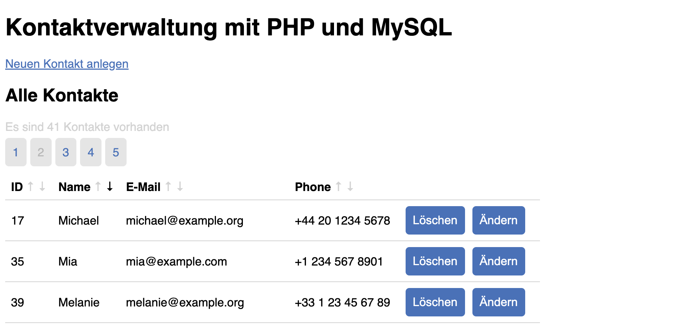

# Implementieren des CRUD-Prinzips in PHP und MySQL

## Das MySQL Datenbank-Management-System

MySQL ist ein relationales Datenbank-Management-Systeme (RDBMS), d.h. es verwenden SQL (Structured Query Language), um Daten in tabellarischer Form zu speichern und zu verwalten.

Es gibt eine Vielzahl an unterschiedlichen Datenbanken. MySQL ist eine Open-Source-Datenbank, die häufig mit PHP verwendet wird, um Daten auf Websites zu speichern und abzurufen. MySQL bietet eine Vielzahl von Funktionen zum Erstellen, Anzeigen und Verändern von Datenbanken und Tabellen.

Um mit MySQL zu arbeiten, benötigen man zunächst eine Verbindung zu einer MySQL-Datenbank:

```php
<?php
  $host = "localhost";
  $username = "username";
  $password = "password";
  $dbname = "database_name";

  // Verbindung herstellen
  $conn = mysqli_connect($host, $username, $password, $dbname);

  // Verbindung überprüfen
  if (!$conn) {
    die("Connection failed: " . mysqli_connect_error());
  }
  echo "Connection established successfully";
?>
```
*Aufbauen der Verbindung in einer PHP Version < 8.1*

```php
<?php
  $host = "localhost";
  $username = "username";
  $password = "password";
  $dbname = "database_name";

  try {
    // Verbindung herstellen
    $conn = mysqli_connect($host, $username, $password, $dbname);
    echo "Connection established successfully";
  } catch ( Exception $e ) {
    echo "Connection Failed: ", $e->getMessage(), "<br>";
  }
?>
```
*Aufbauen der Verbindung in einer PHP Version >= 8.1*


### Aufbau einer Datenbank-Tabelle

Eine Datenbank liegt auf einem Datenbank-Server. Auf einem solchen Server können mehrere Datenbanken gehostet werden.
Eine Datenbank besteht aus einer oder mehrerer Tabellen.

Eine Tabelle in einer MySQL-Datenbank ist eine Struktur, die bestimmte Daten speichert. Eine Tabelle besteht aus Zeilen und Spalten, wobei jede Spalte einen bestimmten Datentyp aufweist und jede Zeile einen Eintrag enthält.

Um eine Tabellenstruktur in MySQL anzuzeigen, können Sie die `DESCRIBE`-Anweisung verwenden. Hier ist ein Beispiel für die Verwendung von `DESCRIBE`, um die Struktur der `users`-Tabelle anzuzeigen:

```sql
DESCRIBE users;
```
Die Ausgabe könnte wie folgt aussehen:
```text
+---------+-------------+------+-----+---------+----------------+
| Field   | Type        | Null | Key | Default | Extra          |
+---------+-------------+------+-----+---------+----------------+
| id      | int(11)     | NO   | PRI | NULL    | auto_increment |
| name    | varchar(50) | NO   |     | NULL    |                |
| email   | varchar(50) | NO   |     | NULL    |                |
| password| varchar(50) | NO   |     | NULL    |                |
+---------+-------------+------+-----+---------+----------------+
```
Diese Ausgabe zeigt die Namen der Spalten, ihre Datentypen und weitere Informationen wie NULL-Werte, Schlüssel und Standardwerte an.

Die Ausgabe von `DESCRIBE users;` gibt Informationen über die Struktur der `users`-Tabelle in einer MySQL-Datenbank an. Jede Zeile in der Ausgabe stellt eine Spalte in der Tabelle dar und enthält folgende Informationen:

* **Field:** Der Name der Spalte.
* **Type:** Der Datentyp der Spalte. Zum Beispiel int für ganze Zahlen oder varchar für Zeichenketten. Manche Datentypen haben auch eine Längenangabe, wie zum Beispiel varchar(50), was bedeutet, dass die Zeichenkette bis zu 50 Zeichen lang sein kann.
* **Null:** Gibt an, ob NULL-Werte in dieser Spalte erlaubt sind. `YES` bedeutet, dass NULL-Werte erlaubt sind, `NO` bedeutet, dass sie nicht erlaubt sind.
* **Key:** Gibt an, ob diese Spalte ein Schlüssel ist. Ein Schlüssel ist ein Wert, der eindeutig in der Tabelle ist und häufig zum Verknüpfen von Tabellen verwendet wird. Mögliche Werte sind `PRI` für einen Primärschlüssel, `UNI` für einen Einzigartigkeitsschlüssel und `MUL` für einen Indexschlüssel.
* **Default:** Der Standardwert für diese Spalte. Wenn ein neuer Eintrag in der Tabelle erstellt wird und kein Wert für diese Spalte angegeben wird, wird der Standardwert verwendet.
* **Extra:** Weitere Informationen über die Spalte. Zum Beispiel auto_increment, wenn der Wert für diese Spalte automatisch inkrementiert wird.


### SQL-Statements

SQL-Statements sind Anweisungen, die an eine MySQL-Datenbank gesendet werden, um bestimmte Operationen auszuführen. Es gibt verschiedene Arten von MySQL-Statements, die zur Erstellung, Anzeige, Aktualisierung und Löschung von Daten in einer Datenbank verwendet werden können.

MySQL-Statements werden häufig verwendet, um Daten in einer Tabelle einer MySQL-Datenbank zu verarbeiten. Zum Beispiel können Sie mit der `SELECT`-Anweisung Einträge aus einer Tabelle abrufen, mit der `INSERT`-Anweisung neue Einträge hinzufügen, mit der `UPDATE`-Anweisung bestehende Einträge aktualisieren und mit der `DELETE`-Anweisung Einträge löschen.

Hier ist ein Beispiel für die Verwendung von MySQL-Statements, um Daten in einer Tabelle zu verarbeiten:

```php
// Verbindung zur Datenbank herstellen
$conn = mysqli_connect($host, $username, $password, $dbname);

// Neuen Benutzer hinzufügen
$sql = "INSERT INTO users (name, email, password) VALUES ('John', 'john@example.com', 'password')";
mysqli_query($conn, $sql);

// Benutzer abrufen
$sql = "SELECT * FROM users WHERE name='John'";
$result = mysqli_query($conn, $sql);

// Benutzer aktualisieren
$sql = "UPDATE users SET name='John Doe' WHERE name='John'";
mysqli_query($conn, $sql);

// Benutzer löschen
$sql = "DELETE FROM users WHERE name='John Doe'";
mysqli_query($conn, $sql);
```
In diesem Beispiel wird ein neuer Benutzer in der `users`-Tabelle hinzugefügt, anschließend wird der Benutzer abgerufen, aktualisiert und schließlich gelöscht.

## Das CRUD-Prinzip

**CRUD** steht für **Create**, **Read**, **Update** und **Delete** und ist ein Akronym für die vier Grundoperationen, die auf Datenbanken ausgeführt werden können. Diese Operationen sind:

* Create: Einträge in einer Datenbank hinzufügen
* Read: Einträge in einer Datenbank abrufen
* Update: Einträge in einer Datenbank aktualisieren
* Delete: Einträge in einer Datenbank löschen

Das CRUD-Prinzip ist ein grundlegender Ansatz zum Verwalten von Daten in einer Datenbank. Hier sind einige Beispiele dafür, wie das CRUD-Prinzip mit PHP und MySQL umgesetzt werden kann:


### CREATE

Um einen neuen Eintrag in einer MySQL-Datenbank hinzuzufügen, können wir die `INSERT`-Anweisung verwenden. Hier ist ein Beispiel für die Verwendung von PHP und MySQL, um einen neuen Benutzer in einer Benutzerdatenbank hinzuzufügen:

```php
<?php
  // Verbindung zur Datenbank herstellen
  $conn = mysqli_connect($host, $username, $password, $dbname);

  // Formulardaten abrufen
  $name = $_POST["name"];
  $email = $_POST["email"];
  $password = password_hash($_POST["password"], PASSWORD_DEFAULT);

  // Benutzer in Datenbank hinzufügen
  $sql = "INSERT INTO users (name, email, password) VALUES ('$name', '$email', '$password')";
  mysqli_query($conn, $sql);
?>
```

### READ
Um Einträge aus einer MySQL-Datenbank abzurufen, können wir die `SELECT`-Anweisung verwenden. Hier ist ein Beispiel für die Verwendung von PHP und MySQL, um alle Benutzer aus einer Benutzerdatenbank abzurufen:

```php
<?php
  // Verbindung zur Datenbank herstellen
  $conn = mysqli_connect($host, $username, $password, $dbname);

  // Benutzer abrufen
  $sql = "SELECT * FROM users";
  $result = mysqli_query($conn, $sql);

  // Benutzer durchlaufen
  while ($row = mysqli_fetch_assoc($result)) {
    echo "Name: " . $row["name"] . "<br>";
    echo "Email: " . $row["email"] . "<br>";
  }
?>
```

### UPDATE
Um Einträge in einer MySQL-Datenbank zu aktualisieren, können wir die `UPDATE`-Anweisung verwenden. Hier ist ein Beispiel für die Verwendung von PHP und MySQL, um den Namen eines Benutzers in einer Benutzerdatenbank zu aktualisieren:

```php
<?php
  // Verbindung zur Datenbank herstellen
  $conn = mysqli_connect($host, $username, $password, $dbname);

  // Formulardaten abrufen
  $id = $_POST["id"];
  $name = $_POST["name"];

  // Benutzer in Datenbank aktualisieren
  $sql = "UPDATE users SET name='$name' WHERE id=$id";
  mysqli_query($conn, $sql);
?>
```

### DELETE

Um Einträge aus einer MySQL-Datenbank zu löschen, können wir die `DELETE`-Anweisung verwenden. Hier ist ein Beispiel für die Verwendung von PHP und MySQL, um einen Benutzer aus einer Benutzerdatenbank zu löschen:

```php
<?php
  // Verbindung zur Datenbank herstellen
  $conn = mysqli_connect($host, $username, $password, $dbname);

  // Formulardaten abrufen
  $id = $_POST["id"];

  // Benutzer in Datenbank löschen
  $sql = "DELETE FROM users WHERE id=$id";
  mysqli_query($conn, $sql);
?>

```

## Aufgaben

Erstellen eine Web-Applikation zur Verwaltung von Kontaktdaten.

### 1. Anlegen der Tabelle
{: .assignment }

Installiere ein `XAMPP` oder `MAMP`, um den Rechner als lokalen Webserver verwenden zu können.

Erstelle mittels `phpMyAdmin` einen Tabelle mit dem Namen `user` und folgenden Feldern:

* `id` – autoincrement, primary, not null
* `name` – varchar(40)
* `email` – varchar(40)
* `phone` – varchar(40)

Legen einige Einträge manuell an.

### 2. Ausgeben aller Einträgen
{: .assignment }
Erstelle eine Datei `index.php`, die eine Liste aller Einträge in einer MySQL-Datenbank anzeigt. Verwende das `SELECT`-Statement, um die Einträge aus der Datenbank abzurufen und sie in einer HTML-Tabelle anzuzeigen.

> 
> <sup>*Beispielhafte Liste als HTML-Tabelle*</sup>

### 3. Hinzufügen von Einträgen
{: .assignment }

Erstellen die Datei `insert.php`, die ein Formular enthält, das es dem Benutzer ermöglicht, einen neuen Eintrag in einer MySQL-Datenbank hinzuzufügen. Verwende das `INSERT`-Statement, um den neuen Eintrag in der Datenbank zu speichern.

Die Übermittlung der Daten soll mit `POST`erfolgen.

> 
> <sup>*Erweiterung um einen Link*</sup><br><br>
> 
> <sup>*Formular zur Erstellung eines neuen Kontakts*</sup>


### 4. Löschen von Einträgen
{: .assignment }

Erweitere die PHP-Seite von Aufgabe 2 (Hinzufügen von Einträgen), um dem Benutzer das Löschen von Einträgen zu ermöglichen. Verwende das `DELETE`- Statement, um die Löschungen in der Datenbank durchzuführen.

Füge einen Button `Löschen` neben den einzelnen Einträgen hinzu.

```php
echo "<form method='post'>";
echo "<input type='hidden' name='id' value='" . $row["id"] . "'>";
echo "<input type='submit' name='delete' value='Löschen'>";
echo "</form>";
```

Klickt man auf den `Löschen` -Button neben einem Eintrag, soll der Eintrag gelöscht werden und die Einträge neu ausgegeben werden. 

> 
> <sup>*Löschen-Button in einem Formular*</sup>

### 5. Aktualisieren von Daten
{: .assignment }
Füge einen Button `Ändern` neben den einzelnen Einträgen hinzu. Verwende das `UPDATE`-Statement, um die Änderungen in der Datenbank zu speichern. Implementiere das Formular zum Ändern der Daten in der Datei `edit.php`.

```php
// Erweiterung der Tabelle in der index.php
echo "<input type='submit' name='update' value='Ändern'>";
```

> 
> <sup>*Ändern-Button in einem Formular*</sup><br><br>
> 
> <sup>*Formular zum Ändern von Benutzerdaten*</sup>


### 6. Zusatz: Sortierung und Paginierung
{: .assignment }
Erweitere die PHP-Seite, um Sortierung und Paginierung von Einträgen zu unterstützen. Verwende das `ORDER BY`- und `LIMIT`- Statement, um Einträge in einer bestimmten Reihenfolge anzuzeigen und nur einen Teil der Einträge auf einer Seite anzuzeigen.

> 
> <sup>*Beispielhafte Umsetzung der Sortierung*</sup>

### 7. Zusatz: Suchfunktionalität
{: .assignment }
Erstelle eine PHP-Seite, die es dem Benutzer ermöglicht, nach Einträgen in einer MySQL-Datenbank zu suchen. Verwende das `SELECT`- Statement und die `LIKE`- Klausel, um Einträge abzurufen, die bestimmte Suchkriterien erfüllen.


## Ressourcen
* [https://remotemysql.com/ - Free MySQL Hosting Site](https://remotemysql.com/){:target="_blank"}
* [https://www.php.net/manual/de/ - php.net Manual: SQL Injection](https://www.php.net/manual/de/security.database.sql-injection.php){:target="_blank"}
* [w3schools.com - PHP - AJAX and PHP](https://www.w3schools.com/php/php_ajax_php.asp){:target="_blank"}