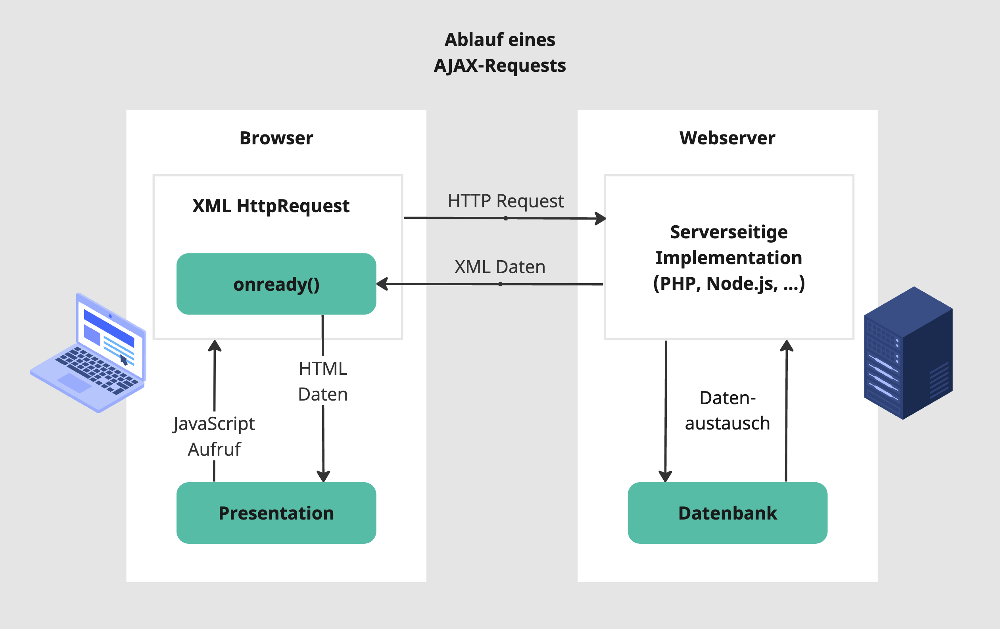

# AJAX – Asynchrone Kommunikation mit dem Server


**AJAX** steht für **"Asynchronous JavaScript and XML"** und bezieht sich auf die Verwendung von JavaScript, um asynchrone HTTP-Anfragen an einen Webserver zu senden und darauf basierende Aktionen auszuführen, **ohne** dabei die gesamte Webseite **neu laden** zu müssen.

Mit PHP und AJAX können so dynamische Webseiten erstellt werden, die Benutzererfahrung verbessert und die Ladezeiten verringert werden.

## Funktionsweise von AJAX mit PHP

### Ablauf eines AJAX-Requests


*Ablauf eines AJAX-Requests, [https://netbeans.apache.org/](https://netbeans.apache.org/){:target="_blank"}*

### Webserver: Erstellen der Antwort auf die AJAX Anfrage

Der Webserver stellt die Anbindung an die Daten zur Verfügung (*Data Store*). 

Als Format für den Datenaustausch bietet sich das JSON-Format an, da das Encodieren und das Decodieren sowohl in PHP als auch in JavaScript implementiert sind.

```php
// data.php

// Verbindung zur Datenbank herstellen
$conn = mysqli_connect($host, $username, $password, $dbname);

// Benutzer abrufen
$sql = "SELECT * FROM users";
$result = mysqli_query($conn, $sql);

// Array mit Daten erstellen
$data = array();
while ($row = mysqli_fetch_assoc($result)) {
  $data[] = $row;
}

// Array als JSON-String zurückgeben
echo json_encode($data);
```

```text
[{"id":"6","name":"Max","email":"max@max.its","phone":"0664 786 57 23"},
{"id":"8","name":"Eva","email":"e@hotmail.com","phone":"0650 234 56 89"},
{"id":"9","name":"Hubert","email":"h@ubert.at","phone":"07722 123 45"},
{"id":"11","name":"Sabine","email":"sab@ine.de","phone":"07514 22 22 22"},
{"id":"14","name":"Christian","email":"ch@htl.at","phone":"0610 123 45 67"},
{"id":"16","name":"Hubert","email":"h@ubert.at","phone":"0650 99 88 77"}]
```
*Die Daten werden im JSON-Format an den Client geschickt.*


### Client: AJAX-Anfrage und Verarbeitung

Der Client stellt eine Anfrage (*HTTP Request*) an der Server und gibt eine *Callback*-Funktion an, die automatisch aufgerufen werden soll, wenn die Daten da sind. 

Sobald der Server die Antwort geliefert hat, wird die *Callback*-Funktion aufgerufen. Der Client kann dann basierend auf den Informationen, die der Server geliefert hat, zum Beispiel das DOM verändern:

```html
<!-- ajax.html -->

<!DOCTYPE html>
<html>
<head>
<meta charset="UTF-8">
    <title>AJAX JSON Beispiel</title>
</head>
<body>
    <ul id="users-list"></ul>
    <script>
    // XMLHttpRequest-Objekt erstellen
    var xhr = new XMLHttpRequest();

    // Anfrage senden
    xhr.open('GET', 'data.php', true);
    xhr.send();

    // Antwort verarbeiten
    xhr.onreadystatechange = function() {
        
        // alles OK?
        if (xhr.readyState == 4 && xhr.status == 200) {
        
            // Daten speichern
            var data = JSON.parse(xhr.responseText);
            
            var usersList = document.getElementById('users-list');

            // Über die Daten iterieren
            for (var i = 0; i < data.length; i++) {
                var user = data[i];
                
                // Listenelement erzeugen und anzeigen
                var listItem = document.createElement('li');
                listItem.innerHTML = user.name + ' (' + user.phone + ')';
                usersList.appendChild(listItem);
            }
        }
    };
    </script>
</body>
</html>
```
*Verändern des DOM, sobald die Daten vom Server geladen wurden.*

#### Der `XMLHttpRequest-readyState`

Das XMLHttpRequest-Objekt hat verschiedene Werte für die Eigenschaft "readyState", die den Status der Anfrage darstellen. Jeder Zustand stellt einen bestimmten Zeitpunkt im Lebenszyklus einer AJAX-Anfrage dar. Die möglichen readyState-Werte sind:

* `0 (UNSENT)`: Das XMLHttpRequest-Objekt wurde erstellt, aber die `open()`-Methode wurde noch nicht aufgerufen.

* `1 (OPENED)`: Die `open()`-Methode wurde aufgerufen, aber die send()-Methode wurde noch nicht aufgerufen.

* `2 (HEADERS_RECEIVED)`: Die `send()`-Methode wurde aufgerufen und die Anfrage wurde vom Server empfangen. Die Antwort-Header sind verfügbar, aber der Inhalt der Antwort ist noch nicht geladen.

* `3 (LOADING)`: Die Antwort wird geladen, es sind jedoch noch nicht alle Daten verfügbar.

* `4 (DONE)`: Man kann sicher sein, dass die gesamte Antwort empfangen wurde und die Antwort nun verarbeitet werden kann.

Man kann den `readyState`-Wert in der Funktion `onreadystatechange()` des XMLHttpRequest-Objekts überprüfen, um auf bestimmte Ereignisse während des Lebenszyklus der Anfrage zu reagieren. Wenn der `readyState 4` erreicht ist, kann man sicher sein, dass die gesamte Antwort empfangen wurde und man die Antwort verarbeiten kann.

#### Der `XMLHttpRequest-status`

Die Eigenschaft `status` des XMLHttpRequest-Objekts enthält den HTTP-Statuscode, der von dem Server als Teil der Antwort auf die Anfrage zurückgegeben wurde. Der HTTP-Statuscode ist eine dreistellige Zahl, die den Status der Anfrage darstellt.

Die möglichen HTTP-Statuscodes sind in verschiedene Kategorien unterteilt, z. B.:
* `1xx` (Informational), 
* `2xx` (Erfolgreich), 
* `3xx` (Umleitung), 
* `4xx` (Client-Fehler) und 
* `5xx` (Server-Fehler).

Ein Statuscode von 200 bedeutet, dass die Anfrage erfolgreich war, während ein Statuscode von 404 darauf hinweist, dass die angeforderte Ressource nicht gefunden wurde.

## Aufgabe 1: Erweiterung der Kontaktdatenverwaltung
{: .assignment }

Verwende dazu die Datenbank, die in der Aufgabe [PHP und MySQL](40_mysql.html), erstellt wurde.

### 1.1 Darstellung der Inhalte

Erstelle eine neues Verzeichnis mit den Dateien `ajax.html` und `data.php`, um die oben angegebenen Beispiele zu implementieren und zu testen.

### 1.2 Sortierung und Paginierung

Erweitere die Applikation, um Sortierung und Paginierung von Einträgen durchzuführen, ohne dass die Seite neu geladen werden muss.

Hänge dazu die Informationen per `GET`-Parameter an den Request an, um in `data.php` darauf reagieren zu können.

## Aufgabe 2. Jobbörse
{: .assignment }

Erstelle eine Webapplikation mit HTML, JavaScript und CSS, die die Jobs der Partner der HTL Braunau anzeigt.

### API der HTL Jobbörse

Die Jobbörse auf der Website der HTL Braunau kommuniziert über eine API mit dem Backend zur Verwaltung der Firmen und deren Jobs. Die Daten werden im JSON Format zur Verfügung gestellt:
[https://jobboerse.htl-braunau.at/htl_job_api.php](https://jobboerse.htl-braunau.at/htl_job_api.php){:target="_blank"}

Über den GET-Parameter `cmd` können verschiedene Anfragen gestellt werden.

**Anzahl der Unternehmen**

* `?cmd=getcpysize` liefert die Anzahl der Firmen in der Datenbank
    ```json
    {
        "cmd":"getcpysize",
        "size":"771"
    }
    ```
  
**Auflistung von Unternehmen**

* `?cmd=getcpylist` liefert die Liste von Unternehmen (alphabetisch nach Firmenname)
  * `&count=3` schränkt die Anzahl der Unternehmen auf eine bestimmte Zahl ein
  * `&from=3` Offset der Unternehmen
  * `&maxage=100` zeigt nur Unternehmen an, die Jobs eingetragen haben, die nicht älter als 100 Tage sind

**Detailansicht eines Unternehmens**

* `?cmd=getcpysingle&company_id=292` liefert die Details eines Unternehmens einer bestimmten `company_id` (inklusive Bildpfad für das Logo)

**Auslistung der Jobs**

* `?cmd=getlist` liefert eine Liste von Jobs (neuere Jobs zuerst)
  * `&maxage=300` schränkt die Liste der Jobs so ein, dass sie maximal 300 Tage alt sein dürfen
  * `&company_id=129` die Jobs eines Unternehmens mit einer bestimmten `company_id`
  * `&count=3` schränkt die Anzahl der Jobs auf eine bestimmte Zahl ein
  * `&from=3` Offset der Jobs

**Detailansicht eines Jobs**

* `?cmd=getsingle&offer_id=2450` liefert die Details eines Jobs mit einer bestimmten `offer_id`

### Allgemeine Hinweise

> #### Alle Aufgaben sollen so umgesetzt werden, dass die Seite nicht neu geladen werden muss!

> #### Achtung: Nur in einer Testumgebung!
> Sollte es zu einer Fehlermeldung wie `Access to XMLHttpRequest at 'https://jobboerse.htl-braunau.at/htl_job_api.php?cmd=getcpylist' from origin 'null' has been blocked by CORS policy: No 'Access-Control-Allow-Origin' header is present on the requested resource` kommen, muss die Chrome-Extension **Moesif Origin & CORS Changer** installiert und aktiviert werden.


### 2.1. Unternehmensliste 
{: .assignment }

Erstelle eine Datei `index.html`, die eine Liste der ersten 10 Unternehmen und deren wichtigsten Daten anzeigt:

* Firmenname
* Anschrift
* Anzahl der Jobs

Zeige nur Firmen an, die Jobs haben, die nicht älter als 300 Tage sind.

### 2.2. Unternehmensliste mit Paginierung
{: .assignment }

Erweitere Beispiel 2.1 so, dass es einen Button `Weiter` und `Zurück` gibt, mit denen die Unternehmen um jeweils 10 Einträge weiter- und zurück geschalten werden können.

Erweitere die Navigation um eine Anzeige der Seiten:

`Zurück` `1` `2` `3` `4` `Weiter`

### 2.3. Anzeigen der Informationen eines bestimmten Unternehmens
{: .assignment }

Erweitere das Beispiel so, dass bei Klick auf ein Unternehmen die Firmendetails inklusive Logo übersichtlich dargestellt werden.

### 2.4. Anzeigen der Jobs eines bestimmten Unternehmens
{: .assignment }

Erweitere das Beispiel 2.3. so, dass unterhalb der Firmeninformationen alle Jobs des Unternehmens in Form einer Liste angezeigt werden, die nicht älter als 300 Tage sind.

Erstellen einen Button `Zur Unternehmensliste`, das auf die Darstellung von Beispiel 2.2 (Unternehmensliste) umschaltet.

### 2.5. Detailansicht eines Jobs
{: .assignment }
Erweitere das Beispiel 2.4. so, dass bei Klick auf einen Job alle Details inklusive Link zum Job-PDF angezeigt werden.

Erstelle einen Button `Alle Jobs des Unternehmens`, das wieder die Liste aus Aufgabe 2.4 des jeweiligen Unternehmens anzeigt.


## Ressourcen
* [w3schools.com - PHP - AJAX and PHP](https://www.w3schools.com/php/php_ajax_php.asp){:target="_blank"}