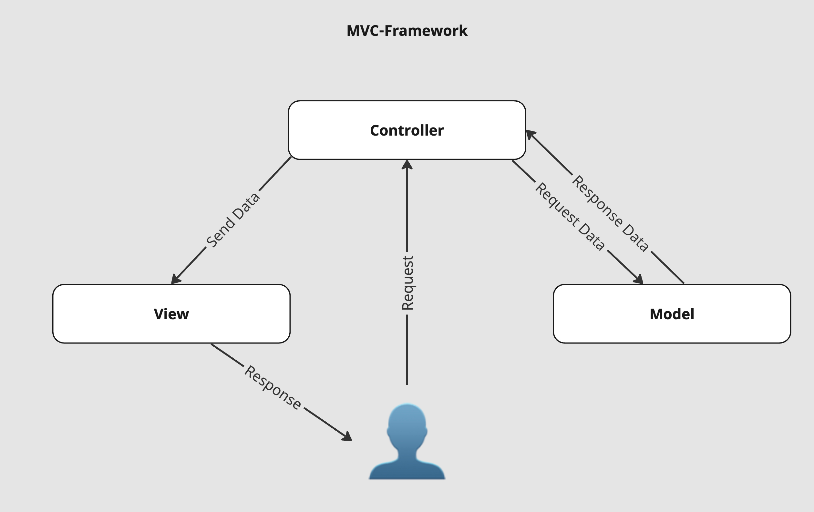

# Das Model-View-Controller-Prinzip
Das MVC-Prinzip (Model-View-Controller) ist ein Entwurfsmuster zur Strukturierung von Software, insbesondere bei der Entwicklung von Webanwendungen. 

Es trennt eine Anwendung in drei miteinander verbundene Komponenten, um eine klare Trennung der Zuständigkeiten zu erreichen. Dies fördert eine organisierte Programmierweise, erleichtert die Wartung und ermöglicht eine unabhängige Entwicklung und Tests der einzelnen Komponenten.

#### Vorteile von MVC

- **Trennung der Zuständigkeiten:** Durch die klare Trennung zwischen Datenmodell, Benutzeroberfläche und Steuerungslogik erleichtert MVC die Entwicklung, Wartung und das Testing der Anwendung.
- **Wiederverwendbarkeit:** Komponenten können leicht wiederverwendet oder unabhängig voneinander entwickelt und getestet werden.
- **Skalierbarkeit:** MVC-Anwendungen lassen sich leicht skalieren und anpassen, da Änderungen an einer Komponente minimale Auswirkungen auf die anderen haben.
- **Flexibilität bei der Benutzeroberfläche:** Die View kann geändert oder durch eine andere Präsentationsschicht ersetzt werden, ohne die Geschäftslogik zu beeinflussen.

## Model-View-Controller: Die Komponenten



### 1. Model (Modell)
Das **Model** repräsentiert die Datenstruktur der Anwendung, die Geschäftslogik und die Regeln zur Manipulation dieser Daten. Es ist direkt mit der Datenbank oder einer anderen Datenquelle verbunden und verantwortlich für die Abfrage, Speicherung und Verwaltung der Daten. Das **Model** benachrichtigt die **View** und den **Controller** über Änderungen an den Daten, damit diese entsprechend reagieren können.

### 2. View (Ansicht)
Die **View** ist für die Darstellung der Daten oder des Outputs, den der Benutzer sieht, zuständig. Sie übersetzt die Daten aus dem Model in eine visuelle Darstellung. Eine **View** ist in der Regel eine Template-Datei, die mit dynamischen Daten gefüllt wird, die vom **Model** bereitgestellt und vom **Controller** verarbeitet werden. Die **View** interagiert nicht direkt mit dem **Model**.

### 3. Controller (Steuerelement)
Der Controller ist das Bindeglied zwischen **Model** und **View**. Er empfängt Eingaben (z.B. Benutzeraktionen) und entscheidet, was mit diesen Eingaben zu tun ist. Der Controller ruft Daten vom Model ab, verarbeitet sie (falls nötig) und leitet sie dann an die View weiter, um eine entsprechende Darstellung zu generieren. Der Controller kann auch Änderungen an den Daten im Model veranlassen.


## Implementierung mit PHP

Die Erstellung eines einfachen PHP-Frameworks mit objektorientierter Programmierung (OOP) und einer MySQL-Datenbankanbindung umfasst mehrere Kernkomponenten: 
- einen Router, 
- einen Controller, 
- ein Model und 
- eine View. 
 
Dieses Framework folgt dem MVC-Designmuster (Model-View-Controller) und bietet eine grundlegende Struktur, die für die Entwicklung von Webanwendungen verwenden werden kann.

### Schritt 1: Verzeichnisstruktur

Die grundlegende Verzeichnisstruktur für das Framework könnte folgendermassen aussehen:

```
/my_framework/
│
├── public/
│   └── index.php
│
├── app/
│   ├── controllers/
│   ├── models/
│   └── views/
│
├── core/
│   ├── Controller.php
│   ├── Model.php
│   └── Router.php
│
└── config/
    └── database.php
```

### Schritt 2: Einstiegspunkt (public/index.php)

Dies ist der Einstiegspunkt Ihrer Anwendung. Alle Anfragen werden durch die `.htaccess`-Umleitung hierher geführt (URL-Rewriting).

Der Webserver wird dann so konfiguriert, dass immer das `public`-Verzeichnis ausgeliefert wird. 

```php
<?php
require_once '../core/Router.php';

$router = new Router();
$router->route();
```

### Schritt 3: Der Router (core/Router.php)

Der Router leitet eingehende Anfragen an die entsprechenden Controller und Methoden weiter.

```php
<?php
class Router {
    public function route() {
        // Hier könnte eine einfache Routing-Logik implementiert werden.
        // Zum Beispiel: /controller/method
        $controller = 'HomeController';
        $method = 'index';

        require_once "../app/controllers/$controller.php";
        $controller = new $controller();
        $controller->$method();
    }
}
```

### Schritt 4: Der Basis-Controller (core/Controller.php)

Der Basis-Controller, von dem alle anderen Controller erben.

```php
<?php
class Controller {
    protected function model($model) {
        require_once "../app/models/$model.php";
        return new $model();
    }

    protected function view($view, $data = []) {
        require_once "../app/views/$view.php";
    }
}
```

### Schritt 5: Das Basis-Model (core/Model.php)

Das Basis-Model stellt die Verbindung zur Datenbank her und bietet eine Schnittstelle für die Interaktion mit der Datenbank.

```php
<?php
class Model {
    protected $db;

    public function __construct() {
        $this->db = new mysqli("localhost", "username", "password", "database_name");
        if ($this->db->connect_error) {
            die("Verbindung fehlgeschlagen: " . $this->db->connect_error);
        }
    }
}
```

### Schritt 6: Datenbankkonfiguration (config/database.php)

Hier speichern Sie Ihre Datenbankkonfiguration.

```php
<?php
define('DB_HOST', 'localhost');
define('DB_USER', 'username');
define('DB_PASS', 'password');
define('DB_NAME', 'database_name');
```

### Schritt 7: Ein Beispiel-Controller (app/controllers/HomeController.php)

Ein einfacher Controller, der von `Controller` erbt.

```php
<?php
require_once '../../core/Controller.php';

class HomeController extends Controller {
    public function index() {
        $this->view('home/index', ['message' => 'Willkommen zu unserem Framework!']);
    }
}
```

### Schritt 8: Eine Beispiel-View (app/views/home/index.php)

Die zugehörige View-Datei für die Anzeige der Inhalte.

```php
<!DOCTYPE html>
<html>
<head>
    <title>Mein Framework</title>
</head>
<body>
    <h1><?php echo $data['message']; ?></h1>
</body>
</html>
```


## Ressourcen
* [developer.mozilla.org - MVC](https://developer.mozilla.org/en-US/docs/Glossary/MVC){:target="_blank"}
* [code.tutsplus.com - How to Build a Simple REST API in PHP](https://code.tutsplus.com/tutorials/how-to-build-a-simple-rest-api-in-php--cms-37000){:target="_blank"}
* [geeksforgeeks.org - MVC Design Pattern](https://www.geeksforgeeks.org/mvc-design-pattern/){:target="_blank"}