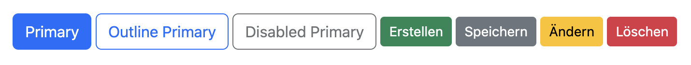
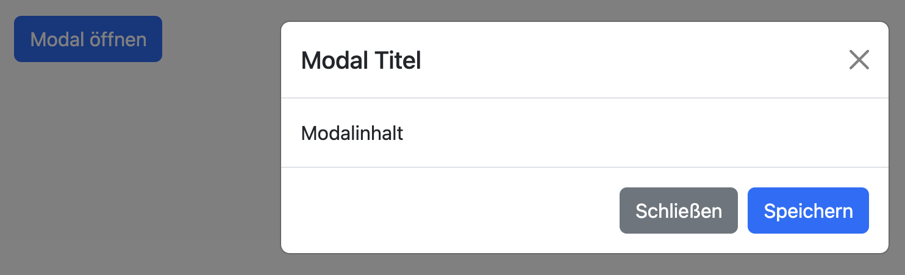
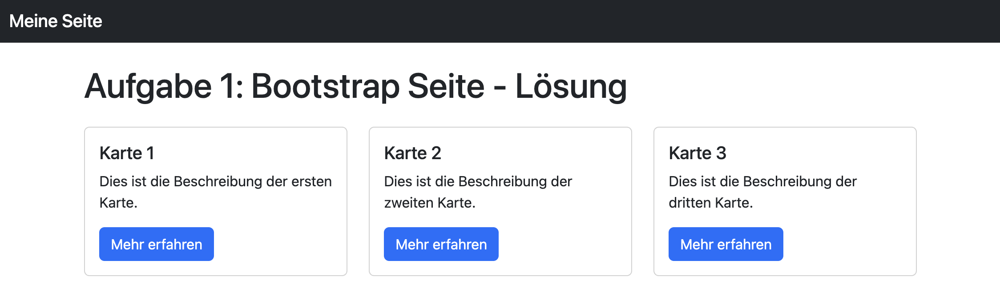
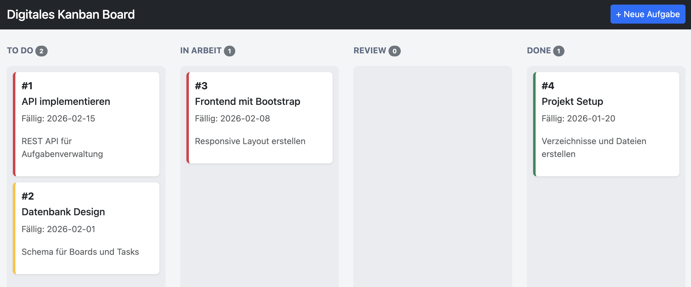
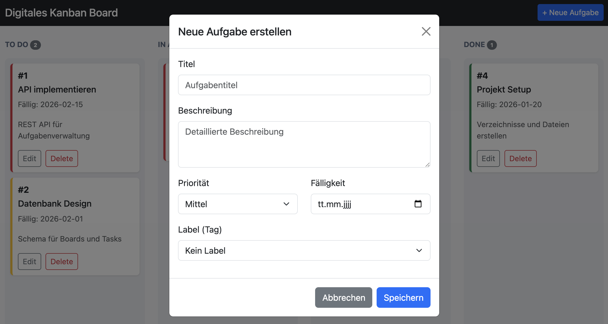
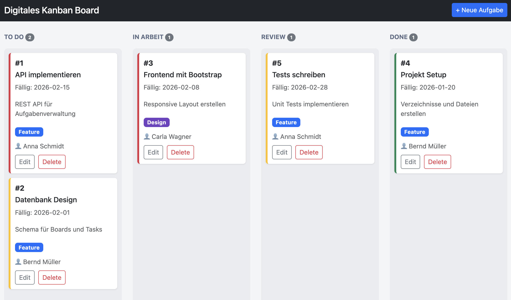

## Das Bootstrap Framework

### Was ist Bootstrap?

Bootstrap ist ein populäres CSS-Framework von Twitter, das es einfach macht, responsive Websites zu erstellen.

**Vorteile:**
- Vordefinierte Komponenten (Buttons, Cards, Modals, etc.)
- Responsive Grid-System (12-spaltig)
- Konsistentes Design
- Schnelle Prototyp-Entwicklung

### Bootstrap einbinden

```html
<!-- Bootstrap CSS -->
<link href="https://cdn.jsdelivr.net/npm/bootstrap@5.3.0/dist/css/bootstrap.min.css" rel="stylesheet">

<!-- Bootstrap JS (am Ende vor </body>) -->
<script src="https://cdn.jsdelivr.net/npm/bootstrap@5.3.0/dist/js/bootstrap.bundle.min.js"></script>
```

### Grid System

Bootstrap nutzt ein 12-Spalten-Grid:

```html
<div class="container">
  <div class="row">
    <div class="col-md-3">25% Breite auf Medium-Geräten</div>
    <div class="col-md-9">75% Breite auf Medium-Geräten</div>
  </div>
</div>
```

**Breakpoints:**
- `col-` : Extra klein (<576px)
- `col-sm-` : Klein (≥576px)
- `col-md-` : Mittel (≥768px)
- `col-lg-` : Groß (≥992px)
- `col-xl-` : Sehr groß (≥1200px)


### Komponenten verstehen (am Beispiel Button)

Bootstrap-Komponenten bestehen aus einfachem HTML plus vordefinierten Klassen. Manche Komponenten brauchen nur CSS (z.B. Buttons, Badges), andere zusätzlich JavaScript (z.B. Modals, Dropdowns) – deshalb das `bootstrap.bundle.min.js` am Ende einbinden.

Buttons zeigen das Prinzip gut: Du nutzt die Basis-Klasse `btn` und kombinierst sie mit Varianten wie `btn-primary`, `btn-secondary`, `btn-outline-*`, Größen (`btn-sm`, `btn-lg`) oder Utility-Klassen (`w-100`, `d-block`) für das Layout.



```html
<button class="btn btn-outline-primary">Outline Primary</button>
<button class="btn btn-btn-primary" disabled>Disabled Primary</button>
<button class="btn btn-success btn-sm">Erstellen</button>
<button class="btn btn-secondary btn-sm">Speichern</button>
<button class="btn btn-warning btn-sm">Ändern</button>
<button class="btn btn-danger btn-sm">Löschen</button>
```


Interaktive Komponenten werden über `data-bs-*` Attribute aktiviert, z.B. `data-bs-toggle="modal"` und `data-bs-target="#myModal"` beim Öffnen eines Modals.

### Cards

Cards sind Behälter für gruppierte Inhalte:

```html
<div class="card">
  <div class="card-body">
    <h5 class="card-title">Kartentitel</h5>
    <p class="card-text">Kartenbeschreibung</p>
  </div>
</div>
```

### Modals

Modals sind Dialogfenster, die über dem Hauptinhalt angezeigt werden:



```html
<div class="modal fade" id="myModal" tabindex="-1">
  <div class="modal-dialog">
    <div class="modal-content">
      <div class="modal-header">
        <h5 class="modal-title">Modal Titel</h5>
        <button type="button" class="btn-close" data-bs-dismiss="modal"></button>
      </div>
      <div class="modal-body">
        Modalinhalt
      </div>
      <div class="modal-footer">
        <button type="button" class="btn btn-secondary" data-bs-dismiss="modal">Schließen</button>
        <button type="button" class="btn btn-primary">Speichern</button>
      </div>
    </div>
  </div>
</div>

<!-- Modal öffnen -->
<button class="btn btn-primary" data-bs-toggle="modal" data-bs-target="#myModal">
  Modal öffnen
</button>
```

### Utility Classes

Bootstrap bietet viele Utility Classes:

```html
<!-- Abstände (margin/padding) -->
<div class="mt-3">Margin Top 3</div>
<div class="mb-2">Margin Bottom 2</div>
<div class="ps-4">Padding Start 4</div>

<!-- Flexbox -->
<div class="d-flex justify-content-between">
  <div>Links</div>
  <div>Rechts</div>
</div>

<!-- Text -->
<p class="text-muted">Grauer Text</p>
<p class="fw-bold">Fetter Text</p>

<!-- Farben -->
<div class="bg-danger">Roter Hintergrund</div>
<span class="badge bg-success">Badge</span>
```

---

## Lernziele

Nach diesem Assignment kannst du:
- Das Bootstrap Grid-System verstehen und verwenden
- Cards und Modals mit Bootstrap erstellen
- Responsive Layouts bauen
- Bootstrap Komponenten kombinieren


## Aufgaben

### Aufgabe 1: Bootstrap Seite

Erstelle eine einfache HTML-Seite mit Bootstrap:

1. Erstelle eine `index.html` mit Bootstrap eingebunden
2. Füge eine Navbar mit Logo und Button ein
3. Erstelle 3 Spalten mit Cards (12-Spalten Grid)
4. Jede Card soll ein Titel und Beschreibung haben



<sup>Beispielhafte Umsetzung `01_aufgabe1_bootstrap.html`</sup>


### Aufgabe 2: Kanban Board Hardcoded

Erstelle das Kanban Board Frontend statisch:

1. Navbar mit Board-Titel und "Neue Aufgabe" Button
2. 4 Spalten (To Do, In Arbeit, Review, Done) mit `col-md-3`
3. Jede Spalte enthält mehrere Task-Cards mit:
  - Aufgaben-ID (#123)
  - Titel
  - Beschreibung
  - Priorität (Farbe als linker Border)
  - Fälligkeitsdatum
  - Edit und Delete Button

4. Erstelle CSS Klassen für:
  - `.task-card` - Styling der Aufgabenkarten
  - `.priority-high / -medium / -low` - Farbige Borders
  - `.kanban-col` - Spalten-Styling


<sup>Beispielhafte Umsetzung `01_aufgabe2_kanban_static.html`</sup>

### Aufgabe 3: Modal Funktionalität

Erweitere dein Kanban Board:

1. Erstelle ein Modal zum Erstellen neuer Aufgaben mit Feldern:
  - Titel (Textinput)
  - Beschreibung (Textarea)
  - Priorität (Select)
  - Fälligkeitsdatum (Date Input)
  - Labels (Select: Bug, Feature, Design)

2. Erstelle ein Modal zum Bearbeiten von Aufgaben

3. Erstelle ein Modal zur Bestätigung beim Löschen



<sup>Beispielhafte Umsetzung `01_aufgabe3_kanban_modal.html`</sup>


### Aufgabe 4: Styling & Details

Verfeinere dein Kanban Board:

1. Benutzerzuweisung anzeigen (👤 Username)
2. Tags/Labels mit Badges anzeigen
3. Aufgabenzähler in Spalten-Headern (Badge mit Anzahl)
4. Hover-Effekte auf Cards
5. Responsive Design überprüfen



<sup>Beispielhafte Umsetzung `01_aufgabe4_kanban_complete.html`</sup>

## Ressourcen
- [Bootstrap Dokumentation](https://getbootstrap.com/docs/5.3/){:target="_blank"}
- [Bootstrap – Grid System](https://getbootstrap.com/docs/5.3/layout/grid/){:target="_blank"}
- [Bootstrap – Compontents](https://getbootstrap.com/docs/5.3/components/){:target="_blank"}
- [Bootstrap - Cards](https://getbootstrap.com/docs/5.3/components/card/){:target="_blank"}
- [Bootstrap - Modals](https://getbootstrap.com/docs/5.3/components/modal/){:target="_blank"}
- [Bootstrap - Formulare](https://getbootstrap.com/docs/5.3/forms/overview/){:target="_blank"}